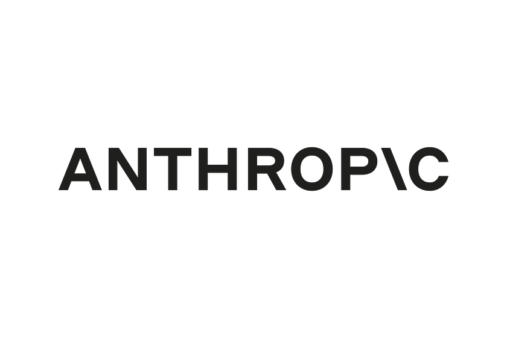
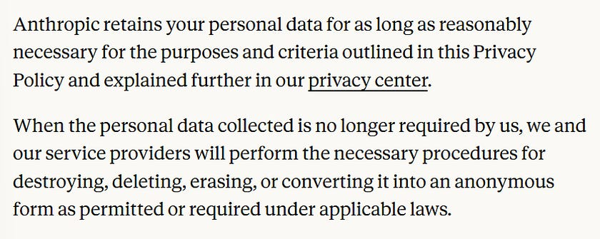
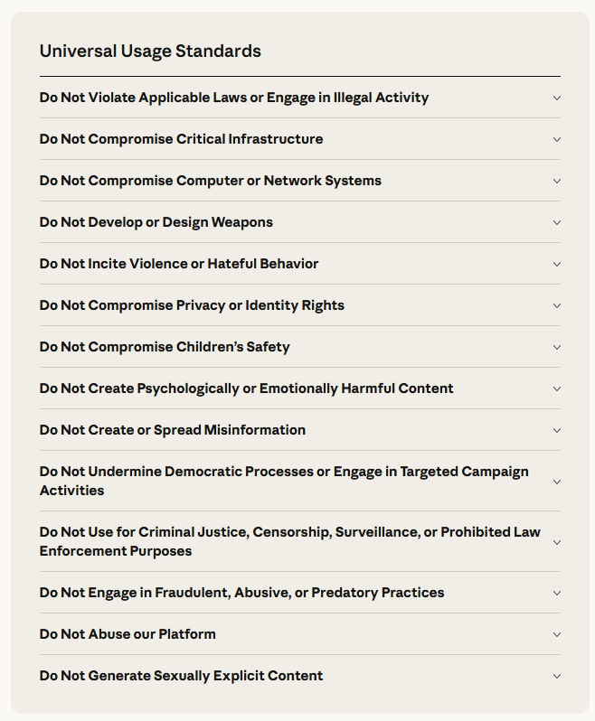

# I Read The Policies So You Don’t Have To: Anthropic (Claude, Artificial Intelligence)

*“Anthropic is an AI Safety and research company working to build reliable, interpretable and steerable AI systems”*, best known for Claude.

This review consisted of reading through the following;

* [Privacy Policy](https://www.anthropic.com/legal/privacy)  
* [Non-User Privacy Policy](https://www.anthropic.com/legal/non-user-privacy-policy)  
* [Consumer Health Data Privacy Policy](https://www.anthropic.com/legal/consumer-health-data-privacy-policy)  
* [How long do you store my data?](https://privacy.claude.com/en/articles/10023548-how-long-do-you-store-my-data)  
* [Cookie Policy](https://www.anthropic.com/legal/cookies)  
* [What Cookies Does Anthropic Use?](https://privacy.claude.com/en/articles/10023541-what-cookies-does-anthropic-use)  
* [Consumer Terms of Service](https://www.anthropic.com/legal/consumer-terms)  
* [Commercial Terms of Service](https://www.anthropic.com/legal/commercial-terms)  
* [Usage Policy](https://www.anthropic.com/legal/aup) (aka Acceptable Use Policy)  
* [Subprocessors](https://trust.anthropic.com/subprocessors)  
* [About the Development Partner Programme](https://support.claude.com/en/articles/11174108-about-the-development-partner-program)  
* [Zero Data Retention](https://code.claude.com/docs/en/zero-data-retention)  
* [Software Directory Policy](https://support.claude.com/en/articles/13145358-anthropic-software-directory-policy)

Apart from where stated, these policies apply to personal customers (not business customers).

It is recommended for all customers to review the privacy settings within Claude and any third party service(s) you have connected to your Claude account(s),

Customers can revoke consent to third-party integrations at any time.

# WHAT INFORMATION IS COLLECTED BY ANTHROPIC

If you use Anthropic’s product(s), they will collect;

* Name  
* Email address  
* Phone number  
* Payment and billing information (if the user makes a purchase)  
* Inputs/Prompts and outputs  
* Feedback  
* Device type  
* Operating system information  
* Browser Information  
* Web page referrers  
* Mobile network  
* Connection Information  
* Mobile operator or Internet Service Provider (ISP)  
* Time zone setting  
* IP Address (including information about the location of the device derived from IP address)  
* Device identifiers  
* Advertising Identifiers  
* Device location  
* Dates and times of access  
* Browsing history  
* Search history  
* Information about the links you click  
* The pages you view  
* Log files (*“if your device experiences an error, we may collect information about the error, the time, the feature, the state of application and any communications”*)  
* Information collected through cookies

Anthropic state they obtain personal data from third party sources for the purpose of model training, including;

* Information that is available publicly on the internet  
* Datasets obtained through commercial agreements  
* Data provided by other users  
* Data generated internally  
* Feedback from other users  
* Materials flagged for safety, security or policy review.

# INFORMATION COLLECTED ON NON-USERS OF ANTHROPIC

Even if you are not a registered user of any Anthropic products, they make clear that their models are trained on personal data obtained from third party sources, which may include the data of non-users.

They state; *“we do not actively set out to collect personal data to train our models. However, a large amount of data on the Internet relates to people, so our training data may incidentally include personal data”*

Anthropic claim to take steps to minimise the privacy impact on individuals as part of their data collection practices, stating that their general purpose crawler agent ClaudeBot operates under strict policies and guidelines.

For example, ClaudeBot does not access password protected pages, does not bypass CAPTCHA controls and respects ‘Do Not Crawl’ signals (robots.txt), according to the Non-User Privacy Policy.

You can read more about the different bots Anthropic use to crawl the internet [here](https://support.claude.com/en/articles/8896518-does-anthropic-crawl-data-from-the-web-and-how-can-site-owners-block-the-crawler), including how to block the crawlers if you’re an admin of a website or ten.

If a crawler has [a source IP address on this list](https://claude.com/crawling/bots.json), it indicates that the crawler is coming from Anthropic.

# DATA RETENTION

Anthropic retains your personal data for as long as reasonably necessary for the purposes required for them to conduct their business under legitimate purposes or legal obligation, in addition they state they may use inputs and outputs to train models and services.

Users can opt out of that, however it is noted that even when opted out, Anthropic will still use inputs and outputs for model improvement where a conversation is flagged for safety review or the user makes a report to Anthropic for review.

Users can delete conversations with Claude at any time, it is removed from the users chat history immediately, and deleted from Anthropic’s back-end storage systems within 30 days.

If a user allows Anthropic to use their data to improve Claude, Anthropic state they may retain the users data in a de-identified format for up to five years within their model training pipelines.

Incognito chats are not used to improve Claude, even if Model Improvement is enabled.

If a chat or session is flagged by Anthropic’s Trust & Safety classifiers as violating their Usage Policy, the inputs and outputs are retained for two years, whilst the trust and safety classification score is retained for up to seven years.

Data provided through feedback mechanisms (including thumbs up/down buttons and bug reports), is retained for five years.

Anthropic state that they may anonymise or de-identify personal data for research or statistical purposes, in which case they “may retain this information for longer”.

# WHAT IS DISCLOSED AND WITH WHO

Anthropic state that they disclose personal data to;

* Affiliates, corporate partners and related entities  
* Service providers and business partners (including website and data hosting)  
* Any connected apps (there are [over 1,500 apps which can connect to Claude](https://integrately.com/find-apps/a/anthropic)).

They also state they \*may disclose personal data;

* To third party websites and services.  
* In the instance of a significant corporate event (i.e. a merger, transaction, bankruptcy or similar involving the transfer of businesses assets, data will be disclosed as part of those corporate transactions.  
* Top fulfil regulator or legal requirements, to enforce safety, the rights of others or their own rights.

Personal data is also shared with various [Subprocessors](https://trust.anthropic.com/subprocessors) in the course of Anthropic being able to provide their service, they state their Subprocessors as being;

* Google Cloud *(all products)*  
* Amazon Web Services *(all products)*  
* Microsoft Azure *(all products)*  
* Cloudflare *(all products)*  
* Stripe *(Claude Pro/Max, Claude Developer Platform, Claude for Work)*  
* WorkOS *(Claude for Work, Claude Developer Platform)*  
* Intercom *(All products except Claude for Government)*  
* Nutun *(All products except Claude for Government)*  
* Boldr *(All products except Claude for Government)*  
* Twilio *(All products except Claude for Government)*  
* Iterable *(All products except Claude for Government)*  
* Sentry *(All products except Claude for Government)*  
* Sift *(All products except Claude for Government)*  
* Arkose Labs *(All products except Claude for Government)*  
* Brave Search *(All products)*  
* ElevenLabs *(Claude for Work)*  
* Palantir Federal Cloud Service (PFCS) *(Claude for Government)*

# CONSUMER HEALTH PRIVACY

Anthropic collect the following categories of consumer health data, where it is provided to them directly by the (personal) customer, including where if the customer connects a third-party application to Claude which contains any consumer health data;

* Information about health-related conditions  
* Symptoms  
* Diagnoses  
* Any medical interventions, surgeries, procedures, testing or treatments  
* Vital signs, bodily functions  
* Health measurements that reveal health status  
* Biometric and genetic data  
* Precise location information  
* *“Information, including location or precise location information, that could identify your attempt to seek health care services or supplies”*  
* *“Other information that may be used to infer or derive consumer health data”*

# ENTERPRISE AND BUSINESS CUSTOMERS PRIVACY

Anthropic state they do not train models on the data generated by customers using their commercial products (e.g. Claude for Work, Claude API, etc).

However, they still provide commercial customers the opportunity to “contribute toward the advancement of AI technology” through the Development Partner Programme.

Under the Development Partner Programme;

* Input and Output tokens from the first-party Claude API are provided to Anthropic.  
* Data sharing does not apply to Claude Apps or API calls unrelated to Claude Code.  
* Data is stored for two years (even if you leave the programme).  
* Data used for model training will not be associated with other customer information.

If you enrol your organisation into the programme, all members under the organisation are enrolled into the programme.

Some Enterprise API customers, subject to Anthropic approval, may have arrangements where Anthropic does not store inputs or outputs (except where to comply with law or combat misuse) by way of requesting a Zero Data Retention Agreement.

A Zero Data Retention Agreement would cover;

* Claude Messages  
* Token Counting API’s  
* Claude Code (when used with Commercial organisation API Keys or through Claude Enterprise)

Any Zero Data Retention Agreement would not cover;

* Console and Workbench  
* Claude Managed Agents  
* Claude Free, Pro or Max plans (web or app)  
* Claude Teams and Claude Enterprise  
* Third Party Integrations

You can [read more about Anthropic Zero Data Retention for Claude Code on Claude for Enterprise here](https://code.claude.com/docs/en/zero-data-retention) and [here](https://privacy.claude.com/en/articles/8956058-i-have-a-zero-data-retention-agreement-with-anthropic-what-products-does-it-apply-to).

# TERMS OF SERVICE (PERSONAL CUSTOMERS)

Users must be at least 18 years old to use the Services

If you use an email address (domain) owned by your employer or other organisation, your account may be linked to the organisation's enterprise account, and the administrator may be able to monitor and control the account.

# TERMS OF SERVICE (COMMERCIAL / BUSINESS CUSTOMERS)

Agreeing to the terms, binds your entire organisation to the terms, they start by stating you may not enter into the terms unless you have the legal authority to bind that entity.

Anthropic agrees that business customers (subject to their compliance with Anthropic terms and policies);

* Retain the rights to its inputs  
* Owns it Outputs

Subject to the Customers compliance with the Terms, Anthropic assigns to Customers its right, title and interest (if any) in and to Outputs.

Both parties agree to waiving the right to a trial by jury and the right to join and participate in a class action lawsuit.

# COOKIES

You can [read about the specific cookies used by Anthropic in their products here](https://support.claude.com/en/articles/9020432-what-cookies-does-anthropic-use)

They state within their Cookie Policy that *“we currently do not respond to browser ‘Do Not Track’ signals”.*

# ACCEPTABLE USE POLICY

Anthropic’s universal standards apply to all users and use cases.

They go on to say *“Anthropic may enter into contracts with certain governmental customers that tailor use restrictions to that customer’s public mission and legal authorities…”*

They state that *“some use cases pose an elevated risk of harm because they influence domains that are vital to public welfare and social equity”*, thus Anthropic require for *“high risk use cases”* that;

* There is a human in the loop  
* Where model outputs are presented directly to individuals or consumers, it must be disclosed that AI has been used to help produce the advice, decisions or recommendations.

“High Risk Use Cases” include;

* Legal  
* Healthcare  
* Insurance  
* Finance  
* Employment & Housing  
* Academic testing, accreditation and admissions  
* Media or professional journalistic content

In addition to the following use cases, regardless of whether they are “high risk or not”;

* All consumer-facing chatbots  
* Products serving minors  
* Agentic use cases  
* Model Context Protocol (MCP) servers listed within the Connector Director must comply with the [Directory Policy](https://support.claude.com/en/articles/13145358-anthropic-software-directory-policy) and [Directory Terms](https://support.claude.com/en/articles/13145338-anthropic-software-directory-terms)