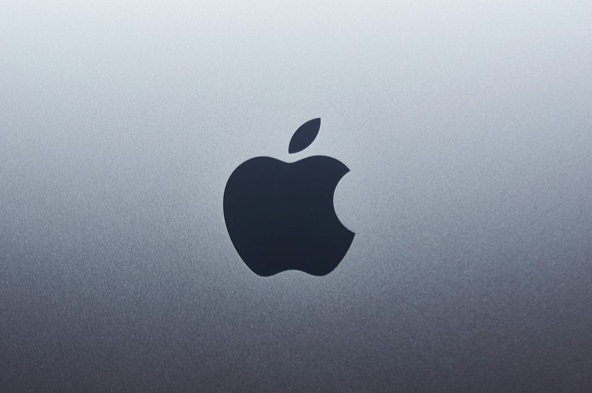
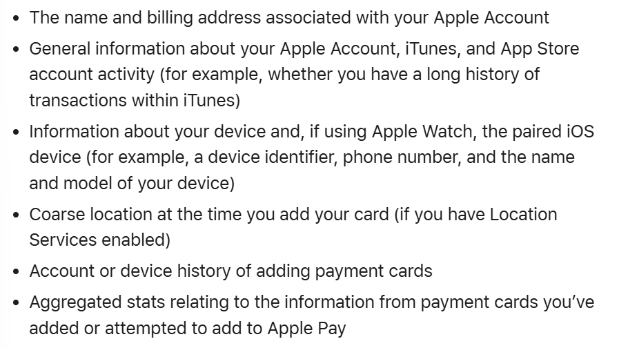
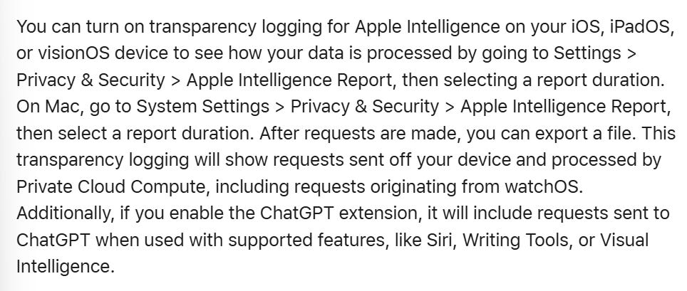
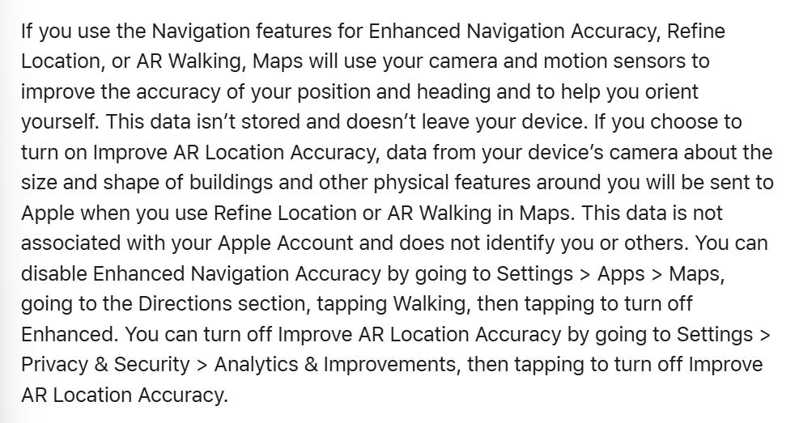
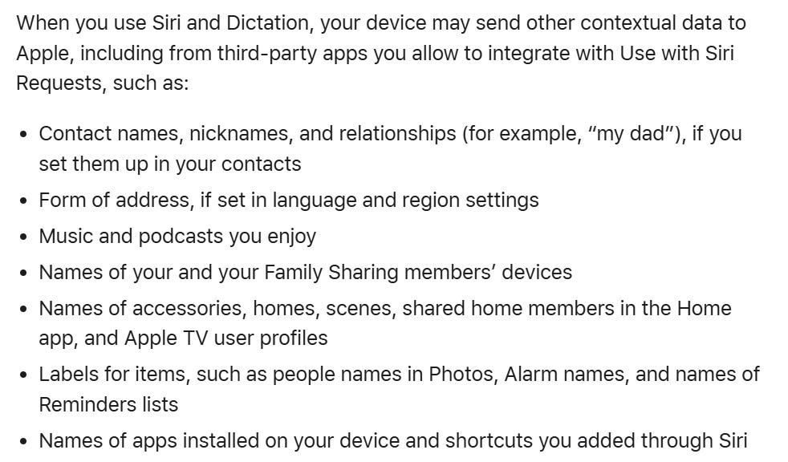
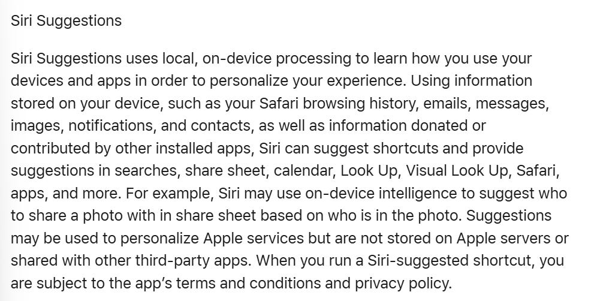

Apple generated a record $416 billion in revenue through 2025, of which a minimal (she says) $4.7 billion stemmed from advertising revenue.

In comparison to some of the other companies in this series so far, this is a relatively small percentage of revenue to stem from advertising.

This review consists of a review of Apples;

* [Privacy Policy](https://www.apple.com/legal/privacy/pdfs/apple-privacy-policy-en-ww.pdf)  
* [Supplementary Privacy Notices](https://www.apple.com/legal/privacy/data/) (138 of them)  
* [California Privacy Disclosure](https://www.apple.com/legal/privacy/california/)  
* [Consumer Health Personal Data Privacy Policy](https://www.apple.com/legal/privacy/consumer-health-personal-data/en-ww/)  
* [Apple Health Study Apps Privacy Policy](https://www.apple.com/legal/privacy/apple-health-studies/en-ww/)  
* [Family Privacy Disclosure for Children](https://www.apple.com/legal/privacy/en-ww/parent-disclosure/)  
* [Privacy Governance](https://www.apple.com/legal/privacy/en-ww/governance/)  
* [Software Licence Agreements](https://www.apple.com/uk/legal/sla/) (many)  
* [California Privacy Disclosures](https://www.apple.com/legal/privacy/california/ca-privacy-disclosures.html) (by app/service, 100+ of them)

There are a myriad of layers and complexities at play. Apple state recurringly that personal data is end to end encrypted, and where possible on device processing occurs.

As a standalone device, if a user is utilising an iPhone with considerable privacy setting restrictions applied, and engaging only with a handful of core functionalities (phone, messaging, email, basic browsing) and no third party developed apps, the volume of data collection is relatively restricted, encrypted, and reportedly not shared with third parties.

Where it gets complicated is the nature of Apple products, they rely on a collective of apps to function, many of them developed by Apple, with usefulness as intended for the average user. Each app engagement or set up of (i.e. health app) creates a new layer of data collection with its own sub-set of rules.

# WHAT INFORMATION IS COLLECTED BY APPLE

Under Apple’s core privacy policy they state they collect the following information;

* Name  
* Email address  
* Devices registered  
* Account status  
* User age  
* Device serial number  
* Browser type  
* Name  
* Physical address  
* Phone number  
* Payment information (billing address, method of payment, payment card information.  
* Device trust score  
* App launches within their services  
* Browsing history  
* Search history  
* Performance and diagnostic data  
* *“other usage data”*  
* Location information (settings dependent)  
* *“data relating to the health status”* including *“physical and mental health”*  
* Fitness information (where shared)  
* Salary  
* Income  
* Assets information  
* Government issued ID (where requested) (passport, driving licence, ID card)  
* Subscriber ID (resets after 180 days if user does not re-subscribe)  
* Biometric information (faceprint or fingerprint, where provided)  
* *“Information about users use of AirDrop”*  
* Keyboard  
* Device language setting  
* Device type  
* OS version  
* Connection type (wi-fi or cellular)  
* Approximate device location (where not shared)  
* Search terms  
* Apps installed  
* User gender  
* Information about use of AirDrop (not copies of any transfers)  
* Use of App Store (interactions with content, searches, views, downloads, purchases)  
* Social security number (in some US states)  
* Protected class groupings (based on race, ethnicity, national origin, religious or philosophical beliefs, disability status)  
* Products and/or services purchased.  
* Biometric information (fingerprint, image of face)  
* How the user interacts with websites and apps  
* Employment information  
* Education information (where affiliated with an institution)

In addition to the data collected core privacy policy, Apple has 138 additional supplementary notices for various apps and functions ([view the full list here](https://www.apple.com/legal/privacy/data/)).

Those notices detail further what data is collected depending on the app and/or function, in addition to highlighting the instances and with whom the user data would be shared if the user engages with that app and/or functionality.

It would be absolute insanity to itemise the data collected under each of those 138 notices, I will just cover the ones of particular interest/relevance/most commonly used.

**Activity (Health);**

* Active calories or kilojoules  
* Exercise minutes  
* Stand or roll hours  
* Steps  
* Time zone  
* Workout information; title, type, duration

**Apple Intelligence;**

* Information on your device including across your apps.

**Apple Music;**

* Songs played, how long for  
* Content listened to  
* Searches  
* Library  
* Downloads

**Apple Pay;**

* Credit, debit or prepaid card number  
* Name and billing address  
* Device identifier and that of any paired devices  
* Account or device history of adding payment cards  
* Percent of time device is in motion (device use/trust score)  
* Approximate number of calls per week (device use/trust score)  
* If migrating to a new device, Apple will collect information about nearby iCloud enabled devices.  
* When making a payment; transaction info inc retailer, location etc.

**Apple Podcasts;**

* Data about listening activity and interactions  
* How much of a podcast is listened to  
* When the user listens  
* When the user streams, downloads or follows.  
* Links the user taps within the app  
* Content in library  
* IP address (shared with hosting provider)

**Apple TV;**

This applies to all devices where the user is signed in

* Purchases  
* Downloads  
* Activity in the Apple TV app  
* Content watched  
* When the content is watched  
* Where it was watched (within the app or a connected app)  
* The device it was played from  
* Device ID of devices user is signed in at  
* Where in the content the user paused or stopped watching  
* Detailed history of all playback activity for Apple TV channels and Apple TV subscription.  
* Location, either GPS or inferred through other data points depending on user settings.  
* IP address  
* *“the channel through which your device was obtained”*  
* Free space/memory on device  
* Version of Operating System  
* Wifi or cellular connection

**ChatGPT Extension** where enabled, supported through features such as Siri, Writing Tools and visual intelligence, and where utilised will collect (and send to ChatGPT);

* Users request / prompt  
* Any attachments (documents, photos, or contents of document)  
* Current time zone  
* Country  
* Device type  
* Language  
* Feature being used when making the request  
* General location

**Siri and Dictation**

Data collected through Siri by Apple is associated with a random, device-generated identifier that rotates multiple times per hour and is not tied to a users Apple Account or email address.

* Category of request made  
* Whether request was completed successfully  
* Device specifications  
* Device configuration  
* Performance statistics  
* Approximate location of device at time of request  
* Request history (including transcripts and related request data)

**Face ID** data includes;

* Mathematical representations of the users face

**FaceTime** data includes;

* Who was invited to a call  
* Device network configurations  
* Apple does not log whether the call was answered.

**Find My** features data collection includes;

* Details about the users Apple account  
* Information about devices under an account including device version and location  
* Any AirTag, AirPod and Find My network accessories, including serial numbers  
* The people the user has shared location of devices with  
* User location (Apple can view location in an unencrypted format if either the users device or the friends device is running on an operating system earlier than iOS 17\)

**Health App** enables users to collect data on themselves through enabling features, submitting data, or linking connected devices or third party services, including;

* Health records  
* Cycle tracking  
* Medications  
* Mental Health  
* Sleep  
* Heart rate  
* Noise notifications  
* Vaccination record

Curiously, Apple state this in relation to whether data collected through the Health App is encrypted;

*“When your device is locked with a passcode, Touch ID, or Face ID, all of your health and fitness data in the Health app — other than your Medical ID — is encrypted and inaccessible by default.”*

Which suggests that when a users device is unlocked, the data is not encrypted ? I don’t know, I’m just some chick.

**ID’s in Wallet**

To register an ID as a Digital ID in Wallet, Apple will collect;

* Live photo of user  
* Facial and head movements of user  
* Front and back of ID  
* Quality of images  
* Type of images  
* Barcode scan of ID: name, address, date of birth  
* ID verification outcome  
* Device use patterns  
* Device settings  
* Device location at attempt to add ID card  
* Live photo metadata  
* Passport chip scan data (where applicable)

It is the users Government ID issuing authority, and not Apple, who decide whether to authorise adding an identity card to Wallet. Information is sent by Apple (encrypted) to the issuing Government authority for their review.

Digital IDs do not receive updates when an ID is re-issued or renewed, users need to delete then add the new ID.

**Safari**

If Safari suggestions is activated, the users search queries and usage data will be collected from the device but not in a manner that is linked to the user.

**Consumer Health Personal Data Apple May Collect**

Apple may collect some health data through a users use of their products or services, some of this data is inferred through user actions, such as adding a pass to their Wallet which could include health related information, participating in an Apple-sponsored health study, through use of apps including which apps are downloaded or content viewed or requested, or through uploading information to iCloud.

They state many of their features are end to end encrypted by default.

Health data Apple collect they categorise as;

* Physical or mental health or condition (including information about health conditions, symptoms, status, diagnoses, testing or treatments)  
* Measurements of bodily functions, vital signs and other related information  
* *“information that could identify a users attempt to seek healthcare services”*  
* Information that could be used to make inferences about or detect the health status of an individual.

In addition to from the user, Apple may receive personal data from;

* Other individuals  
* Businesses  
* Third parties  
* Partners  
* [Apple-Affiliated Companies](https://www.apple.com/legal/privacy/en/affiliated-company/)

Throughout many of the documents reviewed, Apple regularly reiterate that individual metrics are not tied to an Apple account or information that might identify a user.

# DATA RETENTION

Apple retains personal data only for so long as necessary to fulfil the purposes for which it was collected.

Subscription data associated with purchases through an Apple account (inc App Store) are retained for *“at least a 10-year retention period, but in regions such as China that period can be 30 years”*

Records about a users interactions with iCloud-related services are typically stored for 30 days but may be stored for up to three years in an aggregated format, unless required to be stored for longer.

Information collected through Apple Music (listening activity, library content, playlists, searches) is retained for as long as the account is active and up to two years following account cancellation.

Siri data (including transcripts and dictation transcripts) may be retained for two years, with a small subset of data kept beyond two years.

Limited FaceTime data (e.g. when a call was attempted) for up to thirty (30) days.

If a user views a webpage in Safari not through Private Browsing mode, the webpage address is sent to Apple and stored for up to five years to improve products, services and technologies in a way that is not associated with the users account, email address or other data Apple may have on the users use of services.

# WHAT IS DISCLOSED AND WITH WHO

Apple state they do *“not share personal data with third parties for their own marketing purposes”.*

They state they may share personal data with;

* Apple-affiliated companies  
* Service providers  
* Partners  
* Developers (where a user subscribes/purchases)  
* Publishers  
* Payment processing companies

Other data is typically shared on a per app setting basis;

**Activity data** can be shared with friends, if a user sends or accepts an invite from a friend, the email address associated with the users Apple account will be visible to the other user. Sharing workout or activity data triggers that data being sent to Apple servers in an encrypted format (not remaining on device) in order to facilitate sharing with another user.

**Apple Card** is issued through Goldman Sachs with payments processed by Mastercard, who receive Apple Card transaction information in addition to;

**Apple Cash** is facilitated by Apple’s partner bank, Green Dot Bank and an Apple subsidiary company, Apple Payments Inc. Information relating to KYC, identity verification and payments/transactions may be shared with Green Dot Bank and Apple Payments Inc. Apple Cash transactions are through merchant Visa.

**Apple Intelligence** uses on device processing where possible, some data is sent to Private Cloud Compute where more computational power than the device can provide is needed to be leveraged to process complex tasks. *“For example, when you use Writing Tools to proofread or edit an email, your device may send the email to Private Cloud Compute for a server-based model to do the proofreading or editing”*. Data sent to and returned by Private Cloud Compute is not stored or made accessible to Apple and is not retained.

Users of Apple products can turn on Transparency Logging within the Privacy and Security Settings, to be able to view logs of how data is processed. Transparency Logging can be enabled by following these steps;

**Apple Maps**

When a user engages with Apple Maps, the following information is sent to Apple;

* Time of request  
* Destination  
* Mode of transport  
* Whether connected to CarPlay or not  
* Random identifier created for each ask for directions  
* Device model and software version  
* Input language  
* Device location  
* Boundaries of the map area visible on the device  
* Interactions with maps, including search terms and features, places views, interactions with Maps notifications.  
* *“We also collect data on application, device and network configuration and performance when using Maps”*  
* EV charge status (if using EV Routing setting) (including battery capacity, state of charge and *“other vehicle characteristics that may affect range”*

If the Improve AR Location Accuracy setting is activated, *“data from your device’s camera about the size and shape of buildings and other physical features around you will be sent to Apple when you use Refine Location or AR Walking in Maps”*

If a user listens to broadcast radio through Apple Music, their device's IP address will be visible to the broadcast radio station and subject to their privacy policy.

The **Apple Pay** privacy policy is very confusing. In a nutshell, some information is shared (with merchants mostly), some isn’t. Most of the personal and payment data and transaction data is encrypted and stored on the device. Much of the information apparently isn’t stored by Apple but its hard to understand exactly what is and what isn’t, I don’t even know how to articulate that aspect in layman's terms without looking like this meme. I personally don’t use Apple pay nor Apple Wallet, never have felt the need, and probably now never will, take from that what you will.

**Apple Podcasts** assigns a users account with a random unique identifier that is specific to Apple Podcasts, data collected by Apple within Apple Podcasts is not stored to a users Apple account nor linked to other Apple services.

Data collected through **Apple TV** (purchases, downloads) is used to offer advertising within the App Store, Apple News and Stocks, additionally Apple provide non-personal data to their advertisers and strategic partners to provide services and products. If a user watches content via a connected third party app within Apple TV App, certain data is shared with the third party and vice versa.

In relation to the **ChatGPT Extension**, if a user is signed in to their Apple account, Open AI may log the users requests attachments and session history. Any requests made through the ChatGPT Extension may be send to OpenAI for processing.

When a user uses **ChatGPT in Siri**, Apple collects information about the request, additionally, where a user is opted in to improve Siri and Dictation, additional data such as the audio recording and transcript of the request and metadata associated with the response may be logged by Apple, but none of that data is tied to the users Apple Account according to various privacy policies within the Apple policy collective.

**Siri and Dictation** data (including transcripts of requests) may be used to improve Siri, Search, Voice Control, Translate, and automatic speech recognition models.

Additionally;

Where a user chooses to allow apps to use Speech Recognition for transcription, the audio data to be transcribed may be sent to Apple.

Privacy savvy readers might want to review their Siri settings, such settings can be locked down to restrict the data Siri has access to by following a number of the steps laid out throughout [this page on Apple's website](https://www.apple.com/legal/privacy/data/en/ask-siri-dictation/)

**Face ID** data “is encrypted and protected with a key only available to the Secure Enclave”. Face ID data does not leave the users device, and is not backed up to the iCloud. Where Face ID is used as an authentication method within a supported app, apps are notified only as to whether the authentication is successful, apps cannot access Face ID data associated with the enrolled face.

The content of **FaceTime** calls is end-to-end encrypted.

For FaceTime calls on a visionOS device, the users Persona will be sent securely to the members of the call, after the call is completed, the users Persona may remain stored (encrypted) on the other call participants’ devices for up to thirty (30) days.

Some apps on a users device (including FaceTime) may communicate with Apple’s servers to determine whether other people can be reached by FaceTime. When that happens, Apple may store those phone numbers and email addresses associated with the users account for up to thirty (30) days.

**Calls over Wifi**

IP address and call activity may be shared with the wifi service provider.

**ID in Wallet**

When a user adds their identity card through Wallet, their identity information, information about the users Apple account, device use patterns and settings will be used by the digital identity card issuing authority to verify the users identity to enable the ID to be added to the device.

Additional verification information the user submits when adding their ID to their Wallet, such as a Live Photo and recorded facial and head movements, will be used by Apple for fraud prevention for this feature and retained only until the digital identity card issuing authority authorizes or declines adding the users identity card to Wallet.

Apple does not store images of users' identity cards, Apple only uses limited information from the identity card to prevent fraud and to display the ID in Wallet.

If adding a State Identity Card to Apple Wallet, the identity card images are encrypted on device and sent to the government issuing authority, which may share them with their third-party identity verification service provider. The user's device will read the barcode from the back of the identity card and share name, address and date of birth with Apple for identity verification and fraud prevention purposes.

If adding a pass to a wallet, the users device may share with Apple whether and the number of times a pass has been shared.

I guess a very condensed TLDR version of this would be; if you use an app on an Apple device, it is going to collect the data you probably think it will during the act of using it for its designed purpose, and some of that may be shared.

# TERMS OF SERVICE

Apple does not knowingly collect the data of persons under the age of 13\.

When a payment card is used, Apple may retain and automatically update the card number and billing information for future purposes, recurring transactions or other uses authorised by the user. “Apple may obtain this information from your financial institution or payment network”.

Apple state in various places throughout their documentation, “you are not required to provide the personal data that we have requested. However, if you choose not to do so, in many cases we will not be able to provide you with our products or services or respond to requests you may have”

# SOFTWARE LICENCE AGREEMENTS

So here's the thing, your average go hard Apple nerd who has kitted themselves out with an iPhone, a macbook, an iWatch, that utilises Apple TV and has a HomePod would need to work their way through 3,620 A4 pages of software licence agreements to try and understand what they are agreeing too.

This can be broken down into the following;

* Apple TV \- 381 pages  
* iOS 26 \- 930 pages  
* watchOS 26 \- 719 pages  
* tvOS 26 \- 381 pages  
* HomePod \- 314 pages  
* macOS Tahoe \- 895 pages

I will produce some separate articles at some point covering the Software Licence Agreements bc holy moley that's a lot of information.

# COOKIES

Apple generally treats data collected through cookies and similar technologies as non-personal data, apart from the regions where IP addresses or similar identifiers are considered by local laws in those regions.

# OTHER CONSIDERATIONS

Aggregated data is considered non-personal data.

*“For research and development purposes, we may use datasets such as those that contain images, voices, or other data that could be associated with an identifiable person. When acquiring such datasets, we do so in accordance with applicable law in the jurisdiction in which the dataset is hosted”*

Apple has ISO 27001 and ISO 27018, undergoing yearly re-audits. [More info on that here](https://support.apple.com/en-gb/guide/certifications/apc34d2c0468b/1/web/1.0) if you’re interested.

Note: even where a user opts not to provide biometric information as part of the security feature to unlock a device *“if you choose to store your photos with Apple, you may include in those photos an image of your face from which a faceprint could be made”, “Apple does not create or store faceprints of our customers and, as a result, does not consider photos stored in iCloud to be biometric information”*

*“Even if you don’t enroll in Face ID, the TrueDepth camera intelligently activates to support attention aware features, like dimming the display if you are not looking at your iPhone or iPad or lowering the volume of alerts if you are looking at your device. For example, when you are using Safari, your device will check to determine if you are looking at your device and turn the screen off if you aren’t.*

*If you don’t want to use these features, you can go to Settings \> Face ID & Passcode, enter your passcode, then tap to turn off "Attention Aware Features”.*

I personally have been an Apple user for the best part of fifteen years now. I joined the party back in the 3GS days, now I am still comfortable with an iPhone 12\. Restrict settings accordingly, don’t use apps not developed by Apple and the data collection and sharing is relatively slim by comparison to many other products.

I’ll be honest, I really struggled with how to present this monumental amount of information from all the different sources across the Apple policy network (some several hundred pages of policies and supplementary notices) in a remotely digestible way.

This one nearly broke my brain, nearly but not quite.  
