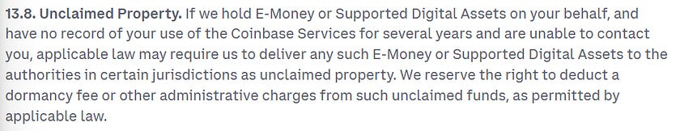
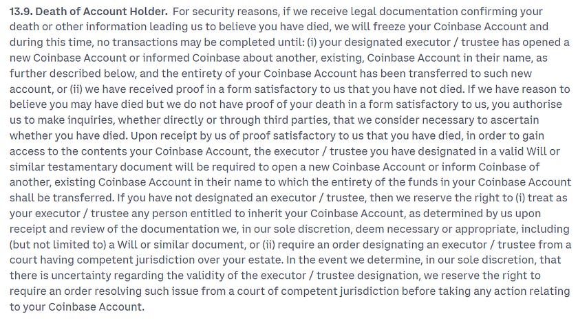
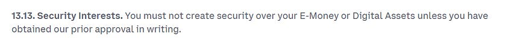
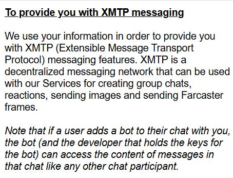

# I Read The Policies So You Don’t Have To: Coinbase (Crypto Exchange)

Coinbase are a global Crypto Exchange.

Holders of in excess of $500 billion in assets, they are a cryptocurrency exchange of choice for over 100m users.

This article consists of a review of Coinbase’s;

* [Global Privacy Policy](https://www.coinbase.com/en-gb/legal/privacy)  
* [User Agreement](https://www.coinbase.com/en-gb/legal/user_agreement/uk)  
* [Prohibited and Conditional Use Policy](https://www.coinbase.com/en-gb/legal/prohibited_use)  
* [Base Account and Base App Privacy Policy](https://wallet.coinbase.com/privacy-policy)  
* [Base Account and Base App Terms of Service](https://wallet.coinbase.com/terms-of-service)  
* [Commerce Privacy Policy](https://www.coinbase.com/en-gb/legal/commerce/privacy-policy)  
* [Cookies Policy](https://www.coinbase.com/en-gb/legal/cookie)  
* [Third Party Cookies](https://www.coinbase.com/en-gb/legal/cookie/third-parties)  
* [Digital Asset Disclosures](https://www.coinbase.com/en-gb/legal/digital-asset-disclosures)  
* [Third Party Identity Verification Service Vendors](https://www.coinbase.com/en-gb/legal/privacy/third-party-verification-vendors)

# WHAT INFORMATION IS COLLECTED BY COINBASE

Coinbase collects the following information, which is either provided to them by the user, is collected automatically, or obtained from Affiliates and third parties.

Information provided by the user;

* Name  
* Address  
* Date of Birth  
* Nationality  
* Country of Residence  
* Gender  
* Phone number  
* Email address  
* Utility Bills  
* Photographs and/or videos of Government issued ID/doc(s)  
* Social Security Number (or other national equivalent)  
* Tax ID (for every tax residency if more than one)  
* The jurisdictions of tax residence(s)  
* Employment information (company name, job title, salary info)  
* Proof of residency (including visa information)  
* Spouse name  
* Spouse Tax ID  
* Biometric information generated based on photos or videos user provides  
* Bank account number  
* Payment card primary account number (PAN)  
* Trading and investment experience  
* Income/net assets/wealth verification statements  
* Country residency information  
* Wallet address(s)  
* Transaction information (sender, recipient, amount, currency, payment method, date, timestamp).  
* Survey responses  
* Customer service call recordings to Coinbase

Information collected automatically;

* IP address  
* Operating system of device  
* Device identifiers  
* Plugins  
* Network device is connected to  
* Browser  
* What the user views  
* What the user clicks  
* Diagnostic and performance information (including timestamps, crash data, website performance logs)  
* KYC Status  
* XMTP Messaging information

Information obtained from Affiliates and third parties (Coinbase companies, public databases, Blockchain data, information from marketing & advertising partners, information from analytic providers, retail merchant information or in app information);

* Coinbase group of company transaction information  
* Product usage  
* Public employment profile  
* Listings on any sanctions lists  
* *“Other data as necessary”*  
* Blockchain transaction info (timestamps, ID’s, digital signatures, amounts, wallet addresses)  
* Marketing content the user has viewed  
* Actions taken on and off Coinbase sites and apps  
* Age group  
* If using Coinbase to conduct a transaction with third party merchant, retailer provides details of the transaction to Coinbase  
* Survey responses

Public Databases include (not exhaustive list);

* United Nations Sanctions List  
* US ITA Consolidated Screening List  
* SEC EDGAR

# DATA RETENTION

*“We retain your information as needed to provide our Services, comply with legal obligations, or protect our or others’ interests”*

Coinbase *“may keep pseudonymised personal information (information with identifying details removed or replaced) and your user ID to help us understand usage patterns and improve our services”*

Biometric information is retained *“for the period required for financial regulatory compliance or otherwise as required by applicable law”*

Information shared with electronic identity verification service providers, or any other, retain the information for as long as set out in their retrospective individual privacy policies.

# WHAT IS DISCLOSED AND WITH WHO

To conduct Identity Verification checks, user data is shared with;

* Jumio  
* Onfido  
* Au10tix  
* Shufti  
* Refinitiv  
* Unico (Brazil users)  
* Persona

User data is also shared with (where required);

* Affiliates within the Coinbase group of companies  
* Linked third party websites  
* Travel Rule Universal Solution Technology (TRUST)  
* Professional advisors  
* Industry partners  
* Authorities  
* Regulators  
* Third party service providers (such as Meta, AppLovin and others)  
* Hosting providers  
* Payment vendors  
* Analytics providers  
* Document repository service providers  
* Customer support vendors  
* Digital asset advocacy groups (*“like Stand With Crypto”*)  
* Marketing & promotions providers  
* Tax Reporting vendors  
* Derivatives service providers

User data may also be disclosed in the instance of a Coinbase group asset transfer or acquisition.

# TERMS OF SERVICE

Nothing in here that jumps out, standard clauses for financial products and e-money.

If you’re using Coinbase in good faith with funds you can prove the origin of, you should have no concerns.

A few points to be mindful of;

# COOKIES

Coinbase doesn’t disclose their first party cookies, but they do disclose their third party cookies, which you can [view here](https://www.coinbase.com/en-gb/legal/cookie/third-parties).

# ADDITIONAL CONSIDERATIONS

