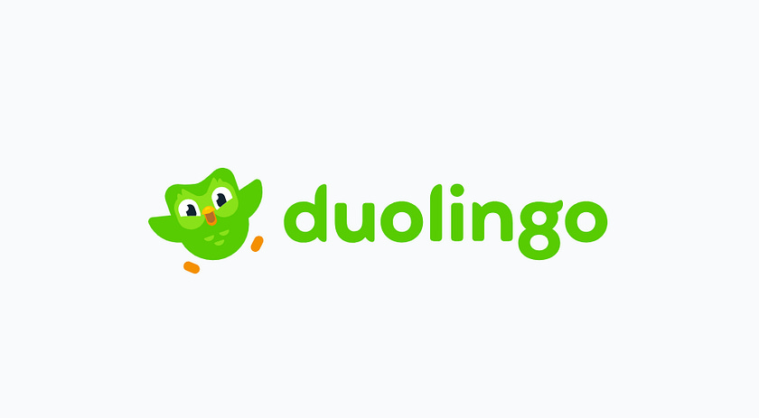

Duolingo describe themselves as a learning platform, they provide learning apps and a language certification. They’ve been around for a while now having formed back in 2011, since going through multiple seed rounds with some key investors over the years being various recognisable VC funds, and arms of Google and Alphabet.

NASDAQ floated from July 2021, with a current market cap of circa $5b USD, a reported 56.5m daily active users, with a goal of 100m daily active users.

Duolingo appear to have embraced the move to being an AI led company from early 2024\.

Fun fact: one of the dudes behind Duolingo, is one of the dudes who was reCAPTCHA before they sold to Google.

This article consists of a review of Duolingo’s;

* [Terms and Conditions of Service](https://www.duolingo.com/terms)  
* [Privacy Policy](https://www.duolingo.com/privacy)  
* [Supplemental Privacy Terms for the Duolingo English Test](https://englishtest.duolingo.com/privacy)  
* [Supplemental Terms & Conditions for the Duolingo English Test](https://englishtest.duolingo.com/terms_of_service)  
* [Cookies List](https://www.duolingo.com/cookies)  
* [Duolingo English Test: Security and Score Integrity (Duolingo Research Paper)](https://duolingo-papers.s3.us-east-1.amazonaws.com/reports/DET_Security_Report.pdf?ref=blog.englishtest.duolingo.com)  
* [The Duolingo English Test Responsible AI Standards (Duolingo Research Paper)](https://duolingo-papers.s3.us-east-1.amazonaws.com/other/Duolingo+English+Test+Responsible+AI.pdf)

# WHAT INFORMATION IS COLLECTED BY DUOLINGO

Duolingo’s core privacy policy applies to Duolingo websites, mobile apps and related services (including Duolingo for Business). For users of those products Duolingo collects;

* Username  
* Age  
* Email address  
* Phone number (not all countries)  
* Comments  
* Likes  
* Reactions  
* Celebrations  
* Video Call Content  
* Text submitted  
* Audio submitted  
* Where phone contacts are synced; phone number, name, photo of all contacts, notes.  
* Users native language  
* Browser  
* Log data  
* IP address  
* Data regarding the users engagement and activities on the Service.  
* Payment transaction information (name, billing address, payment information)

In addition to the above data, when a user uses Duolingo in their app or website, their activity is logged by services called;

* FullStory  
* Session Replay

FullStory and Session Replay capture, analyse and provide Duolingo with;

* Clicks  
* Mouse movements  
* Scrolling  
* Typing  
* Browser  
* Device type  
* Operating system  
* Viewfinder size  
* Script errors  
* IP address  
* Pages visited  
* Referrers  
* URL parameters  
* Session duration  
* Learning activity (e.g. session progress, answers etc).

Information in relation to Child accounts (users under the age of 13\) is collected as follows;

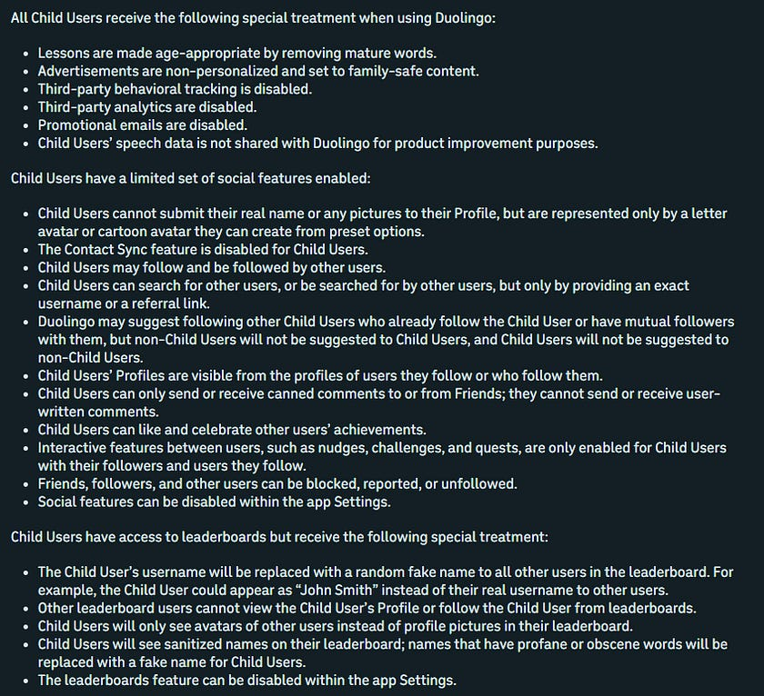

[Duolingo English Test (DET)](https://englishtest.duolingo.com/) takers are governed by an \*additional Privacy Policy and Terms, in addition to the standard Terms & Privacy Policy.

If a user takes the DET, Duolingo collect (in addition to the information collected as stated above under the standard privacy policy);

* Name  
* Email address (or parents email address)  
* Age  
* Date of Birth  
* Native language  
* Secondary school  
* Photograph of current valid drivers licence, passport, or other government-issued ID  
* Photograph of the users face  
* Access to computer/laptop webcam and microphone  
* Video, audio and screen recording during test session  
* Keystrokes and mouse clicks  
* Typing patterns  
* Voice print  
* Face geometry  
* What applications and processes are running on the users computer  
* What peripherals (external devices are attached to the users computer)  
* Network usage statistics  
* Volume of network traffic  
* Device fingerprint

To undertake the DET, all Duolingo English Test taking users are required to download a piece of software which is in effect a form of legal RAT to their PC or Laptop, which is used to monitor and to some extent control the users activity during the test period to ensure the users identity is accurate and that test conditions are met (no cheating etc). This isn’t necessarily unusual for a remote testing under exam conditions, but Duolingo aren’t overly transparent about what that software does on a technical level, nor do they appear to make recommendations that the software is removed/uninstalled post exam.

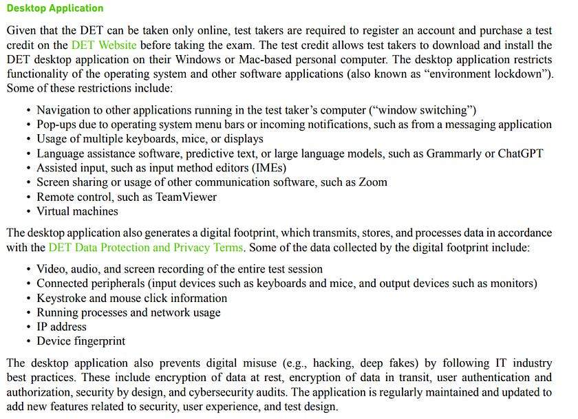

The software is behind a paywall, requiring registered users to first purchase the Duolingo English Test ($49 USD), then a link to download the monitoring software is provided to the user.

Some additional information relating to that can be found [here](https://testcenter.zendesk.com/hc/en-us/articles/360048119332-How-do-I-install-the-Duolingo-English-Test-desktop-app), [here](https://englishtest.duolingo.com/mdownload) and [here](https://englishtest.duolingo.com/download).

The DET is “trusted by 6,000+ institutions worldwide”, with internet [reporting of 700,000 users having taken the DET in 2024](https://goarno.io/blog/how-many-people-take-the-duolingo-english-test/).

Duolingo’s own [2026 Q1 financial shareholder letter](https://investors.duolingo.com/static-files/aab30d54-eb91-422e-b365-c03859fea85c) suggests however that revenue from DET is significantly lower than internet article (and possible PR motivated) speculation.

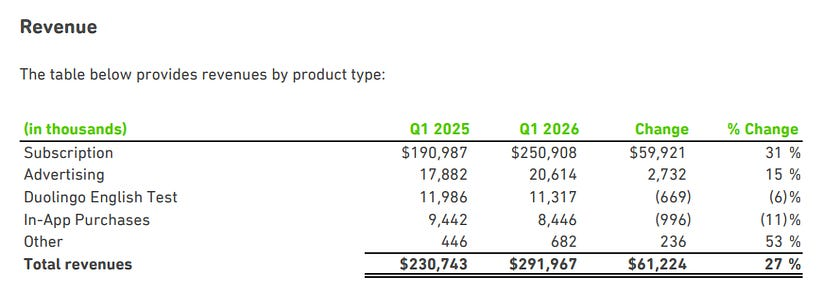

You can [view the institutions which accept the DET here](https://englishtest.duolingo.com/test_takers/accepting_institutions). Some of the institutions which accept the DET are very fancy.

I intend to take a closer look at the binaries of the DET software, Duolingo make a lot of statements in their policies of things the DET apparently doesn’t do which contradict slightly with the purpose of such a piece software existing and being applied in this case use, I would like to confirm their statements are indeed accurate from a privacy perspective.

# DATA RETENTION

Where users interact with Video Call or other AI enabled features, Duolingo may generate, record, and store audio recordings or transcripts of the text and audio the user submits, and use those recordings or transcripts for product improvement, and personalisation purposes including training and running Duolingo’s own artificial intelligence models.

IP address is retained for no more than thirty (30) days (unless circumstances require it to be retained for longer, i.e. payment processing, fraud prevention).

They state *“Duolingo will generally retain your personal information until your account is deleted. However Duolingo may retain certain information longer if necessary to provide our Service, defend our legitimate interests or those of third parties, comply with legal requirements, resolve or defend ourselves in disputes, investigate misuse or disruption of the Service, or perform agreements. We may also retain anonymous data indefinitely”*

DET test results and DET data is deleted from Users accounts after seven (7) years from the date of the completed test.

*“Notwithstanding the above, Duolingo may keep anonymized, pseudonymized, de-identified, or aggregated DET Data and Test Results, as well as your Testing Video, indefinitely”*

# WHAT IS DISCLOSED AND WITH WHO

By default, a users Profile is public and visible to other Duolingo users and anyone else on the Internet. If a profile is public, third-party websites or web scrapers may be able to read, collect and use the public information for their own purposes. Users can set their profile to private in Settings.

Duolingo may share users Public Profile Information with a third-party content moderation service provider to ensure compliance with their Community Guidelines.

Duolingo uses Artificial Intelligence (AI) to help create lessons, matches, and other content within the app, based on users’ learning activity

Duolingo may offer a Video Call feature where the user can have an AI-powered spoken conversation with a Duolingo character to practice the language they are learning. Duolingo may also offer other AI-powered features that allow the user to send text or audio messages to AI chat companions in a conversational format.

When users interact with Video Call or other AI-enabled features, the text and audio they submit may be shared with AI vendors;

* Open AI  
* Google

Duolingo states it has agreements with these AI vendors which mean *“they are not permitted to use any **personal information** for their own purposes”*.

Duolingo may offer a Video Math Tutor feature (an AI powered spoken conversation), when engaged with by the user, the audio may be shared only with Apple.

Additionally, Duolingo state that *“audio may be sent to a third-party provider”* such as;

* Google  
* Apple  
* Amazon Web Services

They advise users within the Privacy Privacy policy not to submit any personal, sensitive, or confidential information when using Video Call, Audio recording or other AI features.

Under Section 2(d) of the Privacy Policy they state *“We will not use your audio recordings to develop any voice cloning technology”.*

When a user uses Duolingo in their app or website, activity is logged by services called;

* FullStory  
* Session Replay

Anonymised information may be shared with Google Analytics.

With regard to DET Users, Duolingo state that answers given during the exam may be shared with AI vendors, but that Duolingo’s agreements with AI vendors prohibit those vendors from using the answers to train their own AI models. Duolingo retain that information *“as long as needed, but no more than three (3) years”*

DET users are ID verified by [SumSub](https://sumsub.com/), this involves sharing users ID and biometric information with SumSub in addition to other DET test data. They state *“SumSub may extract biometric signals from this data, including your face geometry”.* SumSub retain that data for *“as long as needed, but no more than three (3) years”*

Where a user applies a DET coupon code from a third party, the user agrees that Duolingo may share data with the code provider.

Where data is shared, the shared data becomes subject to the privacy policy of the company it is shared with (and to any privacy policies of companies they in turn share with in order to provide their services).

# STANDARD TERMS OF SERVICE

Users of the service *“warrant that you have created or own any material you submit via the Service (including Activity Materials and Content) and that you have the right, as applicable, to grant us a licence to use that material…”*

*“As a condition of submitting any ratings, reviews, information, data, text, photographs, audio clips, audiovisual works, translations, flashcards, or other materials on the Service, you hereby grant to Duolingo a full-paid, royalty free, perpetual, irrevocable, worldwide, nonexclusive, transferrable and sublicensable licence to use, reproduce, copy, adapt, modify, merge, distribute, publicly display, and create derivative works from the Content; incorporate the Content into other works, and sublicence through multiple tiers the Content”.*

*“You acknowledge that this licence cannot be terminated by you once your Content is submitted to the Service”*

If a user receives a promotion code (from anyone), the user understands and agrees that Duolingo may share data relating to the use of the Promotion Code with the Code Provider, including both anonymised, aggregate and individual usage data (including employers who offer Duolingo as a benefit, or a product which offers a subscription as a bonus/referral/gift etc).

Copyright owners can submit copyright infringement notifications to Duolingo

# DUOLINGO ENGLISH TEST (DET) TERMS OF SERVICE

In addition to the above terms, DET users are subject to additional terms.

Inclusive of mandatory arbitration of disputes provision that requires the use of arbitration on an individual basis rather than jury trial or class action suit.

Appeals of invalid or invalidated results must be submitted within 72 hours.

Test results are valid for two years.

No refunds, all payments are non-refundable.

Where a user applies a DET coupon code from a third party, the user agrees that Duolingo may share the users data with the code provider.

Duolingo owns all rights to any samples (including audio or video recordings) taken during the DET, subject to DET privacy terms, Duolingo may use the Test Taker Content for any purpose.

# COOKIES

Duolingo use the following [Cookies](https://www.duolingo.com/cookies);

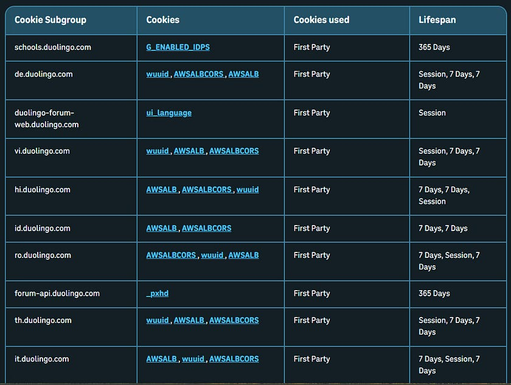

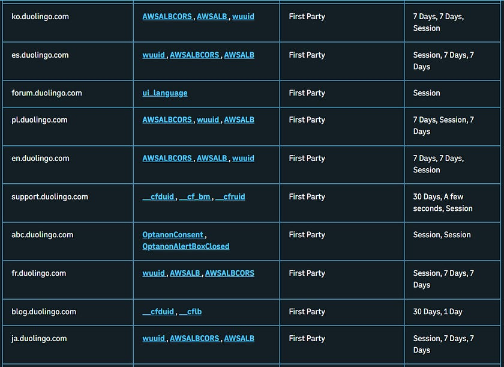

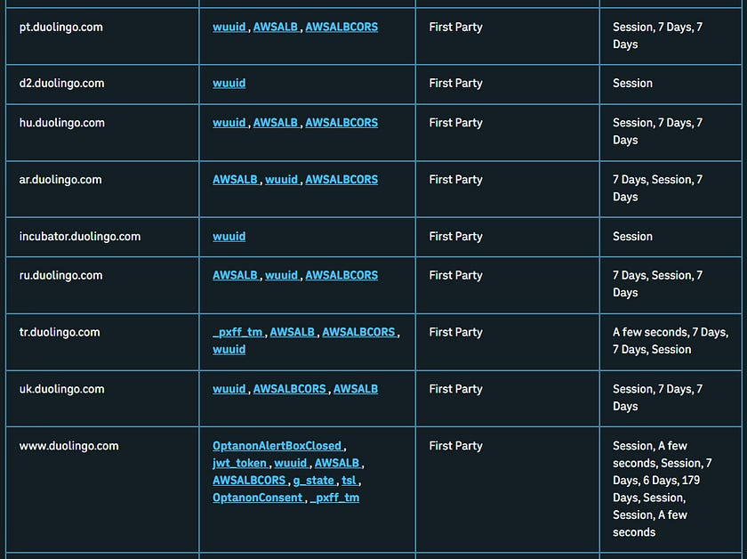

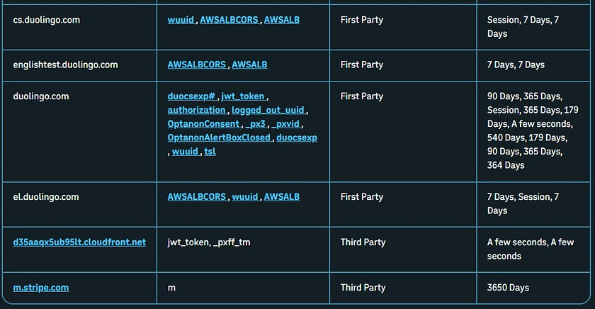

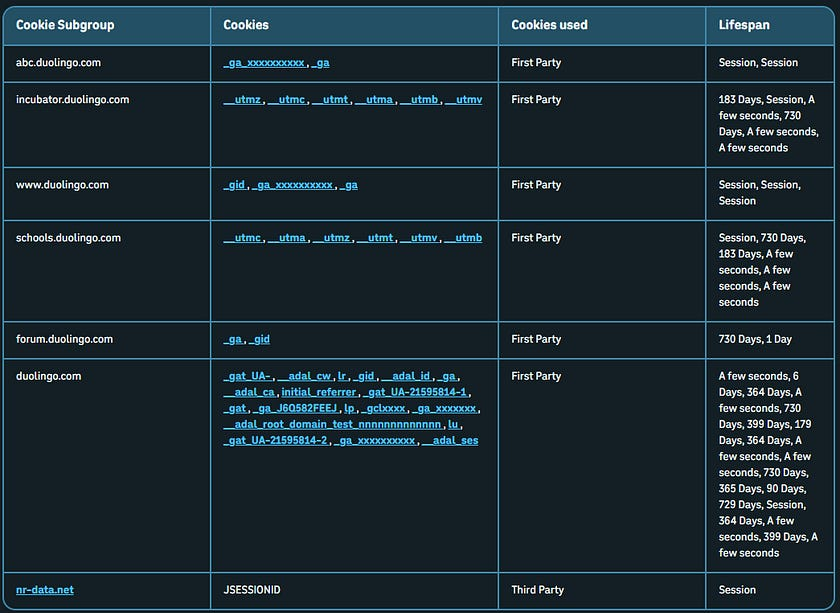

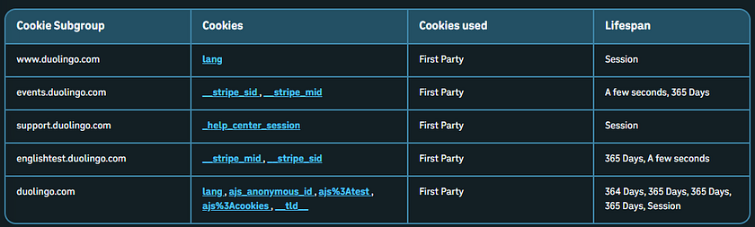

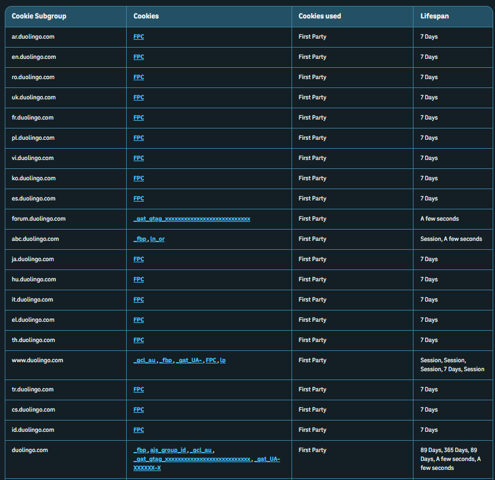

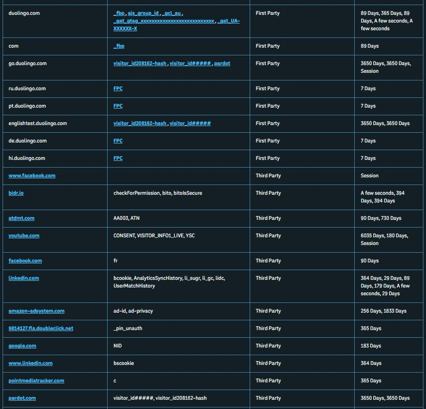

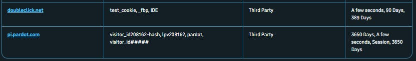

They state *“Please note that our cookies include Targeting Cookies from Google, Meta, Amazon and other companies…”.*

# ADDITIONAL THINGS TO NOTE

If a user logs in using a social login, Duolingo may receive information about you from your social login provider including email and contacts.

The Service is not designed to respond to ‘do not track’ signals sent by some browsers.  
