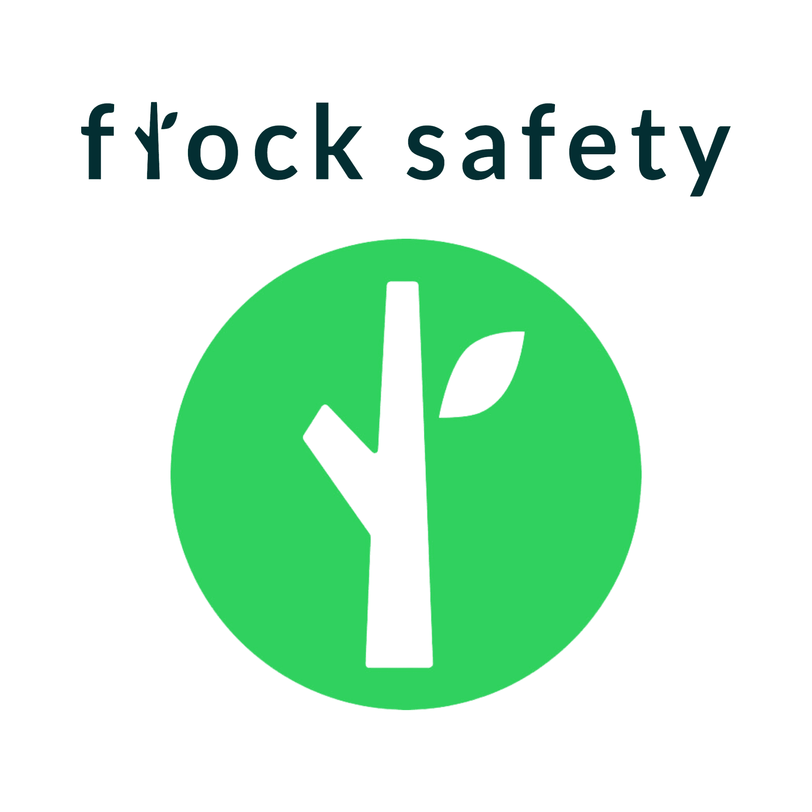
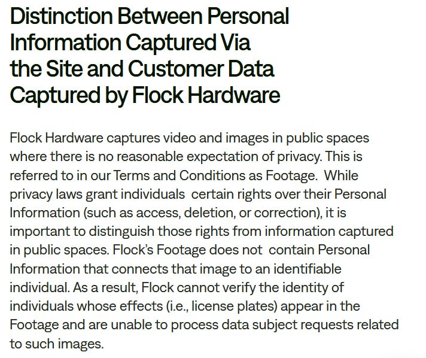
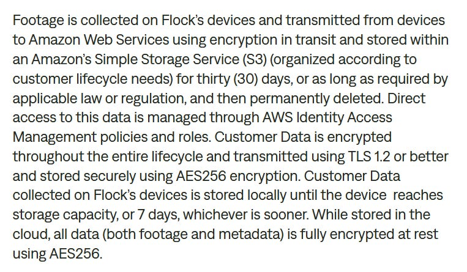

The Flock business model is interesting. Public sector organisations, businesses and residential spaces (HOA’s) pay to install camera’s which comes with access to software for the duration of their working agreement with Flock, to review the data collected through the camera, amongst some other functionalities.

Within the settings of each customer is a tick box, whereby customers can choose to share the data collected through the equipment they have paid to install with other customers within the Flock network in the name of wider safety, or they can reportedly keep their data private within their network/account (however this does not over rule the licence the customer grants to Flock to use the data they collect to provide services).

Given many of Flocks customers are installing cameras in the name of safety, it is highly likely the majority of them are ok with sharing data to help reduce crime.

Flock offer a number of other software products where data collected through the active sharing permissions of individual customers is used to provide such services, many of which are aimed at law enforcement.

All legal requests for data from Government, law enforcement and private customers to be used as evidence is requested from Flock through Kodex, Flock state all requests for evidence are reviewed by their internal legal department as they are received.

Flock appear to want to be the dominant player in the public safety as a service realm.

Attaining $300m in ARR in 2025 and a $7.5 billion valuation following their most recent funding round, they are on their way to being just that.

This article consists of a review of Flocks;

* [Privacy Policy](https://www.flocksafety.com/legal/privacy-policy)  
* [Licence Plate Reader Policy](https://www.flocksafety.com/legal/lpr-policy)  
* [API and Integration Terms](https://www.flocksafety.com/legal/api-integration-terms)  
* [Flock Evidence Policy](https://www.flocksafety.com/legal/flock-evidence-policy)  
* [Trademark Notice](https://www.flocksafety.com/legal/trademark-notice)  
* [Terms and Conditions](https://www.flocksafety.com/legal/terms-and-conditions)  
* [State-Specific Contractual Provisions](https://www.flocksafety.com/legal/state-required-provisions)  
* [Developer Hub (API docs)](https://docs.flocksafety.com/?_gl=1*z40aqe*_gcl_au*NDA5MzE4NjkyLjE3ODA1NjUzOTE.*_ga*MTcyMzEwNjEwNS4xNzgwNTY1Mzkx*_ga_920D26WZNB*czE3ODA1ODkxMjAkbzMkZzEkdDE3ODA1OTEzODgkajE4JGwwJGgwJGRDNE1MVGNUazZ0V2hjSEFPdVEyUzZIYklReXZSLXZ2NHRB)  
* [Security Centre](https://security.flocksafety.com/)  
* [Vendor Information Security Addendum](https://www.flocksafety.com/legal/vendor-infosec-addendum)  
* [Partners and Integrations](https://www.flocksafety.com/partner-program)  
* [Frequently Asked Questions](https://www.flocksafety.com/faq)

# WHAT INFORMATION IS COLLECTED BY FLOCK

In their Privacy Policy, Flock define Personal Information as *“information which can be used to identify you, directly or indirectly, alone or together with other information”.*

That definition matches near enough the very established legal definition of what Personal Information is in nearly all local jurisdictions.

Only a little bit lower down in their privacy policy however, Flock go on to state;

Frankly, that is some bs. Legal definitions are what matter, and Flock's interpretation of what it deems to be Personal Information is not consistent with the legal precedents which are already well established of what Personal Information is.

Flock collects the following customer data in relation to customer accounts;

* Full name  
* Contact information  
* Email address  
* Mailing address  
* Phone number  
* Device ID’s (of Flock Device \+ devices the customer signs into web app from)  
* *“Certain cookie and network identifiers”*  
* *“Any content captured by our products that may be used to identify an individual”*   
* Flock device(s) name  
* Geolocation of Flock device(s)  
* Flock device temperature  
* Flock device ambient light levels  
* *“images, video, and/or audio recordings from your device for the duration of your designated retention period”*  
* Device software version  
* Device signal strength  
* IP address

Licence Plate Reader (LPR) systems collects the following data;

* Licence plate image  
* Vehicle image  
* Vehicle characteristics (e.g. colour, make)  
* Licence plate number  
* Licence plate state  
* Date  
* Time  
* Camera location

Flock state their ALPR does not identify drivers or passengers and does not use facial recognition. They also state that Flock ALPR does not collect or infer race, religion, gender, ethnicity or other personal traits, however, they do partner with selected organisations through various integrations, some of the services offered by the available integration partners may have the functionality to use Flock Data to analyse images captured by Flock Hardware.

# DATA RETENTION

Data collected by Flock devices is provided to customers, they have access to that data through the Flock Services during their subscription in accordance with the customers agreed retention period.

Customers must download data before the retention period ends (thirty (30) days as standard unless otherwise agreed) as they are no longer available within the Flock Services thereafter.

Flock retain Personal Information for as long as needed for the specific purpose in which it was collected, or as required by applicable law or regulation.

They do not provide any further information than this in regard to their data retention, noting that people are welcome to contact privacy@flocksafety.com to enquire how long a certain data set is retained should they like.

# WHAT IS DISCLOSED AND WITH WHO

Flock state that a small fraction (less than 1%) of images captured by Flock Services (which are stripped of all metadata and identifying information) are used as training data for their machine learning model.

Data collected by Flock Hardware is owned by the Customer and only shared as directed by the customer. Each customer has at least one or more administrator, customer data is accessible to the administrator(s) and any authorised end users within the customer account.

To provide customer support and address system issues, Flock has designated CJIS-certified engineers who are able to access CJIS data and other designated individuals who are able to access other system data.

Any licence plate data that may be searched by authorised law enforcement requires that person to provide a justification for the search which is included in audit trails. When a search query is made the following information about the query is logged for auditing purposes (customers do their own auditing, flock does not audit customers);

* Username of requestor  
* Date of query  
* Time of query  
* Purpose of query (justification)  
* License plate and other elements used to query the system

They state they *“may share Personal Data with both affiliated and unaffiliated third-parties acting as sub-processors, such as IT infrastructure providers, cloud storage vendors, or analytics services”.*

Flock offers its customers a number of integration partners, which they name as;

* Tacti Track GPS  
* AWS  
* Tyler Technologies  
* TEI Innovations  
* Starchase  
* CodeFour  
* 3Si  
* ATS (All Traffic Solutions)  
* Wanco  
* Vumacam (South Africa)  
* Blue Eye  
* Resilient (Puerto Rico)  
* LTT Partners  
* Sensys Gatso  
* Blue Line  
* Altumint  
* Axon Fleet 3  
* Redspeed  
* Alabama Power  
* Genetec  
* Ubicquia  
* Halos  
* Getac  
* ESRI  
* Cradle Point  
* Motorola (Avigilon)  
* Mark 43  
* Prepared911  
* SunRidge  
* Central Square  
* FirstTwo  
* Axon ([Evidence.com](http://Evidence.com))  
* 10–8 Systems (coming soon)  
* Ensurity  
* Motorola (Command Central Aware)  
* CRG  
* SaferMobility  
* ForceMetrics

They state the following regarding encryption of data;

# TERMS OF SERVICE

They’re contradicting.

On one hand they state that data captured by “Flock Hardware” is “Flock Property”, and that apart from the limited ability (within thirty (30) days of data capture) for customers to download Customer Data, *“no rights are granted to download, extract, export or otherwise create or retain copies of such elements of Flock Property”*

On the other hand they state that any data collected through Flock Hardware is not their data and is in fact the customers; *“all right, title and interest in and to Customer Data belong to and are retained by Customer. Customer hereby grants Flock a limited, non-exclusive, royalty free, irrevocable, perpetual worldwide licence to…”* do pretty much what they want.

So which is it?

Other notable aspect of the Terms and Conditions are;

* Flock lead on the deployment plan once a purchase order is received for Flock Hardware, advising customers on the location and positioning of the Flock Hardware for optimal product functionality, Flock has final discretion to veto on locations.  
* Customers are charged fee(s) to replace any Flock Hardware which are lost, damaged or stolen.  
* Flock cannot and will not contemplate hazardous materials. In the event that any such hazardous materials (including without limit; asbestos, lead or toxic flammable substances), Flock have the right to cease work immediately.  
* Any legal cases against Flock must be lodged within the State of Georgia under which its laws Flock are governed.  
* *“The parties agree that the United Nations Convention for the International Sale of Goods is excluded in its entirety from this Agreement”* \-, that is a clause you don’t see everyday in someone’s Terms and Conditions.  
* Cyber Insurance with a cap of $5m per claim.

# COOKIES

Flock do not have a Cookies Policy, there is a section within their core Privacy Policy dedicated to Cookies where they outline the types of cookies (Strictly necessary, Performance, Targeting, Functional) but provide no details further than this.

# OTHER CONSIDERATIONS

There is a rumour circulating in particular circles online that Flock cameras collect various information and data.

According to the policy documents Flock cameras as a standalone product do not collect more than stated further above, they do not have facial recognition, however, they do offer a number of integrations with partners \- it is the partners technology which can offer the Flock Customer additional functionalities beyond number plate recognition within the collected images, video, audio etc.

Flock complies with the EU-U.S. Data Privacy Framework. You can [view their security certifications and details regarding their compliance here](https://security.flocksafety.com/). They include;

* CJS  
* ISO 27001  
* ISO 27027  
* ISO 27018  
* ISO 27701  
* ISO 42001  
* NDAA  
* SOC 2 Type 2  
* TX-RAMP Level 2  
* VPAT

Customers of Flock are responsible for ensuring their use of Flock Services or Flock Hardware is compliant with local data protection and privacy laws, they make no claim of being compliant with such laws, accept no liability, and state that *“recording and sharing content involving other people may affect their privacy and/or data protection rights”*

Flock requires its Hardware to be installed in locations which are in accordance with constitutional rights, meaning, they cannot be placed in a location where there is a reasonable expectation of privacy.

One does not have to be a Flock customer to make a request for evidence, however they note that customer data belongs to their customers, but they have a limited licence to access the data to provide services.

