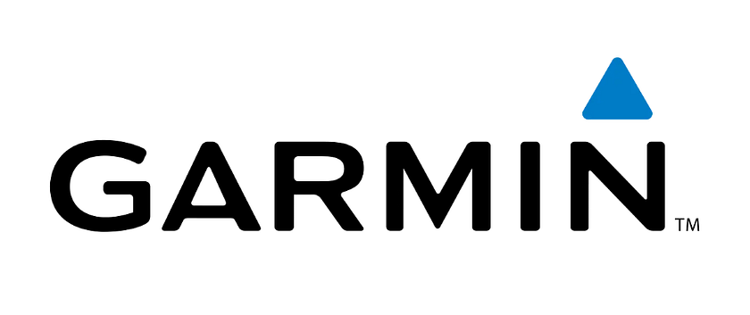

# I Read The Policies So You Don’t Have To: Garmin (Smartwatches, GPS Products)

Garmin are a case study example of a company that have adapted with the times to stay relevant.

An American company founded in 1989 as in-car navigation devices, with its corporate HQ registered in Switzerland since 2010 for reasons, no one can say they haven’t taken the opportunities spotted in the consumer market. With a reported revenue of $7.25 billion in 2025, multiple product lines across many industries including maritime and aviation, with a present emphasis on wearable tech to accommodate the booming general consumer health and fitness market, global reach, shipping hundreds of millions of products each year worldwide.

This article consists of a review of Garmin’s;

* [Privacy Policy](https://www.garmin.com/en-GB/privacy/global/policy/)  
* [California Privacy Notice](https://www.garmin.com/en-GB/privacy/ccpa/policy/)  
* [Terms of Use](https://www.garmin.com/en-GB/legal/terms-of-use/) (website)  
* [End User Licence Agreement](https://static.garmin.com/shared/emea/custom/HERE_EULA/British_English/HERE.htm) (products)  
* [Outdoor & Recreation Services, Apps and Websites Privacy Policy](https://www.garmin.com/en-GB/privacy/outdoor/policy/)  
* [Garmin Connect, Garmin Apps For Spot & Fitness & Compatible Garmin Devices Privacy Policy](https://www.garmin.com/en-GB/privacy/connect/policy/)  
* [Garmin Jr App Privacy Policy](https://www.garmin.com/en-GB/privacy/garminjr/policy/)  
* [Marine Applications and Websites Privacy Policy](https://www.garmin.com/en-GB/privacy/marine/policy/)  
* [Garmin Aviation Privacy Policy](https://www.garmin.com/en-GB/privacy/aviation/policy/)  
* [Garmin Response Privacy Policy](https://www.garmin.com/en-GB/privacy/response/policy/)  
* [Consumer Automotive Applications Privacy Policy](https://www.garmin.com/en-GB/privacy/consumerauto/policy/)  
* [Clipboard Coaching App Privacy Policy](https://www.garmin.com/en-GB/privacy/clipboard/policy/)  
* [Garmin Sports Privacy Policy](https://www.garmin.com/en-GB/privacy/sports/policy/)  
* [Garmin Pay Privacy Notice](https://www.garmin.com/en-GB/privacy/garminpay/policy/)  
* [Garmin Golf App Privacy Policy](https://www.garmin.com/en-GB/privacy/golf/policy/)  
* [Garmin Dive Mobile Application Privacy Policy](https://www.garmin.com/en-GB/privacy/dive/policy/)  
* [Garmin Connect IQ Privacy Policy](https://www.garmin.com/en-GB/privacy/connectiq/policy/)  
* [FLTPlan Privacy Policy](https://www.garmin.com/en-GB/privacy/fltplan/policy/)  
* [Garmin Data Privacy Framework Notice](https://www.garmin.com/en-GB/privacy/dpf/)  
* [Aerodata Privacy Policy](https://www.garmin.com/en-GB/privacy/dpf/)  
* [Garmin Marathon Series Privacy Policy](https://www.garmin.com/en-US/privacy/marathon/policy/)  
* [Active Intelligence \- AI Transparency Statement](https://www.garmin.com/en-GB/legal/ai-transparency-statement/)  
* [Garmin Group of Companies](https://www.garmin.com/en-GB/legal/garmin-companies/)  
* [Cookies Policy](https://www.garmin.com/en-GB/privacy/cookies/policy/)

Other services offered by Garmin are subject to **additional** policies to the core policy.

# WHAT INFORMATION IS COLLECTED BY GARMIN

The data Garmin collects varies only slightly between products. If using a Garmin product, it would be best to work on the basis that if the device has the functionality to collect a data point, unless deactivated/restricted in the device and/or account settings (where possible), it will collect that data point.

Garmin state they collect;

* Name  
* Email address  
* Phone number  
* Date of birth  
* Password  
* Unique Personal Identifier  
* Online Identifier  
* Gender  
* Height  
* Weight  
* Steps taken  
* Distance  
* Pace  
* Calories burned  
* Heart rate  
* Sleep data  
* Menstrual cycle information  
* Hydration levels  
* Bed and wake times  
* Music played  
* IP address (when syncing)  
* Sync date and time  
* Crash/diagnostic logs (including creating logs)  
* Geographic location of the device  
* *“information about the network used to sync”*  
* Device battery level  
* Stress score  
* Body battery  
* Pulse oximetry  
* ECG  
* Respiration rate  
* Breathing variations  
* Skin temperature  
* Serial numbers of the Garmin product(s)  
* Date of purchase/acquisition  
* Billing address (if purchasing direct or a subscription)  
* Postal address (if ordering a direct)  
* Content the user contributes to their account (including photos, comments, reviews, fitness logs etc)  
* Interactions with an internet website, application or advertisement  
* Any audio, electronic, visual or similar information (where using a Garmin device to record or transmit audio or video content)  
* *“Inferences drawn from any other categories of personal information reflecting the consumer’s preferences, characteristics, psychological trends, predispositions, behaviour, attitudes, intelligence, abilities and aptitudes”.*  
* The contents of messages (if sent via Garmin services)  
* Device sensor data  
* Social media information (where user syncs their social media account to device(s))  
* Where connected, data from MyFitnessPal, Strava or TrainingPeaks  
* Any other devices associated with the user’s email address/account  
* Saved waypoints, routes, tracks, markers, vessel photos  
* Tracks, routes, markets  
* ActiveCaptain account information (where applicable)  
* Where a user engages with the Connext satellite services; the phone numbers for text messages and calls made and received, date and time of those activities, duration of calls.  
* Where a user engages with Garmin Pilot; file flight plans, logs etc are submitted to the applicable aviation authorities  
* Citizenship (Garmin response only)  
* Last four digits of payment card and expiration date (if using Garmin Pay)  
* Qualification details (times and events), race results, photos, online identifiers if the user interacts with websites and apps provided by Garmin during an event (Marathon series only)

If using the FltPlan features, Garmin collect;

* Make, model, equipment, tail number, call sign  
* Avionics product information such as; model numbers, system or unit identification numbers, ICAO data (home base, operator name, emergency contacts, airborne contact, satellite phone number)  
* Stored routes, documents, navigation logs, passenger information, pilots, aircraft information  
* GPS positions  
* Flight logs (if generated via Garmin) (passenger names, counties of birth, passport numbers, where applicable)  
* FBO briefings  
* Runway analysis  
* Weight and balance  
* Departure and arrival times  
* User ID

Garmin state that data may be anonymised.

Most, not all Garmin products currently being retailed contain the following sensors;

* GPS  
* GLONASS  
* GALILEO  
* QZSS  
* BEIDOU  
* SATIQ  
* Heart monitor  
* Barometric Altimeter  
* Compass  
* Gyroscope  
* Accelerometer  
* Thermometer  
* Light sensor

It doesn’t outwardly state it in the policies, but any product with voice command functionality will be to some extent on standby waiting for voice commands.

# DATA RETENTION

*“We will retain your personal data as long as your Garmin account is considered to be active or in accordance with applicable law and regulatory obligations”*

# WHAT IS DISCLOSED AND WITH WHO

If using the navigation feature, aggregated data may be shared with third parties to enhance the quality of traffic, parking and other features.

Data may be shared with service providers and third parties in order for Garmin to provide their services, which Garmin name as;

* MoEngage  
* SendGrid  
* Twilio  
* Vonage  
* Ayden  
* 2C2P  
* PayPal  
* Alipay  
* WeChat  
* Tenpay  
* UnionPay  
* Cybersource  
* Loqate  
* Google  
* CDYNE  
* Avalara  
* LogiSense  
* Erply  
* Narvar  
* Global Blue  
* Nedallia  
* Certex  
* Amazon Web Services (AWS)  
* Google Cloud  
* Microsoft Azure  
* Cloudflare  
* Atlassian  
* Flurry  
* Amplitude  
* Alibaba Cloud (Chinese mainland only)  
* every8d (Taiwan only)  
* aligo sms (South Korea only)  
* fpt (Vietnam only)  
* chunghwa (Vietnam only)  
* true corp (Thailand only)  
* Facebook  
* Google Analytics

Garmin state they may also make disclosures of personal data;

* To comply with legal and regulatory obligations e.g. subpoena  
* To investigate fraud or enforce their terms

They may also transfer personal data to;

* Affiliates  
* Subsidiaries  
* Those within the Garmin group of companies ([view here](https://www.garmin.com/en-GB/legal/garmin-companies/))

Additionally, user fitness data is used to train the Garmin Active Intelligence AI model.

Garmin state they do not sell personal data. However they do have agreements with some partners where they provide access to anonymised versions of the data for a fee.

File flight plans, logs etc generated through Garmin Pilot are submitted to the applicable aviation authorities.

If using Garmin Clipboard (coaching) and are invited by a coach, the coach will have access to view the invited users profile information and users health and activity data, there is an opportunity to configure stress and sleep data visibility. Health and activity data may also be available to other team members under the coach, and/or other coaches attached to the club, dependent on their settings.

If a user sets up Garmin Pay on their device, Garmin may provide the users card provider; the identity of the device holder, account information, device(s) wallet.

Where using Garmin Pay to conduct a purchase, at the discretion of the retailer, Garmin may receive confirmation of the purchase.

To provide Garmin Pay services, Garmin will share information with issuing banks, payment networks, card issuers and transit operators where Garmin pay is accepted.

Where using FltPlan, to provide services data is provided to;

* FuelerLinx  
* CST Flight Services (previously Caribbean Sky Tours)  
* FlightBridge  
* LuxSci

# TERMS OF SERVICE

If a user’s account becomes inactive Garmin may delete the account.

The map data embedded in the device is owned by HERE North America LLC (or its affiliates), licensed to Garmin.

*“Garmin also owns, or licenses from third party providers, information, traffic data, text, images, graphics, photographs, audio, video, images and other applications and data that may be embedded in the Device or Application”.*

Garmin products are licensed, not sold. Garmin grants users a limited licence to use the applicable product.

Garmin deems its products to be *“out of service and its useful life”* if the software on a device has not been updated in 24 months, the device may become obsolete if the software is not updated in any 24 month period.

In the instance that a user makes a claim in relation to a faulty or broken product, Garmin may review the account information of the device serial number, including previous communications associated with the account, to detect fraud or abuse.

Children aged over 8 may use Garmin products.

# COOKIES

Garmin uses some third party services to facilitate and manage cookies, naming those as;

* Tealium IQ Tag Management  
* Google Tag Manager (in some regions)  
* TrustArc  
* App Dynamics  
* Loggly  
* New Relic  
* Sentry  
* Rekuten (Australia only)  
* Commission Junction  
* Microsoft Advertising  
* Google Marketing Platform  
* Meta Advertising  
* AdRoll  
* NextRoll  
* YouTube API  
* Bilibili (China only)  
* Touko (China only)

# ADDITIONAL CONSIDERATIONS

The Garmin Active Intelligence AI model was trained with more than 8 trillion tokens of text data from a variety of sources; web documents, code, mathematics and user fitness data.

The Garmin Jr product(s) collect the same data, just some features are restricted and the parent/guardian has eyes on any accounts under them.

Satellite communications via Garmin products are provided by Iridium. Messages made via Garmin products are not encrypted, Garmin can view them.  
