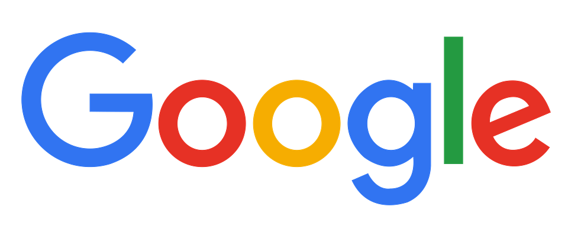
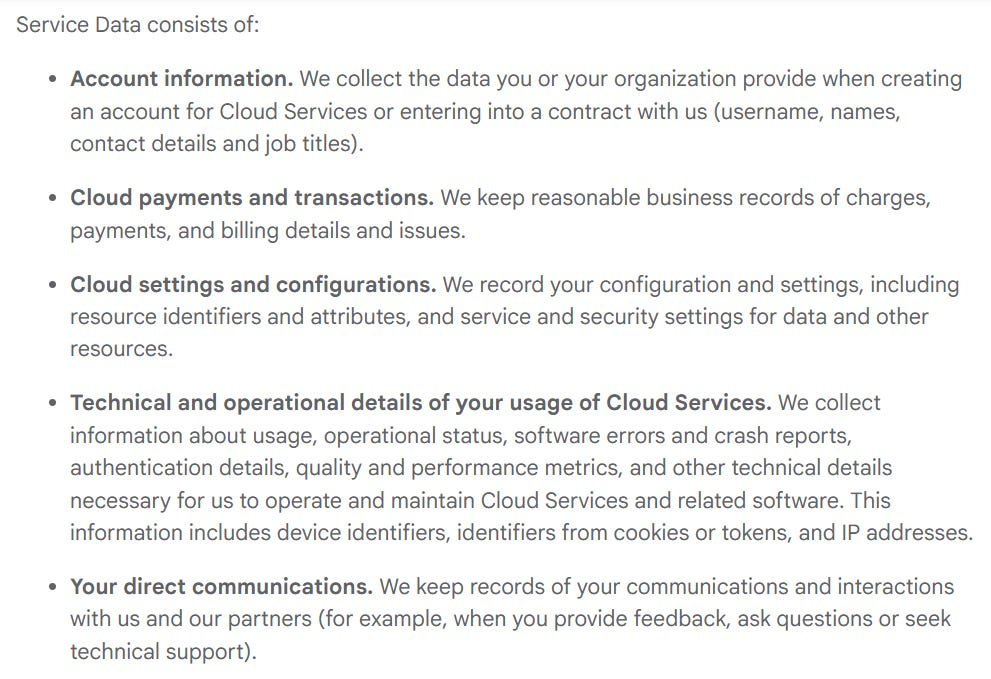
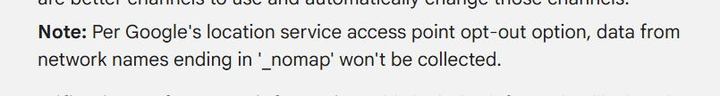

The Don of data collection, the inspirer of many technology and advertising companies which have appeared in the last fifteen years.

Over four billion monthly active users across all products and services, including over 1.8 billion active Gmail accounts, over 3 billion workspace users, more than 1 billion users monthly interacting with Gemini in addition to Chrome being installed on over 5 billion devices globally.

What does that get them?

The 2025 fiscal year for Alphabet (Google's parent company) netted revenue of $402.84 billion, nearly $350 billion of which stemmed from Google \- of which nearly $270 billion was advertising revenue.

This article consists of a review of Google’s;

* [Privacy Policy](https://policies.google.com/privacy)  
* [Gemini Apps Privacy Notice](https://support.google.com/gemini/answer/13594961?hl=en-GB#pn_what_data&pn_data_usage&pn_other_google_services&pn_connected_apps&pn_audio_features&pn_canvas&pn_config_settings&pn_retain_data&pn_remove_export&pn_things_to_know&pn_respect_rights)  
* [Workspace For Education Privacy Notice](https://workspace.google.com/terms/education_privacy/)  
* [YouTube Kids Privacy Notice](https://kids.youtube.com/t/privacynotice)  
* [Cloud Privacy Notice](https://cloud.google.com/terms/cloud-privacy-notice)  
* [Privacy and Terms](https://policies.google.com/privacy/archive/20200701?hl=en&gl=us)  
* [How Google Improves Speech Models](https://support.google.com/assistant/answer/11140942#federated_learning&zippy=)  
* [Privacy with Google Health](https://support.google.com/product-documentation/answer/13532616?hl=en-GB)  
* [Fitbit Privacy Policy](https://support.google.com/product-documentation/answer/13532616?hl=en-GB)  
* [Advertising and Measurement Cookies](https://business.safety.google/adscookies/?hl=en_GB)  
* [Google Home and Next Privacy](https://support.google.com/googlenest/answer/9415830?hl=en-GB&visit_id=639150747486305118-2446149032&p=privacyfaqs&rd=1#expandinfocollection#expanddatausage#expandsharinginfo#expandconnectedhome#expandprotectinginfo#geminiapps#geminiforhomehowtouse#geminiforhomehowtouse#HomeActivity)  
* [Sensors in Google Nest Devices](https://support.google.com/googlenest/answer/9330256?hl=en-GB)  
* [Data Retention Policy](https://policies.google.com/technologies/retention?hl=en-GB&fg=1)  
* [Automatically Linked Services](https://support.google.com/accounts/answer/14202510?hl=en-GB)  
* [Terms of Service](https://policies.google.com/terms)  
* [Chromecast, Google TV Stream, Google Nest & Your Privacy](https://support.google.com/chromecast/answer/9001232)  
* [Nest Wifi and Your Privacy](https://support.google.com/chromecast/answer/6246642)  
* [Connected Home Devices & Services](https://support.google.com/googlenest/answer/9327662?visit_id=639152348605923040-4086727368&p=connected-devices&rd=1)

You can view the products and services which the standard privacy policy and terms apply to [here](https://policies.google.com/terms/service-specific) (it's basically near enough all of them).

# WHAT INFORMATION IS COLLECTED BY GOOGLE

The main Privacy Policy applies to all of Google’s core services; some products have additional supplementary policies.

Under the core Privacy Policy, Google state that they collect the following user data;

* Name  
* Email address  
* Content the user creates, uploads or receives from others (inc emails, photos, videos, docs, spreadsheets, comments, travel itineraries).  
* Advertising ID  
* UUID  
* IMEI number  
* MEID number  
* ESN number  
* Device serial number  
* MAC address  
* Browser type  
* Browser settings  
* Device type  
* Device settings  
* Operating system  
* Mobile network information (including operator name, phone number)  
* IP Address  
* *“System activity”*  
* Referring URL  
* *“If you’re using an android device with Google apps, your device periodically contacts Google servers to provide information about your device and connection to our services”*  
* Network connectivity  
* Performance data  
* Hardware type  
* Product  
* Model  
* Manufacturer  
* CPU types  
* Keyboard, navigation & screen layout types  
* Screen size  
* Total memory  
* Locale  
* Time zone  
* OS build string (aka OS build fingerprint)  
* OS build timestamp  
* SIM subscription data  
* Truncated IMSI with last 5 digits rounded down  
* Apps installed on the users device  
* Battery level  
* How often the user uses the apps  
* Quality and length of network connections  
* Terms searched for  
* Video’s watched  
* Views and interactions with content and ads  
* Voice and audio  
* Purchase activity  
* People the user communicate with  
* Activity on third-party sites and apps which use Google services  
* Browsing history  
* Wi-fi access points  
* Cell towers  
* Nearby Bluetooth enabled devices  
* User activity across Google Services  
* GPS location  
* Sensor data from the users device  
* Signal strength  
* Application data caches  
* Gender  
* Language  
* Biometric information (if the user provides fingerprints etc)  
* Searches and terms  
* Activity on third party sites which user Google services  
* Inferences about the users interests, characteristics, traits.  
* How many reboots and factory resets have been initiated on a device

If using Google services to make and receive calls (in addition to the above standard policy);

* Calling party number  
* Receiving party number  
* Forwarding numbers  
* Sender and recipient email address  
* Time and date of calls and messages  
* Duration of calls  
* Routing information  
* Types and volumes of calls and messages

If using Google Gemini, the following privacy policy collection applies, in addition to the standard policy;

* What the user says to Gemini  
* Content shared with Gemini i.e. files, videos, photos, page content etc.  
* Transcripts and recordings of the users interactions with Gemini Live  
* Prompts  
* The content / outputs Gemini provides to the user  
* Connected apps  
* Apps on the users device  
* If using the Gemini app; call and message logs, contacts, installed apps, language preferences, screen content.  
* Connected smart home devices  
* Playlists

If using Google Workspace for Education, the following applies in addition to the standard privacy policy (whereby a Google account is created and managed by a school for use by students and educators);

* Anything submitted, stored, sent or received through the services  
* Users secondary email address (phone number and address)  
* Professional, employment and education information

**YouTube Kids** is also governed by an additional privacy notice, within which they state they do not collect personal information such as name, address or contact information from children users, but do collect the remainder of the information in the aforementioned core services privacy policy.

The additional Google Cloud privacy notice applies to; Google Workspace (inc for Education), Cloud, Marketplace, Identity. It applies whether customers are direct or via partners, but only to Service data, not customer data.

They define Service data as:

Fitbit users are subject to the core services privacy policy, in addition to the Google Health policy. Under that policy Google state they collect;

* Height  
* Weight  
* Sex  
* Basal metabolic rate  
* Calorie burn  
* Number of steps taken  
* Distance travelled  
* Calories burned  
* Heart rate  
* Sleep stages  
* Active minutes  
* Manual entries into Google Health app (inc through connected third party apps)  
* Medical records (if uploaded by the user or the user connects their account to their medical provider for syncing (inc lab results, clinical notes, health conditions)  
* Fitbit device ID(s)  
* Any interactions and conversations and related information where the user interacts with the AI features in Google Health  
* Menstrual cycle (if cycle health enabled or data imported through third party connection)  
* Data from third party connected apps (e.g. nutrition information via MyFitnessPal, Kaiser.

If a user utilises any of [these Google Home devices and services](https://support.google.com/googlenest/answer/9327662?visit_id=639152348605923040-4086727368&p=connected-devices&rd=1), where the device has the capability, Google also collect (in addition to the data under the core services Privacy Policy);

* Information about the device using the apps (device name, device type, information about the users home inc address, postcode and where the device is placed).  
* Sensor data (detected motion, ambient light measurements, temperature, humidity, carbon monoxide and smoke levels (including information derived from that data, such as sleep information).  
* *“Audio and video data from devices with cameras and microphones and information derived from that data, such as coughing, snoring, facial recognition information and person, object, sound, motion or activity detection information, all subject to your permissions and settings”*  
* Device usage data including manual device instructions, heating and cooling usage data, device state, settings, features used.  
* Technical data; device make and model, serial number, IP and MAC access, detection of other devices on the users network and nearby access points, hardware and software version, sensor status, log files from connections, HVAC system capabilities.  
* Voice match / print data (biometric)

You can understand more about which Google Nest connected home devices and services collect data by device [here](https://support.google.com/googlenest/answer/9327662?visit_id=639152348605923040-4086727368&p=connected-devices&rd=1) under ‘more about data from your devices and services’.

You can [understand which Google devices have which sensors in them here](https://support.google.com/googlenest/answer/9330256?hl=en-GB).

Users of Google Nest Wifi is not much different in terms of data collection, if you use any of the home based services it is recommended to change network names to end in ‘\_nomap’.

Google state they may also collect information about users from;

* Publicly available sources  
* Trusted partners  
* Directory services  
* Marketing partners  
* Security partners  
* Advertising and research partner  
* Cookies  
* Pixel tags

# DATA RETENTION

Different data is retained for different periods of time.

Users are free to delete their accounts at any time which will delete some data, though significant swathes of data is retained in an anonymised format and that is kept indefinitely for the purposes of; record keeping, security, fraud & abuse prevention, to comply with legal or regulatory requirements or providing services

Google’s data retention policy is vague.

Where a user deletes activity from their account or their entire account, “this process generally takes around two months from the time of deletion” for the data to be actually deleted, which can take longer to remove the data from backups.

*“Our services also use encrypted backup storage as another layer of protection to help recover from potential disasters. Data can remain on these systems for up to six months”*

With regard to Google Gemini;

* Auto delete can be set by the user from 3 months to 18 months, 36 months or indefinite keep.  
* Chats reviewed by human reviewers are not deleted when a user deletes their activity, they are retained for three years.  
* Anonymised or data required to fulfil business obligations is retained for longer, in an undefined manner.

**Google Cloud** service data is retained for up to 180 days, but may be retained for longer where anonymised or required for legal or regulatory reasons (e.g. billing/transaction/purchase information is retained for a minimum of five years.

Transcripts of interactions with any **Gemini** integration (including voice assistant) are retained in a de-identified format, and may be used to train Gemini.

# WHAT IS DISCLOSED AND WITH WHO

Google state they do not share personal information with companies, organisations or individuals outside of Google, except;

* With the users consent  
* With domain administrators (and resellers)  
* For external processing  
* For legal reasons

Google state that customer data and service data collected through Google Workspace for Education is not used for advertising purposes (primary and secondary schools only, this does \*not include universities), but is used to provide and improve services. Admins of Workspace for Education users may have access to limited user data of users under their account.

Under **YouTube Kids**, Google does not allow child accounts to share personal information with third parties or make it publicly available. They state they only disclose information collected from YouTube Kids accounts; with parental/guardian consent, for legal reasons or in good faith belief that it reasonably necessary to; meet laws, regulations, enforce terms, for fraud and abuse prevention, or to protect harm to the rights, property or safety of Google. The tools available to parents/guardians are geared more toward being able to restrict or supervise the content seen by the child user, not restrict the data collection.

Service data collected through Google Cloud is shared;

* When the user procures third-party services  
* With the users consent (the user has consented through the terms of service)  
* With administrators and authorised resellers  
* For external processing  
* For legal reasons

**Google Health (FitBit)** data, if partnering with employers and insurance companies who provide the product/service, certain data is shared with those employer and/or insurance company partners. Health Coach is enabled by default, it is an AI powered feature and all health data is shared with the Health Coach so it can provide suggestions.

User interactions with Gemini for Home are not used to show the user ads, however searches performed via Gemini may be used to show ads (contradictory). Transcripts of accidental activations of Gemini by users are retained to help reduce unintended activations.

# TERMS OF SERVICE

User grants Google a licence which is worldwide, non-exclusive, royalty free and sublicensable by Google, which allows Google to do most things with the content that a user submits or provides to or through the services Google provides.

The licence lasts for as long as the content is protected by intellectual property rights.

*“Don’t rely on the services for medical, legal, financial or other professional advice. Any content regarding those topics is provided for informational purposes only and is not a substitute for advice from a qualified professional”*

# COOKIES

73 Google cookies, not including those of partners, you can view them [here](https://business.safety.google/adscookies/?hl=en_GB).

You can understand a bit about how the cookies work [here](https://policies.google.com/technologies/cookies?hl=en-GB&fg=1&hl=en_GB#types-of-cookies).

# OTHER CONSIDERATIONS

Users are not shown ads based on the content from Google Drive, Gmail or Photos.  
