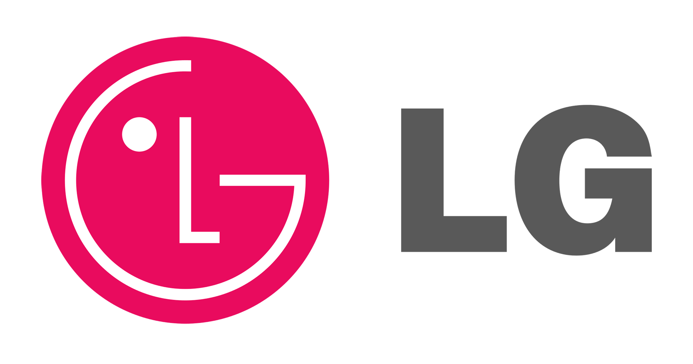
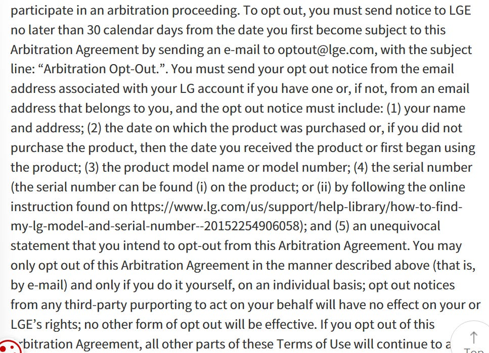

LG achieved a turnover of $60.5 billion in 2025\. Despite their recent attention in online media following some updates to their Smart TV privacy policies, LG have been selling smart TV’s since 2007, or at least that’s when they first started selling their first internet connected TV’s.

They dominate around 50% of the European market, whilst accounting for an estimated 16-20% of the global market share, meaning around 1 in 5 homes globally with a TV, its likely to be an LG device, and likely to be “smart”.

Over ten million OLED units have been sold in Europe alone.

This article consists of a review of LG’s;

* [LG Apps (Smart TV) Legal Notice](https://us.lgappstv.com/main/terms#tabContentTerms1)  
* [LG Apps Privacy Policy](https://us.lgappstv.com/main/terms#tabContentTerms4)  
* [LG Apps ACR and Viewing Information Agreement](https://www.lg.com/global/newsroom/news/statements/statement-understanding-privacy-on-lg-smart-tvs/)  
* [LG Apps Voice Information Agreement](https://us.lgappstv.com/main/terms#tabContentTerms6)  
* [LG Apps Interest-Based & Cross-Device Advertising Agreement](https://us.lgappstv.com/main/terms#tabContentTerms7)  
* [Smart Media Product Membership Privacy Policy](https://gb.lgemembers.com/lgacc/front/v1/footer/terms/retrieveTerms?country=GB&language=en-GB&svc_code=SVC301&type=A_PRV_GDPR&menFootId=3)  
* [LG Content Store Terms of Use](https://us.lgemembers.com/lgacc/front/v1/footer/terms/retrieveTerms?country=US&language=en-US&svc_code=SVC301&type=A_SVC&menFootId=2)  
* [LG Group Global Privacy Policy](https://www.lg.com/global/privacy/)  
* [LG Group Global Cookie Policy](https://www.lg.com/global/privacy/#tabs-cookie-policy)  
* [LG UK Privacy Policy](https://www.lg.com/uk/privacy/?srsltid=AfmBOoqdZLjp83gFs0uOnmUwWBZnOLz7RyDZFKO8dOUf5Lxgb_duUnO-)  
* [LG Electronics UK Limited Privacy Policy](https://www.lg.com/uk/business/privacy/?srsltid=AfmBOoq8bA5GM4Wr3u45LY22f-eXHlBIIegz-UytCK28nE2P7GL1QQQa)  
* [Third Party Analytics Services](https://gb.m.lgaccount.com/customer/terms_detail?country=GB&language=en-GB&third_party_service_name=lgcomckp&terms_svcCode=SVC202&terms_type=LGCKP&terms_publish=Y&division=noticeterms)

# WHAT INFORMATION IS COLLECTED BY LG

The following information may be collected by LG as a result of a persons use of a Smart Media Product (smart TV or similar);

* Name  
* *“Basic contact details”*  
* IP address  
* MAC address  
* Device ID  
* Device Name  
* IMEI  
* UUID  
* OS version  
* Advertising ID (Ad ID)  
* Device model  
* Device type  
* SW version  
* Manufacturer  
* Screen resolution  
* Language  
* Network & location information (country code, zip or postal code)  
* *“Connected modem information”*  
* *“Internet router information”*  
* *“Settings of devices”*  
* Ad block information  
* Information about what features, menu items, apps or services and general activity within apps or functions, content accessed, URLs requested or visited through the device browser  
* Interactions with LG channels including device information, name of channel or program watched, requests to view content, details of actions taken whilst viewing (play, stop, pause, click etc), duration of content watched, whether the user clicked or dismissed a notification.  
* Search keywords  
* Clicking frequency  
* *“We may collect audio, electronic, visual or similar information such as video recordings”*

LG may also collect information about other devices linked to the Smart Media Product including;

* Type of device (set-top box, DVD player, game console, mobile phone etc)  
* Device details (model number, manufacturer)  
* Device connection method (HDMI, Wi-Fi, Bluetooth, Network)  
* How the user uses external devices connected to the Smart Media product including how long it was used, what was accessed or interacted with

They note that this may include information relating to smart bulbs, smart switches, smart appliances etc which share the same network as the Smart Media Product.

LG state they do not collect information about activity within Third-Party Apps (however the third party apps themselves do).

Use of many of the features requires the user to agree to and additional separate corresponding Additional User Agreement. The user can either agree to the Additional User Agreement, or be locked out from using that feature.

If you make any payments through the Smart Media Product, that data will also be captured (payment information, billing address, voucher information (if used), purchase history, 3D Secure authentication tokens).

LG state that they may use and combine information collected with other information collected through a users use of other LG services such as LG SmartHome services, ThinQ App, SmartWorld App and SmartWorld website.

LG state they may receive information about users from third parties;

* Facebook  
* Google  
* Amazon  
* Line  
* Marketing companies  
* Data brokers

# VOICE COMMAND SOFTWARE IN LG SMART TV’s

LG state that the microphone is turned off by default and is not enabled unless the user agrees to the Voice Information Agreement, thus will not have access to certain features which require voice commands.

The Voice Information Agreement states the service provider for providing Voice Command Services as being Nuance Communications Inc.

Nuance Communications Inc was acquired by Microsoft Corporation in March 2022 for circa $19.7 billion.

Data collected through Voice Commands is shared with Nuance Communications Inc and becomes subject to their policies and terms.

Nuance Communications converts voice commands into text to access, use and analyse in addition to providing the services (returning search results, providing a recommendation etc).

# DATA RETENTION

Voice data collected through the utilisation of the Voice Command features is retained for six (6) months, after that period it is deleted or anonymised. If it is anonymised it is retained indefinitely.

Other data collected is retained for as *“long as necessary to protect us from possible legal claims”*, advising this to be *“for the lifetime of the contract and up to ten (10) years after”* following which it will either be deleted or anonymised and retained indefinitely.

# WHAT IS DISCLOSED AND WITH WHO

In order to provide LG channels content (including video on-demand services, live digital channels and advertisements) data is shared with the third-party partners who provide the LG channels streaming content and services.

Where a user engages with the “Live Plus” services, LG share the users viewing information and device information with their affiliates, third-party partners and service providers.

Where a user has agreed to the Interest-Based and Cross-Device Advertising Agreement, viewing information may be shared with third parties so they may provide targeted advertising to the user.

Where a user engages with the Voice Commands function, data is shared with LG’s service partner to improve and develop new Smart Media Product functions.

If using the Voice Command functionality within a third-party app, that data becomes subject to the third-party apps terms and policies.

LG may also share information with;

* Companies within their corporate umbrella (including corporate parent, subsidiaries and affiliates) or with outside entities  
* Payment processors  
* IT service providers  
* Security partners  
* Hosting services  
* Website maintenance support  
* Data maintenance and analytics partners  
* Customer service providers  
* Security and quality assurance vendors  
* Market research companies  
* Data analytics providers  
* Alphonso Inc (provider of the ACR software)  
* Nuance Communications Inc (Voice Command software provider)  
* Other business partners  
* Government authorities, judicial authorities, regulators or similar where required

Being a global organisation, LG state that data may be transferred outside of the country where the user and their Smart Media Product is located.

# TERMS OF SERVICE

*“If you know this device will be used by more than one person, you represent that you have obtained consent from all others who will use this Smart Media Product..”*

Users have the option to opt out of the Arbitration Agreement within 30 days of creating their account, where the user does not opt out following the stated process under subsection 21(k) of the terms they will only be permitted to pursue any disputes or claims through binding arbitration and waive the right to participate in a class action lawsuit, waive the right to pursue disputes in a court of law and waive the right to a jury trial.

Accessing or using the Services is confirmation of acceptance of the Terms of Use and the users agreement to comply with them (including policies).

# COOKIES

LG deploy Cookies and Beacons across their apps within Smart Media Products.

They name their third party analytics partners who have cookies embedded in their services as;

* Google  
* Adobe  
* Meta  
* Criteo  
* Salesforce  
* Microsoft  
* Mixpanel

These are in addition to the over 50 tracking cookies that LG deploy themselves

# OTHER CONSIDERATIONS

LG uses “Automatic Content Recognition” (ACR) to identify the content watched or listened to on a device, regardless of the source of information (e.g. set-top box, gaming console, media player, over the air broadcast or other sources connected to the smart device).

They state *“the ACR software identifies content by continuously analysing audio signals it receives directly from the soundboard integrated with the Smart Media Products speakers, it does not receive any information directly from the microphone on the Smart Media Product or remote(s)”.*

That said, the Smart Media Products remain to have voice capable remote control enabling the user to control aspects of the Smart Media Product with voice commands. Users must accept the Voice Information Agreement before being able to use that feature.

The likelihood of the average user installing an app on the device which enables it to act as a residential proxy for the grey market is high.  
