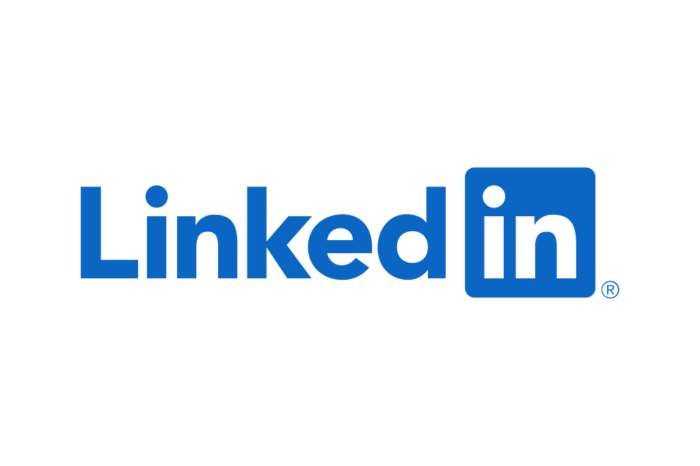
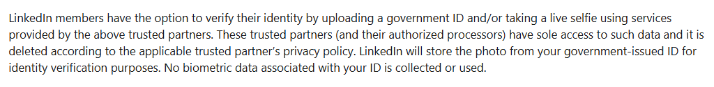

# I Read The Policies So You Don’t Have To: LinkedIn (Professional Networking Platform)

LinkedIn claim over 1.3 billion registered users globally, with up to 400 million of those conducting some kind of activity on the platform each week, leading to revenue generation of $17.8 billion in the 2025 fiscal year, with a reported $8.2 billion wedge of that revenue stemming from advertising revenue, advertising revenue that would not be possible without the mass collection of user data.

This article consists of a review of LinkedIn’s;

* [User Agreement](https://www.linkedin.com/legal/user-agreement?trk=d_checkpoint_lg_consumer_login_ft_user_agreement)  
* [Privacy Policy](https://www.linkedin.com/legal/privacy-policy?trk=d_checkpoint_lg_consumer_login_ft_privacy_policy)  
* [European Regional Privacy Notice](https://www.linkedin.com/legal/privacy/eu)  
* [California Consumer Privacy Act](https://www.linkedin.com/legal/california-privacy-disclosure)  
* [Cookie Policy](https://www.linkedin.com/legal/cookie-policy?trk=d_checkpoint_lg_consumer_login_ft_cookie_policy)  
* [Cookie Table](https://www.linkedin.com/legal/l/cookie-table)  
* [Copyright Policy](https://www.linkedin.com/legal/copyright-policy?trk=d_checkpoint_lg_consumer_login_ft_copyright_policy)  
* [Message Content Automation](https://www.linkedin.com/help/linkedin/answer/a1336512/?trk=microsites-frontend_legal_privacy-policy&lang=en)  
* [Off-LinkedIn Data To Target Advertising](https://www.linkedin.com/help/linkedin/answer/a426264/)  
* [Verifications on LinkedIn](https://www.linkedin.com/help/linkedin/answer/a1359065)  
* [LinkedIn and Generative AI (GAI)](https://www.linkedin.com/help/linkedin/answer/a5538339?hcppcid=search)  
* [LinkedIn’s AI Principles](https://www.linkedin.com/blog/member/trust-and-safety/responsible-ai-principles)

# WHAT INFORMATION IS COLLECTED BY LINKEDIN

LinkedIn state they may collect (either from the user directly, through partners or from related companies and other services, including applicant tracking systems);

* Name  
* Email address  
* Mobile number  
* Location (city)  
* If registering for a premium service; payment card, billing information  
* Education  
* Work experience  
* Skills  
* Photo  
* Endorsements  
* Salary  
* Demographic Information  
* Job applications made  
* Calendar meetings (if outlook/email acct(s) synced)  
* Email header information (if outlook/email acct(s) synced)  
* Contacts (if synced)  
* Job title  
* Work email address  
* IP address  
* Clicks on content or ads (on and off LinkedIn)  
* Searches performed  
* Actions taken on the product (web or app)  
* Device ID(s)  
* Ad ID  
* Operating system  
* Browser information  
* URL of the site the user came from and the one they go to  
* Proxy server  
* Add-ons (plugins)  
* Device identifier  
* Internet Service Provider  
* Mobile carrier  
* Location (GPS or approximate based on other data points collected if not actively shared by user through settings)  
* With who and when a user communicates through the services  
* Address book uploads  
* Information from partner integrations  
* Content of the users (including posts, likes, follows, comments, messages)  
* *“Public information about you, such as professional-related news and accomplishments”*  
* *“Data about you when you use some of the other services provided by us or our Affiliates, including Microsoft”*  
* Usage data  
* Activity data (page visits, videos watched, actions, clicks)  
* User language  
* User agent  
* Browser type  
* Browser version  
* Operating system  
* Two factor verification information  
* Hashed User ID  
* Country of issuance for Government ID (where ID verified)  
* CV (where uploaded)  
* Topics of interest  
* Job search filters  
* Inferred gender  
* Inferred age  
* Inferred interests (general, product and service)  
* Traits  
* Sign-ups  
* Purchases  
* Disability status  
* Conversation data that users input into LinkedIn’s generative AI features (prompts, search text, queries, chats, responses and other input and output data).  
* Responses to screening questions (if applied to jobs)

# DATA RETENTION

*“We generally retain your personal data as long as you keep your account open or as needed to provide you Services. This includes data you or others provided to us and data generated or inferred from your use of our Services”*

*“We retain your personal data even after you have closed your account”*

*“We will retain de-personalized information after your account has been closed”*

Information a user shares via InMail will remain visible within InMail after an account has closed.

# WHAT IS DISCLOSED AND WITH WHO

LinkedIn data is used to train artificial intelligence (AI) models (Microsoft)

*“Advertising partners can associate personal data collected by the advertiser directly from you with hashed IDs or device identifiers received from us”*

Data may be shared with;

* Service providers  
* Partners  
* Related companies  
* Affiliates (including ad networks, exchanges, other companies within the group including Microsoft or any of its subsidiaries).

Where a user is using an account with a licence purchased by their employer/organisation/enterprise, the users data may also be available to that employer/organisation/enterprise.

LinkedIn are very vague in not stating specifically which companies they share data with, even where they are service providers to LinkedIn. This doesn’t help consumers to understand where their data goes and how to have some controls over it with third parties.

# TERMS OF SERVICE

LinkedIn do not sell users personal information, but they do engage with sharing as per CCPA definitions, for a fee, for the purposes of cross-context behavioural advertising - users agree to this in using the product and services.

Included also the usual standard licence to LinkedIn to use/do almost what they like with any content users put on to the platform in a royalty free manner.

# COOKIES

Users of LinkedIn services will encounter nearly a couple of hundred cookies and pixels from LinkedIn and some of their carefully selected partners.

You can [view the list of LinkedIn cookies here](https://www.linkedin.com/legal/l/cookie-table).

LinkedIn does not generally respond to “do not track” requests.

# IDENTITY VERIFICATION ON LINKEDIN

Users can opt to verify their identity to have a badge on their profile, which apparently signals authenticity, builds trust and gives others more confidence in you.

Verifying identity on LinkedIn involves the user providing a copy of their Government issued ID to one of LinkedIn’s verification partners, which varies dependent on the users location.

ID verifications are undertaken by;

* CLEAR (in the US, Canada and Mexico)  
* DigiLocker (In India)  
* Persona (nearly everywhere else)

It is important to remember that any data provided to the above companies during the process of undertaking ID verification, becomes subject to that company’s policies and terms, these parties may retain copies of submitted ID and biometric data of the user.

