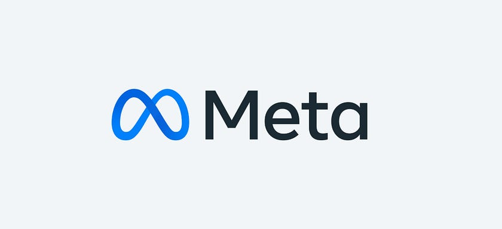
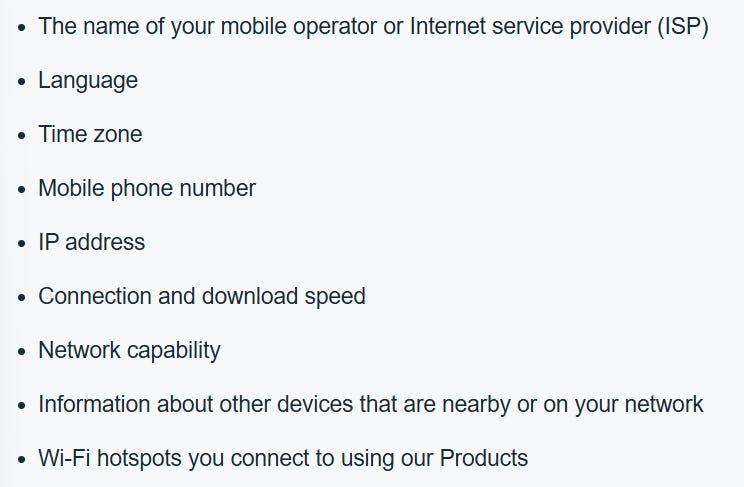
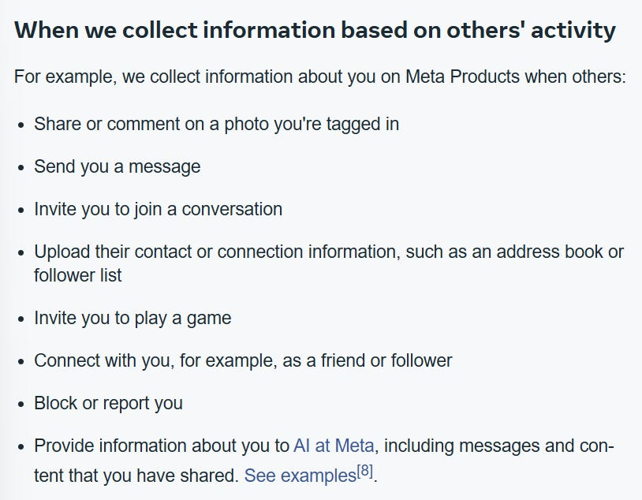
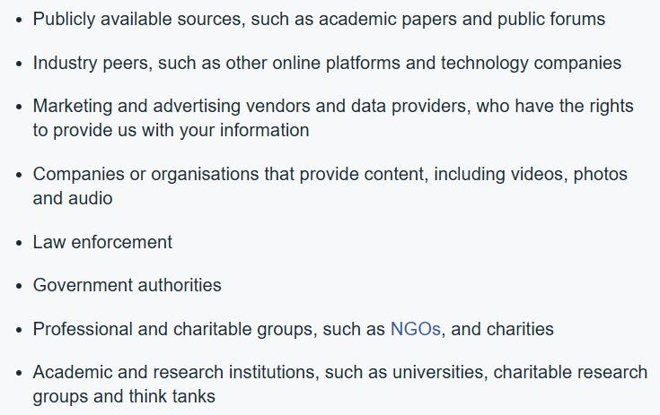
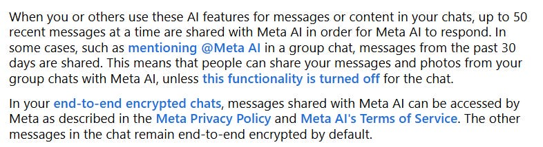
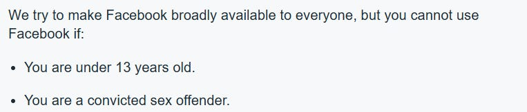
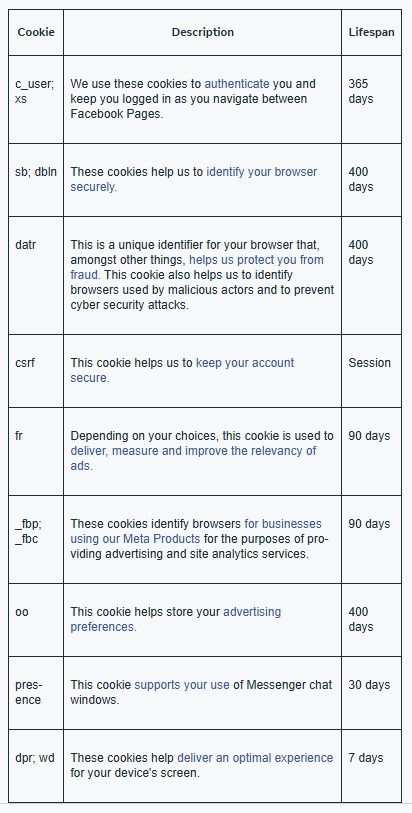
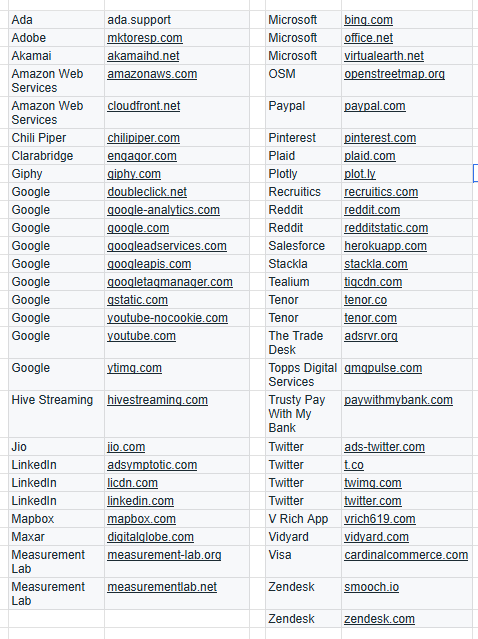

# I Read The Policies So You Don’t Have To: Meta (Facebook, Instagram, WhatsApp, Threads etc)

Collectively across all of their products Meta boasts a whopping 3.85 billion active daily users, harnessing them over $200 billion in revenue throughout 2025 (mostly generated through a form of advertising), controversially they are removing end to end encryption (E2EE) messaging on their Instagram product from the 8th May 2026, having only introduced encrypted messaging to Instagram 876 days earlier.

Meta products include;

* Facebook  
* Facebook Messenger  
* Instagram (including apps such as Edits, Threads, Boomerang)  
* Meta VR Products  
* Worlds  
* Meta Horizon Workrooms  
* Avatars  
* Metal Portal-Branded devices  
* AI at Meta  
* Meta Business Tools  
* Meta Audience Network  
* Meta Checkout Experiences  
* Meta Pay  
* Games published under Meta, Oculus, Beat Games, Sanzaru, Armature, Camouflaj, Twisted Pixel, BigBox  
* Meta Horizon Workrooms  
* Meta Wearable Products (including glasses and wrist devices i.e. Meta Ray-Ban, Meta Neural Band).

The standard Meta policies do not apply to Messenger Kids, which has its own separate [privacy policy](https://www.facebook.com/legal/messengerkids/privacypolicy?version=2020) (last updated in December 2023).

All of the products listed above are subject to the standard Meta policies, the following of which have been reviewed as part of this ‘I Read The Policies So You Don’t Have To’ article series;

* [Meta Privacy Policy](https://mbasic.facebook.com/privacy/policy/printable/version/23954169707588482/#1)  
* [Messenger Kids Privacy Policy](https://www.facebook.com/legal/messengerkids/privacypolicy?version=2020)  
* [Cookies Policy](https://mbasic.facebook.com/privacy/policies/cookies/printable/)  
* [Meta Terms of Service](https://mbasic.facebook.com/legal/terms/plain_text_terms/)  
* [Developers Platform Terms](https://developers.facebook.com/terms)  
* [Meta Commercial Terms](https://www.facebook.com/legal/commercial_terms?entry_point=POLICY_SECTION%3Asection_4)  
* [Meta AI Terms of Service](https://www.facebook.com/legal/uk-ai-terms?entry_point=POLICY_SECTION%3Asection_4)  
* [Transparency Reports](https://transparency.meta.com/reports/)  
* [Supplemental Meta Platforms Technologies Terms of Service](https://www.meta.com/gb/legal/supplemental-terms-of-service/?utm_source=mbasic.facebook.com&utm_medium=oculusredirect)  
* [WhatsApp Privacy Policy](https://www.whatsapp.com/legal/privacy-policy-uk#privacy-policy-information-we-collect)  
* [Consumer Health Data Privacy Policy](https://www.facebook.com/privacy/policies/health/?locale=en_GB)  
* [Instagram Data Policy](https://help.instagram.com/155833707900388)

# WHAT INFORMATION IS COLLECTED BY META

(This does not apply to WhatsApp, see way below for WhatsApp data collection)

Even if you don’t have any Meta account, Meta still receives information about internet users (people) through the Meta Pixel and various plugins when visiting other websites and apps which use Meta’s business tools or products.

If you access and use Meta services through any of their products, they collect (because the user chooses to provide either by using the product(s), by posting the information, or inferred from activity);

* Name  
* Email  
* Phone number  
* What is clicked  
* What is ‘liked’  
* Any photos uploaded  
* Metadata of images uploaded  
* Posts made  
* Comments made on posts  
* Audio  
* Camera roll (if not restricted)  
* Meta data of images in camera roll (if permissions are not restricted to camera roll)  
* Messages sent and received including their content  
* Interactions with AI at Meta  
* Information about the network your device you are accessing the service through (see below)

* Ads viewed  
* Ads Interacted with (and how)  
* How long you run any Meta apps  
* Check-ins (within a meta product app)  
* Purchases or transactions through Meta Checkout  
* Hashtags used  
* Time, frequency and duration of activities  
* Religious views  
* Sexual orientation  
* Political Views  
* Health information  
* Racial or ethnic origin  
* Philosophical beliefs  
* Trade union membership  
* Information from Partners about things done both on and off Meta products (including websites visited, apps used, online games played etc) (Meta’s definition of Partner \= ‘*a person, business, organisation or body using or integrating our Products to advertise, market or support their products and services*’)  
* Information from Integrated Partners *(defined by Meta as; advertisers, businesses and people who use our products to sell or offer goods and services, publishers and their vendors, app developers, game developers, device manufacturers, e-commerce platforms)*.  
* Friends  
* Followers  
* Groups  
* Accounts  
* Facebook Pages (following, viewed, actions taken)  
* Users and Communities connected with on and off Meta products  
* Device contacts (phone and email)  
* Type of device  
* Operating system  
* Hardware and software details  
* Brand and model  
* Battery level  
* Signal strength  
* Available storage  
* Browser type  
* App and file names and types  
* Plugins  
* Device ID  
* Mobile Advertiser ID  
* Gamer ID(s)  
* Family Device IDs  
* GPS  
* Language setting(s)  
* Keyboards  
* Bluetooth signals  
* Nearby Wi-fi access points  
* Beacons  
* Cell towers  
* When you use Social plugins, Facebook Login, in-app browser link history or auto-fill  
* Purchases within an online game  
* Donations to a friends fundraiser  
* Subscriptions, Meta Pay or Meta Checkout payments (whereby the following also apply;)  
* Credit or debit card number  
* Billing, delivery & contact details  
* Items purchased and how many  
* Other devices connected to the network the product is accessed from including; computers, phones, hardware, TV’s, Meta Quest and *‘other web-connected devices’*.  
* Information based on others activity (below)

They also state that *“some people, businesses, organisations and bodies share information with Meta, but don’t necessarily use our Products”*, defining those as;

* Information shared through device settings  
* Location-related information  
* ‘Identifiers that tell a device apart from others’

Some of this data collection can be limited through rigorous privacy settings adjustment.

Unfortunately, the information collected under Messenger Kids is not much less, you can [view that information here.](https://www.facebook.com/legal/messengerkids/privacypolicy?version=2020)

# INFORMATION COLLECTED BY WHATSAPP

* Mobile phone number  
* Profile name  
* Profile picture  
* ‘About’  
* Status  
* Location information  
* Phone contacts  
* Groups a user is a member of  
* The time, frequency and duration of activity within the app  
* The features used  
* Online status, last seen.  
* Diagnostic and performance information (log files, time stamps, crash data, performance logs, error messages, reports).  
* Device hardware  
* Device model  
* Operating system information  
* Battery level  
* Signal strength  
* App version  
* Browser information  
* Mobile network  
* Wi-fi or cellular data connection  
* Mobile operator or Internet Service Provider (ISP)  
* Language (keyboard(s))  
* Time zone  
* IP Address  
* Device identifiers  
* Information through cookies  
* In app choices (settings, privacy settings, when terms accepted)

In regard to WhatsApp messages, Meta states *“Typically your messages are stored on your device(s) and not on our servers. We temporarily store your messages in encrypted form while they are being delivered. Once your messages are delivered, they are deleted from our servers”*.

They go on to state *“If a message cannot be delivered, we keep it in encrypted form on our servers for up to 30 days while we try to deliver it. If a message is still undelivered after 30 days, we delete it. We cannot see the contents of undelivered messages stored on our servers as they are encrypted.*

*When a user sends media within a message, we store that media for up to 30 days in encrypted form on our servers to aid in more efficient delivery, such as if recipients choose to forward the media. We cannot see the media as it is encrypted”*

# DATA RETENTION

Meta state they *“keep information for as long as we need it to provide our products, comply with legal obligations or to protect our or others interests”*, whilst they *“decide how long we need information on a case-by-case basis”*

They retain profile information, photos posted and security information for the lifetime of an account.

If a user searches for something, the search is retained for a minimum of six months unless the search history is cleared (via activity log) or the account is deleted.

Where a user requests to delete their account or content, it is stated to take up to 90 days to delete the information, and a further 90 days to remove it from back ups and disaster recovery systems.

Any deleted content is moved to a recycle bin and the deletion process (which takes up to 180 days as per above) commences after 30 days or sooner where the user deletes content from the recycle bin or recently deleted areas of their account.

Apps or websites that you’ve logged in to using Facebook Login or connected to your Instagram account can access your non-public information on Meta Products unless it appears to Meta you haven’t used the app or website in 90 days

In some instances, they may retain information for longer, such as to comply with; a legal request or obligation (includes all Meta companies), a government investigation, an investigation of possible violation of terms or policies, to prevent harm, for safety, security and integrity purposes, to protect themselves, their rights, their property or products, or if it is needed in regard to a legal claim, compliance, litigation or regulatory proceedings — wide scope\!

# WHAT IS DISCLOSED AND WITH WHO

Meta state repeatedly that *“we don’t sell any of your information to anyone and we never will”* \- which is a factually correct illusion of words.

Meta does not sell the information in a traditional sense of exchanging a tangible quantity of data for a fee, Meta sells access to viewable versions of the information at fluctuating rates whilst retaining ownership of the data collected collected by their systems, on each and every one of the 3.8+ billion active consumers of their products and services.

Where a user utilises Facebook Login to access any website, the organisation will “ask” to receive some information about the user, such as email, date of birth.

Where other Meta users interact with Meta AI (including within WhatsApp, Instagram, Facebook Messenger), they may share information about other users;

Any publicly shared content across any of the products is made available to third party services such as;

* API’s  
* The media  
* Other apps and websites connected to Meta products  
* Search engines

Where a user, uses an integrated partners product or service, they automatically receive;

* What the user posts or shares from the products or services  
* What the user uses the integrated partners service to do  
* Information about the device being used  
* The language setting on the product

In some cases, integrated partners ask for permissions for additional information, such as email address, hometown, birthday, previously shared content. The user has to approve this, permission can be revoked.

Information about Meta users is shared with (often in an aggregate or allegedly anonymised format) under agreements but not sold to;

* Advertisers  
* Audience Network Publishers (and their vendors)  
* Business Accounts  
* Facebook Pages  
* Users of Meta analytic services  
* Partners who offer goods or services on Meta products  
* Measurement Vendors  
* Marketing Vendors  
* Service Providers  
* External Researchers  
* Search engine providers  
* Other companies within the Meta group of companies, including for AI and VR model training

Meta is a global set of companies with globally located customers. They make clear that they share the information they collect globally both internally across all of their offices and datacentres, and externally with their partners, measurement vendors, service providers and third parties.

# CONSUMER HEALTH PRIVACY

The categories of Consumer Health Data that Meta may collect;

* Health conditions, status, treatment, symptoms, diseases, or diagnosis  
* Social, psychological, behavioural, and medical interventions  
* Health-related surgeries or procedures  
* Use or purchase of prescribed medication  
* Measurements of bodily functions, vital signs, or similar characteristics identifying a health status  
* Diagnoses or diagnostic testing, treatment, or medication  
* Gender-affirming care information  
* Reproductive or sexual health information  
* Photos, videos, and voice recordings  
* Genetic data  
* Precise location information  
* Other health information, including information that may be used to infer or that is derived data related to the above.

Sources of the health data Meta describe as either; provided by the data subject either directly or through their activity with Meta products, other people (including their use of products), devices, Meta companies, Partners, vendors, third parties.

Consumer health data may be disclosed as per previous sections on data sharing but not sold. Meta do not sell personal data.

# TERMS OF SERVICE (PERSONAL CUSTOMERS)

*“If you do not agree to these Terms, then do not access or use Facebook or the other products and services covered by these Terms”*

*“If you choose to use our Product for free with ads, you allow us to show you ads that businesses and organisations pay us to promote on and off the Meta products”*

*“We don’t sell your personal data and we don’t share information that directly identifies you (such as your name, email address or other contact information) with advertisers unless you give us specific permission”*

Convicted sex offenders are not allowed under the Meta terms to have a Facebook account.

Users retain intellectual property rights of content, but grant Meta Licence to use the content, which Meta extends to other users of products.

Where a user's content has been used by others under the Licence, and where they have not deleted it, the licence continues to apply until the user chooses to delete it.

Users give permission for Meta to use their name, profile picture and information about the actions the user has taken on Facebook without any compensation to the user.

If a user uses content generated by Meta owned intellectual property available through their products (i.e. images, designs, video’s, sounds which are added to user content), Meta retain all rights to that content (but not the original content the IP was added to).

Customers have the right to lodge a ‘breach of contract’ claim against Meta.

# TERMS OF SERVICE (COMMERCIAL / BUSINESS CUSTOMERS)

The Commercial Terms apply to access or use of the Meta Products for a business or commercial purpose.

Business or commercial purposes include using ads, selling products, developing apps, managing a Page, managing a Group for business purposes or using the measurement services regardless of the entity type.

The user grants Meta a licence to content that is covered by intellectual property rights (e.g. photos or videos) that they share, post or upload on or in connection with Meta Products.

Big liability caps in Meta’s favour.

All parties waive their respective rights to a trial by jury or to participate in a class or representative action.

THE PARTIES AGREE THAT EACH MAY BRING COMMERCIAL CLAIMS AGAINST THE OTHER ONLY IN ITS INDIVIDUAL CAPACITY, AND NOT AS A PLAINTIFF OR CLASS MEMBER IN ANY PURPORTED CLASS, REPRESENTATIVE OR PRIVATE ATTORNEY GENERAL PROCEEDING.

# DEVELOPER PLATFORM TERMS

The Meta for Developers Platform is the set of API’s, SDK’s, tools, plugins, code, technology, content and services.

If you access or use the platform, you are agreeing to the terms on behalf of the entire entity you represent.

The developer grants a licence to Meta for; their content, their app(s), your name, trademark and any logos, royalty free, on the understanding meta may use the licence granted to generate income.

*“We do not guarantee that the Platform will always be free”*

# META AI TERMS OF SERVICE

Users own the IP rights to prompts, not outputs.

When information is shared with AI, the AI will sometimes retain and use that information.

Meta may share information with selected partners such as search engines. By using Meta AI you instruct Meta to share information with selected partners for the purpose of providing you with relevant information.

Partners that Meta name as supporting them under Meta AI to provide up to date information are;

* Finnhub  
* Microsoft  
* Brave

# COOKIES

Meta Pixel

In addition to;

Below are the companies and websites which embed cookies on access and provide services to Facebook as per their Cookie Policy;

If a user accesses any of the above sites and accept cookies, information about the users activity on those sites would likely be provided to Meta.

# OTHER CONSIDERATIONS

What is unfortunate for consumers' privacy rights when it comes to companies like Meta and its subsidiaries, is there is no escape.

If you choose to not use nor have any Meta product account, your online and offline activity is still tracked through one of their many partners, vendors or third party providers.

If you were a non-user with no meta product account, you might be inclined to think “hey, I still don’t feel like being tracked by Meta, what can I do about that”, sadly, the answer is not much.

Meta relies on a number of basis to process personal data, namely; legal basis, performance of a contract, consent, legitimate interests, vital interest, legal obligation, public interest.

Even where a user removes their consent, Meta can, will and do argue they still have a handful of other reasons to process the data and thus will still collect and process the data.

