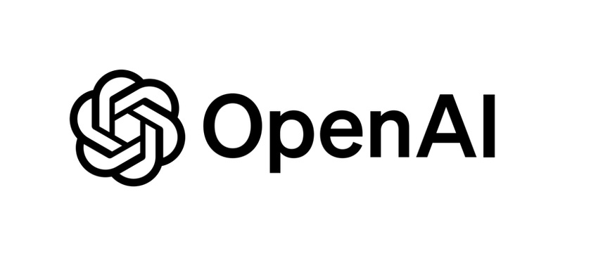
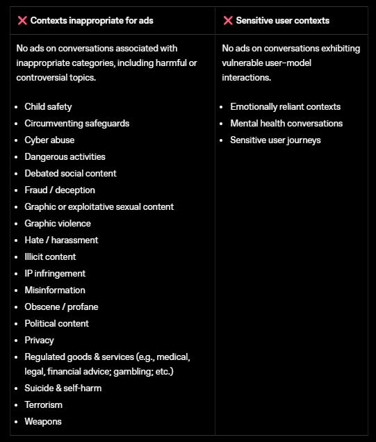

# I Read The Policies So You Don’t Have To: OpenAI (Chat GPT, Artificial Intelligence)

OpenAI run their show through a myriad of policies, this review consisted of reading through the following;

* [Privacy Policy](https://openai.com/en-GB/policies/privacy-policy/)  
* [(Non-Europe) Privacy Policy](https://openai.com/en-GB/policies/row-privacy-policy/)  
* [Sub Processors List](https://openai.com/en-GB/policies/sub-processor-list/)  
* [Health Privacy Notice](https://openai.com/en-GB/policies/health-privacy-policy/)  
* [Enterprise Privacy Policy](https://openai.com/enterprise-privacy/)  
* [Europe Terms of Use](https://openai.com/en-GB/policies/terms-of-use/)  
* [(Non-Europe) Terms of Use](https://openai.com/en-GB/policies/row-terms-of-use/)  
* [Service Agreement](https://openai.com/en-GB/policies/services-agreement/) (applies to API’s, ChatGPT Enterprise, ChatGPT Business)  
* [Arbitration Agreement](https://cdn.openai.com/pdf/applicant-arbitration-agreement.pdf)  
* [Model Performance Notice](https://openai.com/en-GB/policies/how-your-data-is-used-to-improve-model-performance/)  
* [Cookie Policy](https://openai.com/en-GB/policies/cookie-policy/)  
* [Ad Policy](https://openai.com/en-GB/policies/ad-policies/)

[Holders of and compliant with](https://openai.com/security-and-privacy/); SOC 2, ISO 27001, 27017, 27018 and 27701, ISO 42001, PCI-DSS and CSA Star Level 1\.

Let's look first at the Europe Privacy Policy and Non-Europe Privacy Policy

These policies apply to personal customers, not business, API or enterprise customers (see enterprise policy way below).

# WHAT INFORMATION IS COLLECTED BY OPENAI

* Name  
* Contact Information  
* Account Credentials  
* Date of birth  
* Payment Information  
* Transaction History (with OpenAI)  
* Profile Picture (if user opts to upload one)  
* Prompts by the user  
* Any uploaded content; files, images, audio, video, Sora characters.  
* Data from any [connected services](https://help.openai.com/en/articles/11487775-apps-in-chatgpt).  
* Contacts data (if user chooses to connect device contacts).  
* IP address  
* Browser type, settings.  
* The types of content that the user views or engages with, the actions taken, the people the user interacts with.  
* Time zone  
* Country  
* Dates and times of access  
* User agent and version  
* Type of computer or mobile device  
* Computer connection information  
* Name of device  
* Operating system  
* Device identifiers  
* Location Information

They also state that they receive information from other sources *“such as our trusted security and safety partners”* but do not state what that information is, or who the trusted partners are.

They state they collect information also from other sources *“like information that is publicly available on the internet”.*

They state that they may use Content provided by users to improve their services, *“for example to train the models that power ChatGPT”.*

# DATA RETENTION

OpenAI state they *“retain your Personal Data for only as long as we need in order to provide our Services to you, or for other legitimate business purposes….”*

Users have the option to delete Personal Data stored in their account, if that is requested, they will remove it within 30 days unless they need to retain it for another reason.

If and where the information has been de-identified, they are not obligated to delete it since it can no longer be used to identify you.

They state that some instances (i.e. temporary chats) are automatically deleted within 30 days, unless they want to keep them for other business reasons.

They also state that they *“in some cases”* need to retain Personal Data for longer even after deleted *“because we are legally required to, to address fraud and abuse, for security reasons, or for financial record keeping purposes”*

# WHAT IS DISCLOSED AND WITH WHO

OpenAI state that they aggregate or de-identify Personal Data so that it no longer identifies the user, adding they maintain and use de-identified information in de-identified form and “not attempt to reidentify the information, unless required by law”.

They state that they disclose Personal Information to the following;

(notably unlike many other policies which word this section with ‘may disclose’, there is no may, they state *“we disclose”* .. to);

* Hosting services  
* Customer service vendors  
* Cloud services  
* Content delivery services  
* Support and safety services  
* Email communication software  
* Web analytics services  
* Payment and transaction processors  
* Search and shopping providers  
* Information technology providers.  
* Age and identity partners  
* During the course of any business transfer  
* Government authorities or other Third Parties  
* Affiliates  
* Business Account Administrators  
* Parents of Guardian of a Teen

Specifically under the Sub-Processor list, they state they engage the following entities to provide processing activities for Customer Data;

* Cloudflare  
* Microsoft Corporation  
* CoreWeave  
* Oracle Cloud Infrastructure  
* Google Cloud  
* Amazon Web Services  
* Cerebras  
* Snowflake  
* TaskUs LLC  
* Intercom Inc  
* Salesforce  
* Pylon Labs  
* Accenture International Ltd  
* Fivetran  
* Confluent  
* Cinder Technologies  
* WorkOS  
* Okta Inc  
* Merge API

In addition to the following of OpenAI’s affiliates;

* OpenAI OpCo LLC  
* OpenAI LLC  
* OpenAI Ireland Ltd  
* OpenAI UK Ltd  
* OpenAI Japan Ltd

# HEALTH PRIVACY NOTICE

This policy applies if a user engages with the ‘Health’ feature within ChatGPT (in addition to the other above and below policies).

It opens with *“Some of the information you provide to Health in ChatGPT may constitute ‘Consumer Health Data’* *as that term is defined under Washington state’s My Health My Data Act and Nevada’s Consumer Health Data Privacy law”*

In addition to the collected data as per the core Privacy Policy, if using the ‘Health’ feature, this includes any prompts, content, documents, files or images uploaded by the user such as;

* Medical Records  
* Lab and test results  
* Prescription information  
* Measurements of vital signs and movements, i.e. heart rate, sleep data, estimated calories burned, steps taken, workout details (including data from other devices and services connected to Health such as via Apple or Strava).  
* Information about your health history, symptoms, health care services you have sought or seek to learn about, fitness and wellness goals.

Note, they do collect data from third parties such as Strava or Apple Health, but only where the user has integrated services thus providing that information.

They state that, *“by default we do not use data in Health content to improve our foundational models…”,* followed by *“a limited number of authorized OpenAI personnel and trusted service providers might access Health content to improve model safety, unless you have opted out”*.

# ENTERPRISE PRIVACY

The Enterprise Privacy Policy applies to; ChatGPT Business, ChatGPT Enterprise, ChatGPT for Healthcare, ChatGPT Edu, ChatGPT for Teachers and their API platform.

They state under this policy that;

* They do not train models on enterprise data “by default”  
* Customers own their inputs and outputs (where allowed by law)  
* Customers have control over how long data is retained.  
* Control over which sources are connected  
* Custom models are not shared

If you’re interested, you can [read more about the enterprise data controls here](https://developers.openai.com/api/docs/guides/your-data).

They do state that they may run business data through automated content classifiers and safety tools.

*“OpenAI may securely retain API inputs and outputs for up to 30 days to provide the services and to identify abuse. After 30 days, API inputs and outputs are removed from our systems, unless we are legally required to retain them. You can also request zero data retention (ZDR) for eligible endpoints if you have a qualifying use-case”*

# TERMS OF SERVICE

Nothing majorly unusual that jumps out in either the EU or Non-EU Terms of Service. As usual the US terms have a class action lawsuit waiver and there is a separate [Arbitration Agreement](https://cdn.openai.com/pdf/applicant-arbitration-agreement.pdf) to cover users elsewhere.

# COOKIES

[Lots of cookies](https://openai.com/en-GB/policies/cookie-policy/)

# AD POLICY

OpenAI’s policy is to allow ads to be placed near chats that are *“safe, appropriate and consistent with user trust and brand safety”.*

They reportedly have in place guardrails which means ads will not be shown on the following types of conversations;

They state that during *“ads are primarily limited to consumer verticals such as lifestyle, household goods, local services, travel experiences and digital products or education. These categories may expand over time”.*

Other categories disallowed, include those *“that violate policies and those related to sensitive or regulated areas such as dating or sexual content, health claims, alcohol and drugs, healthcare, financial or legal services, gambling or political content”.*