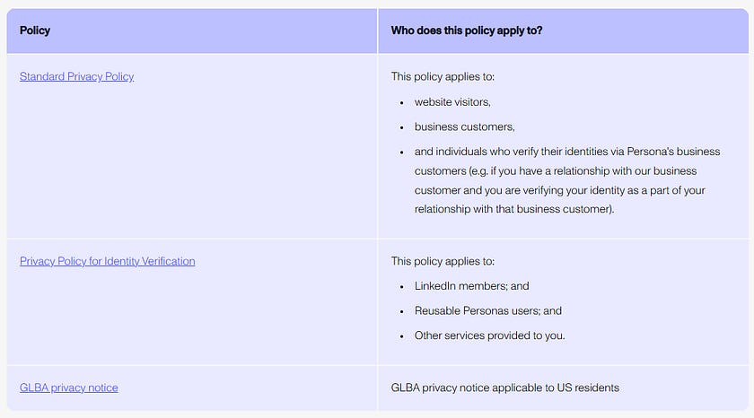

# I Read The Policies So You Don’t Have to: Persona (Secure Identity Verification Solutions)

The first of many ‘I Read The Policies So You Don’t Have To’ articles, let’s kick it off with Persona.

Want to understand what personal data Persona collect, from where, and who they share it with? Read on.

Persona have two different privacy policies, the one that applies depends on which service(s) you are in receipt of in accordance with the above table.

Let’s look at the [Standard Privacy Policy first](https://withpersona.com/legal/privacy-policy)

This policy applies to all individuals using the Persona Service to verify their identities as part of their Service offered to their business customers, website visitors and business customers.

# WHAT INFORMATION DOES PERSONA COLLECT UNDER THE STANDARD PRIVACY POLICY

Direct from the data subject;

* Name and contact information, including name, email address, address and phone number.  
* Demographic data, including date of birth and age.  
* Files you upload, such as tax forms and utility bills  
* Government documents, barcodes, and identifiers, such as driver’s license and Social Security Number; and  
* Audio, Video, and Photos of data subject, namely from the selfie or video provided and from the government identification document.  
* From third parties and customers Persona (may) also collect;  
* Current and previous name and contact information, including name, email address, address, and phone number;  
* Demographic data, including birthdate and age, gender, marital status, and similar demographic details;  
* Government documents, barcodes, and identifiers, such as drivers license and Social Security Numbers;  
* Device information, including IP address, device type, your device’s operating system, browser, cookie and device identifiers, and other software including type, version, language, settings, and configuration;  
* Account information, such as details about the account with their Customer(s) or other third parties;  
* Publicly available data, including data from governmental public records, the public internet and social media;  
* Geolocation data, ‘we may infer general geographic location (such as city, state, and country) based on IP address;’  
* Biometric Data, only with express consent, including a scan of the facial geometry based on the photos or video provided.  
* Wireless Carrier Information \-, “you authorize your wireless carrier to use or disclose information about information about your account and your wireless device, if available, to us or our service provider for the duration of your business relationship…”  
* Consumer Health Data; measurements of bodily functions, vital signs or characteristics (including photographs which may be considered biometric information) ([more info here](https://withpersona.com/legal/consumer-health-data-privacy-policy))

Persona States, ‘Based on the Personal Data we collect from you and other sources, we infer information about you for identity verification and fraud’.

Third party sources they collect information about users from include (but are not limited to;

* Data brokers  
* Third party partners, applications and services including social networks  
* Co-branding/marketing partners  
* Service providers  
* Publicly available sources

Under their Notice for Individuals Verifying their Age section, Persona state their ‘default setting is to automatically delete the personal data as soon as processing is complete and an outcome has been determined’, but goes on to state ‘However, Persona’s business customers (i.e. the websites requiring you to undertake verification) may choose to retain certain data for longer periods as necessary…”

This section of the policy states that Persona are only acting as the service provider on behalf of the customer requesting verification, confirming the Persona customer as being the data controller responsible for determining how your PI is processed, not persona.

# DATA RETENTION

Further down in the policy, Persona discuss data retention, stating they ‘retain Personal Data for as long as necessary to provide the services and fulfill the transactions \[you have\] requested, comply with our legal obligations, resolve disputes, enforce our agreements, and other legitimate and lawful business purposes’, adding ‘these needs can vary for different data types in the context of different services, actual retention periods can vary significantly…’ without providing any examples.

# WHAT DATA DO PERSONA SHARE OR DISCLOSE AND WITH WHO

Persona states it does not sell or share personal data collected for age assurance with third parties.

However later in the policy it also states “Some of the data disclosures to these third parties may be considered a “sale” or “sharing” of Personal Data as defined under the laws of California and other U.S. states”.

They state they disclose your Personal Data to complete transactions or provide services.

They state that they may engage or work with third parties to provide their services, through which they may disclose Personal Data to them, or to other service providers including;

* Hosting  
* Cloud services  
* IT services providers  
* Email communication providers  
* SMS software providers  
* Identity verification services  
* Mobile device operators  
* Background check providers  
* Public and private records database providers  
* Consumer reporting services  
* Fraud and Identity Management providers  
* Affiliates (subsidiaries, affiliates and related companies)  
* Law enforcement and Government Agencies

The Persona Privacy Policy also includes a Class Action Waiver, applicable to all US residents.

# Privacy Policy for Identity Verification

On to the [Privacy Policy for Identity Verification](https://withpersona.com/legal/idv-privacy-policy)

This policy applies to; LinkedIn Members, Reusable Personas users and other services provided to you by Persona business partners.

This policy does not apply to personal data Persona process as a service provider or data processor on behalf of partners or business customers, the above Standard Privacy Policy applies to that data.

With regard to LinkedIn verification, the policy states that Persona will generate a verification result for LinkedIn, but it is LinkedIn that ultimately decides how it uses the verification result provided to them, adding that their policy does not apply to LinkedIn’s use of your personal data.

With regard to the Reusable Persona feature, Persona state ‘the personal data stored in the Reusable Persona is not readable by Persons in its encrypted form, and can only be unencrypted when you successfully authenticate to access the encryption key stored on your device’.

# WHAT DATA IS COLLECTED UNDER THIS POLICY

Under this policy they state they collect the following;

* Information from the user directly (including name, email address, postal address, phone number, sex, nationality, date of birth, age, uploaded content including photo or video and government issued ID, National ID number, biometric information)  
* Information collected automatically (cookies)  
* Information from third-party sources (see below)  
* Data inferred or generated from other data  
* Indirectly collected information (i.e. not from the data subject they state as being the following;  
* Identifiers and Device Information; IP address and information about your device, including device identifiers (such as MAC address); device type; and your device’s operating system, browser, and other software including type, version, language, settings, and configuration.  
* Geolocation Data (settings dependent); based on IP address. They state they no not collect precise geolocation data.  
* Usage data; How long it takes to complete the verification, access times, and other details about your use of and actions on the Service such as hesitation detection and copy and paste detection

They state that “we may receive unique reference numbers from our customers, and provide unique reference numbers, to enable each of us to identify you in our systems” (“Account Identifiers”).

They state they may obtain personal data about you from their global network of trusted third party data sources including;

publicly available sources, such as open government databases, government and national ID registries, consumer credit agencies, utility companies, mobile network providers and postal address databases.

# WHO IS THE DATA SHARED WITH UNDER THIS POLICY

If you are a LinkedIn Member using the service to verify your identity for LinkedIn, Persona disclose the following personal data to LinkedIn (which then falls under LinkedIn’s privacy policy);

* Account identifiers  
* Full name  
* Identity document type & issuing authority  
* Verification result, including NFC chip check result (where a NFC chip exists in the identity document, the data is extracted from the NFC chip and compared to the information on the face of the document).

If you are using Persona to recover access to your LinkedIn account, in addition to the above, the following will also be sent to LinkedIn;

* Address (city, state, country)  
* Birth year  
* Image of your identity document with personal information blurred except name and portrait, and  
* results of the verifications performed by Persons.

If you are using Reusable Persona, you consent to share the information with a business customer, noting that the customer is an independent controller of any copy of your Reusable Persona personal data, and it is subject to the business customer’s privacy policy.

In addition, Persona may disclose some of all of the categories of personal data described above to;

* Service providers; vendors or agents working on Personas behalf  
* Global network of data partners  
* Affiliates; subsidiaries, affiliates and related companies (where they share common data systems or where access helps Persona to provide services and operate their business)  
* Law enforcement  
* Protect rights, safety and/or security

# FACIAL SCAN AND BIOMETRICS INFORMATION

Has its own little section in their policy.

Persona states that uploaded images and scan data are collected, used and stored directly by Persona.

Persona stores all uploaded images and scan data in an encrypted format.

Personas states that third party vendors may have access to the Scan Data to provide some or all of the analysis, to store the data, to maintain back up copies and to service the systems on which the data is stored, stating the third party vendors as;

* Anthropic  
* AWS  
* Confluent  
* DBT  
* Elasticsearch Inc  
* Fingerprint JS  
* Google Cloud Platform  
* Groqcloud  
* MongoDB  
* OpenAI  
* Resistant AI  
* Sigma Computing  
* Snowflake  
* Stripe  
* Twilio  
* Persona Identities Canada Inc

View [subprocessor](https://withpersona.com/legal/subprocessors) information here, including the task performed by the vendor.

Persona states that they will permanently destroy Scan Data upon completion of Verification, or within 6 months of your last interaction with Persona.

If you are a Reusable Persona user, Persona does not store the Scan Data in the Persona.