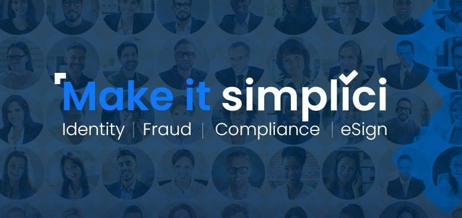
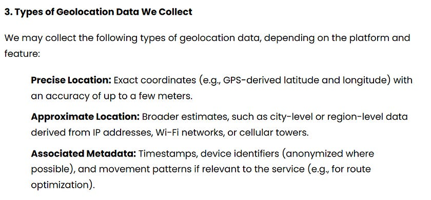

# I Read The Policies So You Don’t Have To: Simplici (Verification & Fraud Detection Solutions)

[Simplici](https://simplici.io/) are a verification and fraud detection service, owned by parent company [Satschel](https://satschel.com/), who are also parent company of [Liquidity.io](http://Liquidity.io).

This is the second article in this current ‘I Read The Terms So You Don’t Have To’ series. Last time we looked at Persona.

Want to understand what personal data Simplici collect, from where, and who they share it with? Read on.

The privacy policy used by Simplici is that of Satschel, which it uses for itself and any of its wholly owned subsidiaries, which Simplici is.

Helpfully for readers they note quite early on, that this policy does not apply to any third-party websites or services.

For transparency, you can [find the full privacy policy here](https://simplici.io/privacy-policy/).

# WHAT INFORMATION DOES SIMPLICI COLLECT

Simplici / Satschel categorises personal information in one of two ways;

Site User Information: information provided to them by you, the user or;

Service User Information; information collected and otherwise processed in the course of providing services

In their policy, they state that they may collect and use the following Site User Information;

* Full name  
* Facial Biometrics  
* Date of Birth  
* Social Security Number  
* Tax ID  
* Nationality  
* Passport  
* National Identity Card  
* Driver Licence  
* Gender  
* Marital Status  
* Signature  
* Name of Employer  
* Address of Employer  
* Business Nature of Employer  
* Occupation  
* Residential Address  
* Residential Phone Number  
* Personal Mobile Number  
* Personal Email Address  
* Business Address  
* Business Mobile Number  
* Business Phone Number  
* Legal Representative’s Details  
* Financial Situation  
* Certificate of Incorporation or Incumbency  
* Articles of Incorporation  
* Bank Account Information  
* Source of Wealth  
* Annual Income  
* IP Address  
* Browser Type  
* Browser Version  
* Website Pages Visited  
* Date of Visit  
* Time Spent on Pages  
* Utilisation of Functionalities  
* Type of Device  
* Device Unique ID  
* Operating System  
* Mobile Browser  
* Diagnostic Data  
* Geolocation

You can read their separate [Geolocation Policy here if you’re interested.](https://liquidity.io/geolocation_data_policy)

To clarify, the above is personal information this company collects only where provided by the data subject.

Where you use the services of Simplici, they state that they also process the following Service User Information “on behalf of you” as part of the Anti-Money Laundering (AML) Screening Process;

* Criminal Background  
* Politically Exposed Person (PEP) Status  
* Global Sanctions (OFAC, UN, HMT, EU, DFAT)  
* Adverse Media  
* Watchlist (Interpol, Federal and State Government Agencies).

# DATA RETENTION

Simplici state that they will retain your Personal Information only for as long as necessary, and to the extent to comply with regulatory and legal obligations.

Adding though, that they maintain Site User Information and Service User Information for as long as needed for the business purposes for which such information is collected.

*“In general, the Personal Information relating to you is held for at least a period of five years”*

They state that they retain suite usage information for internal analysis.

# WHAT DATA DO SIMPLICI SHARE OR DISCLOSE AND WITH WHO

This section of their policy opens with;

*“we do not sell or otherwise share personal information about you, except as described in this privacy policy”*

Credit to Persona here, they were more transparent in their Privacy Policy about what vendors and third parties might have access to data, than Simplici are being in their policy.

Simplici merely state;

*“We may share personal information with third parties who perform services for us or on our behalf, and we may share Site User Information and Service User Information with third-party distributors and other business partners to enable them to provide you with Satschel Services”*

without really providing any elaboration on who that could be. This makes it difficult for users to understand where their data ends up, and the further policies which apply to it.

At the very start of Simplici’s Privacy Policy they state;

*“Note that this Privacy Policy does not apply to any third-party websites or services, including those you reach through links we have provided on the Site. We encourage you to request and review the privacy policies of any third party prior to disclosing information to such a party”*

How can users request and review the privacy policies of any third party without being given any indication of who those third parties are? Well, they can’t.

They might not disclose to whom, but they do disclose the situations in which personal information might be shared;

* To send and receive text messages to/from customers  
* Anti-bot service  
* Service Monitoring  
* Fraud Prevention  
* AML Screening  
* Business Transfers  
* With affiliates  
* With business partners  
* With regulators and Law Enforcement

# BIOMETRIC PRIVACY NOTICE

Simplici has a separate privacy notice for the collection, use, sharing, retention and destruction of Biometric Data.

When they say ‘Biometric Data’, Simplici categorise this as one of two things, either;

1\. **Biometric Identifiers**; data generated by measurements of your biological characteristics, such as;

* Retina or iris scan  
* Fingerprint  
* Voiceprint  
* Scan of your hand, or face geometry.

Or,

2\. **Biometric Information**; information based on a Biometric Identifier that can be used to identify you.

Simplici state that they collect; face geometry and fingerprints.

They state they use AI and ML to evaluate the authenticity of your identity document and assess whether the image on the ID and the image of yourself match, as well as a license detection.

They state they share the results of identity verification with their customer for which the vertification is required, but do not share your Biometric Identifiers.

They state they may store a copy of your Biometric Identifiers in an encrypted format with their cloud infrastructure partners, but that said providers do not have access to that data.

They state they comply with court orders.

In terms of retention of Biometric Data, they say the following;

"[Simplici Biometric Information Retention](Images/Simplici-Image-2.jpg)

At the end of the retention period, they either anonymise the Biometric Data or permanently erase it.

# ARBITRATION NOTICE

Included in the separate Terms of Service is a Legal Waiver, that you agree to in the course of accessing or using the services, whereby you (and Satschel each) waive the right to a trial by jury, or to participate in any class action or representative legal proceedings.  
