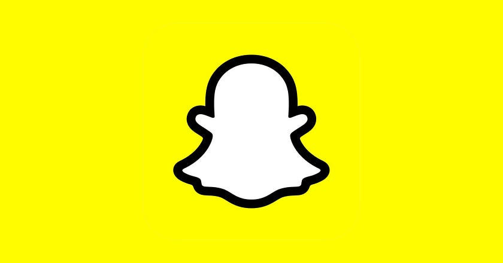
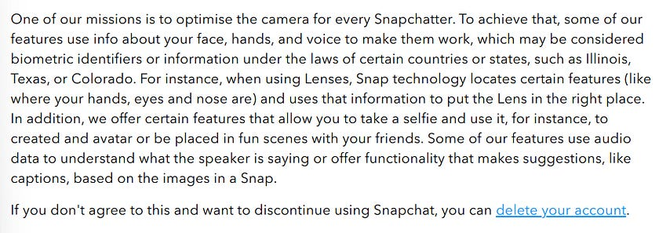
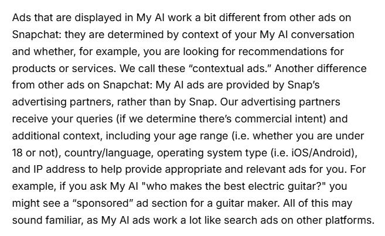
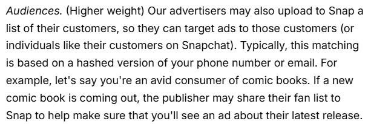

# I Read The Policies So You Don’t Have To: Snapchat (Instant Messaging Social App)

Snapchat are an instant messaging social app offering a multitude of features and integrations, one of the first messaging platforms to have originally offered disappearing messages, highly popular amongst teens, touting nearly 1 billion active monthly users globally.

This article consists of a review of Snapchat’s;

* [Privacy Explained](https://values.snap.com/privacy/privacy-center?lang=en-GB)  
* [Privacy Policy (UK)](https://values.snap.com/privacy/privacy-policy?lang=en-GB#how-we-use-information)  
* [Privacy Policy (US)](https://values.snap.com/privacy/privacy-policy/us-state-privacy-notice?lang=en-GB)  
* [Terms of Service](https://www.snap.com/terms?lang=en-GB)  
* [Ad Transparency](https://values.snap.com/privacy/ads-privacy?lang=en-GB#controlling-ads)  
* [Transparency Hub](https://values.snap.com/privacy/transparency?lang=en-GB)  
* [Integration Partners](https://help.snapchat.com/hc/en-gb/articles/7012332511252-What-are-Integration-Partners-and-Features-on-Snapchat?lang=en-GB)  
* [My AI on Snapchat](https://help.snapchat.com/hc/en-gb/articles/13266788358932-What-is-My-AI-on-Snapchat-and-how-do-I-use-it)  
* [Data and My AI](https://help.snapchat.com/hc/en-gb/sections/21446356060436)  
* [Service Providers](https://help.snapchat.com/hc/en-gb/articles/7012351145364-Learn-About-Snap-s-Service-Providers?lang=en-GB)  
* [Cookies Policy](https://www.snap.com/cookie-policy?lang=en-GB)  
* [Cookie Information](https://www.snap.com/privacy/cookie-information?lang=en-GB#Necessary)  
* [Privacy by Product](https://values.snap.com/privacy/privacy-by-product?lang=en-GB)  
* [Spectacles Supplemental Privacy Policy](https://values.snap.com/privacy/privacy-policy/spectacles-supplemental-privacy-policy?lang=en-GB)  
* [Information from the Camera](https://help.snapchat.com/hc/en-gb/articles/7012366118676-How-Snap-Uses-Information-from-the-Camera?lang=en-GB)  
* [My Selfie Terms](https://www.snap.com/terms/my-selfie)

# WHAT INFORMATION IS COLLECTED BY SNAPCHAT

*“We may collect this data when you provide it to us, when you use our services, or when we receive it from third parties”*

* Name  
* Username  
* Display Name  
* Email address  
* Date of Birth  
* Contact list (if user consents to share)  
* Phone number  
* Bitmoji  
* Language  
* Interests  
* Friends  
* Profile picture  
* Content shared  
* Inputs (including text, images, video, audio, precise location, engagement).  
* How the product is interacted with (i.e. which Lenses are viewed or applied, stories the user watches, how often the user interacts etc).  
* Engagement with the camera  
* Geolocation (GPS)  
* Hardware  
* Operating System  
* Device memory  
* Advertising identifiers  
* Apps installed on device  
* Browser type  
* *“Information from device sensors that measure the motion of your device, compasses and microphones”*  
* Whether user has headphones connected  
* Information about wireless and mobile connections  
* IP address  
* Device settings  
* Web storage information  
* Screen size  
* Access times  
* Metadata of uploads  
* Postal address  
* Unique Personal Identifier  
* Payment information (where a purchase/subscription is made)  
* Gender  
* *“Products or services purchased, obtained, considered or other purchasing or consuming histories or tendencies”*  
* Camera roll (if not limited)  
* Session logs  
* Search history  
* *“Inferences drawn from other personal information”*  
* Voice Chat messages, where they are transcribed by the user the transcribed data is retained.  
* Information attached to users Bitmoji  
* Information from the users camera

They also state they *“may receive information from third parties”* including;

* Website publishers  
* Social network providers  
* Law enforcement

but do not state what that information is.

# SNAPCHAT SPECTACLES

Users of Snapchat Spectacles are subject to an **\*additional** supplemental privacy policy, in addition to the standard policy. Under that policy the following information is stated as being collected;

* Location (if enabled)  
* Camera information  
* Microphone Information  
* Information about the users hands (size, distance between knuckles, position and motions of hands)  
* Information about the users voice (processing the audio to create text transcripts)  
* Information about the users surroundings (walls, windows, furniture, estimates of size, distance, shape).  
* Eye distance (between users eyes), provided by the user willingly or estimated based on other collected data

# DATA RETENTION

*“We keep information as long as you tell us to, and otherwise as long as we need it to provide our Services, or as required by law”* or *“If we need it for other legitimate purposes”.*

*“If you store something in Memories, we will keep it as long as you need it”*

*“When you Chat with a friend, our systems are designed to delete Chats you send within 24 hours after your friend reads it (unless you’ve changed your default settings or decide to save it)”.*

*“Although our systems are designed to delete some of your information automatically, we cannot promise that deletion will take place by a specific time”*

Face hand and voice data collected through camera use in app is deleted within 3 years of a users last use of snapchat

# WHAT IS DISCLOSED AND WITH WHO

* The Snap Inc. Family of Companies (i.e. [Saturn](https://www.joinsaturn.com/))  
* Third party apps (where connected)  
* Service providers  
* Business and integrated partners  
* Anti-fraud partners  
* Legal, safety and security partners  
* Affiliates  
* For the purposes of a merger or acquisition

Where a user interacts with an integrated feature, *“certain data”* is shared. Integrated partners of Snapchat are listed as;

* Apple Maps  
* Google Maps  
* iTranslateLinkfire  
* Lyft  
* OpenTable  
* Resy  
* Strava  
* The Infatuation  
* Ticketmaster  
* TripAdvisor  
* Uber

Snapchat also share information with trusted third party service providers, they do not disclose the service providers in full, but describe them as;

* Advertising partners  
* Cloud storage providers  
* Content providers  
* Customer communications providers  
* Customer support providers  
* Data analytics providers  
* Data management providers  
* Data solution providers  
* E-commerce providers  
* Logistics providers  
* Map providers  
* Marketing partners  
* Measurement partners  
* Payment providers

My AI (the AI in Snapchat) is *“powered by Large Language Models like GPT Models from OpenAI and Gemini models from Google”*, thus inputs to My AI are shared with those companies.

Images uploaded, taken with or shared with the My Selfie feature *“will be used to develop and improve machine learning models for use throughout the Services and for research purposes”*

# TERMS OF SERVICE

As usual, by using the services, the user agrees with the terms.

Terms include an up front arbitration notice, waiving any right to participate in a class action lawsuit.

Services are not directed to children under the age of 13\.

Convicted sex offenders are not permitted to use Snapchat

If using the Services on behalf of a business or other entity, the user is binding the business or entity to the terms.

When uploading or posting original content, the user retains ownership rights to the content, but grants Snapchat a licence to use that content.

*“For all content you create using the Services, or submit or make available to the Services (including Public Content), you grant Snap and our affiliates a worldwide, royalty-free, sublicensable and transferable licence to host, store, cache, use, display, reproduce, modify, adapt, edit, publish, analyse, transmit and distribute that content, including the name, image, likeness or voice of anyone featured in it”*

*“By using My Selfie, you grant Snap, our affiliates, other users of the Services, and our business partners an unrestricted, worldwide, royalty-free, irrevocable and perpetual right and licence to use, create derivative works from, promote, exhibit, broadcast, syndicate, reproduce, distribute, synchronise, overlay graphics on, overlay auditory effects on, publicly perform, and publicly display all or any portion of generated images of you and your likeness derived from your My Selfie, in any form and in any and all media or distribution methods, now known or later developed, for commercial and non-commercial purposes”*

*“We may access, review, screen and delete your content at any time and for any reason”*

*“if you provide feedback or suggestions, just know that we can use them without compensating you and without any restriction or obligation to you”*

# COOKIES

Snapchat state their Third Party Cookie Advertising Partners as;

* Bing  
* Facebook  
* Google  
* LinkedIn  
* Pardot  
* PayPal  
* Pinterest  
* Reddit  
* Twitter

They embed cookies from the above advertising partners, as well as the following;

* Taboola  
* Rokt  
* Outbrain  
* Fullstory  
* Zendesk  
* TwelveNYC  
* StreamShark  
* Q4  
* Cloudfare

You can view a full list of the [Snapchat cookies here](https://www.snap.com/privacy/cookie-information?lang=en-GB#Necessary)

# ADDITIONAL CONSIDERATIONS

Ads in My AI (the AI in Snapchat)

Snapchat state that they do not use the contents of private communications between friends to personalise a users experience, make recommendations or show ads.

Conversations with My AI work differently, Snapchat retain the content sent to and received from My AI.  
