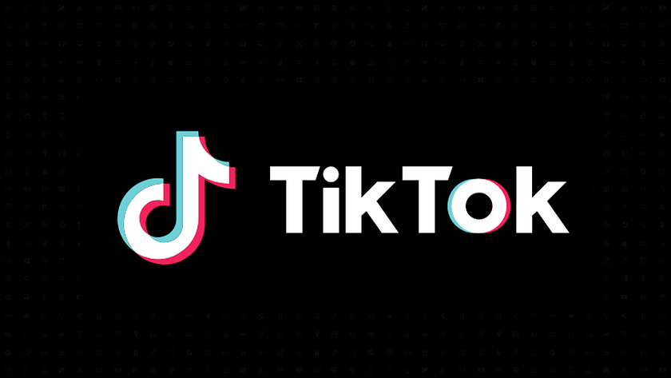

# I Read The Policies So You Don’t Have To: TikTok (Social Media Platform)

Claiming 1.5 billion monthly active users globally, not bad for a ‘late to the party’ social media platform, TikTok has taken the world by storm (for good and for bad) since its formation in 2016, netting a reported $23 billion in revenue in 2024, the majority of which stems from its advertising services.

This article consists of a review of TikTok’s;

* [Privacy Policy](https://www.tiktok.com/legal/page/eea/privacy-policy/en)  
* [Terms of Service](https://www.tiktok.com/legal/page/eea/terms-of-service/en)  
* [Location Information on TikTok](https://www.tiktok.com/support/faq_detail?id=7543897457726593542&category=web_account)  
* [Cookies Policy](https://www.tiktok.com/legal/page/global/tiktok-website-cookies-policy/en)  
* [Cookie Partner List](https://www.tiktok.com/legal/page/global/tiktok-partner-list/en)  
* [Ad Network Privacy Policy](https://www.tiktok.com/legal/page/global/tiktok-ad-network-privacy-policy/en)  
* [Information about TikTok Analytics](https://www.tiktok.com/legal/page/global/information-about-tiktok-analytics/en)  
* [Law Enforcement Guidelines](https://www.tiktok.com/legal/page/global/law-enforcement/en)

# WHAT INFORMATION IS COLLECTED BY TIKTOK

The following information is collected through a user engaging with TikTok either through the web or app version.

* Date of birth  
* Username  
* Email address and/or telephone number  
* Password  
* Profile image  
* Bio  
* Content the user creates, imports, uploads or publishes through TikTok  
* Photographs  
* Videos  
* Audio recordings  
* Livestreams  
* Comments  
* Hashtags  
* Reviews  
* Associated meta data (when, where, by who, what device etc) of content created, imported, uploaded or published  
* Contacts (if synced) (names, phone numbers, email addresses)  
* Camera roll contents (if not restricted)  
* Content from device clipboard (text, images, video) from devices clipboard if utilised in app.  
* Content of messages sent and received on the platform (web or app) and associated metadata of the messages, including chat functionality messages within shopping feature.  
* Where a purchase is made, a payment or other transaction through TikTok, they collect; payment card information, billing address, delivery address, contact information, and products purchased.  
* Proof of age documentation  
* Device model  
* Operating system and version  
* Keystroke patterns  
* Keystroke rhythms  
* IP address  
* System language  
* Device settings  
* Diagnostic information  
* Performance information (crash reports, performance logs)  
* Device ID  
* Location information (approximate or GPS)  
* Sim card number  
* Information about how the user engages with content and ads  
* Duration and frequency of use  
* User’s engagement with others  
* Internet Service Provider  
* Mobile country code  
* Mobile Network Code  
* Mobile carrier  
* Connection type (cellular or WIFI)  
* Connection speed  
* Screen resolution  
* Time the users device was last updated and started  
* Search history  
* If using the in-app browser, information about how the user interacts with websites via that in-app browser.  
* Content characteristics and features about the users videos, images and audio recordings, e.g. identifying objects and scenery, existence or location within an image, a face or other body parts, text of words spoken.  
* Inferred information; age range, gender, interests.  
* Monetised accounts (rewards programme) also must provide bank account or PayPal

Note: information about user content is collected “through pre-loading at the time of creation, import, or upload, regardless of whether the user chooses to save or upload that content”.

TikTok also collect information from other sources, which they state as being;

* Advertising, measurement and other partners  
* Sellers, payment and transaction fulfilment providers  
* Publicly available sources  
* Government authorities  
* Professional organisations  
* Charity groups

The information they collect through the other sources is stated as;

* Mobile identifiers  
* Hashed email addresses  
* Off platform activities (online and in person purchases)  
* Payment confirmation details  
* Authentication ID

# DATA RETENTION

TikTok *“retain information for as long as necessary”* to provide the platform, services, to comply with contractual and legal obligations or where they have a legitimate business interest to do so.

# WHAT IS DISCLOSED AND WITH WHO

Where contacts are synced, TikTok matches that information to users of the platform.

TikTok engage a number of service providers in order to deliver their service through which some data is shared in order to provide the service, as well as within the TikTok corporate group.

They do not name the service providers, but describe them as;

* Cloud Hosting providers  
* Content delivery providers  
* Customer and technical support  
* Content moderation providers  
* Marketing providers  
* Analytics providers  
* Payment services  
* Advertisers  
* Measurement and data partners  
* Sellers and their service providers  
* Users of TikTok’s Analytics Services

Additionally, where a user integrates a third party information is shared with that third party to provide a *“seamless service”*. This includes where a user logs into a third party platform using their TikTok login.

TikTok state they may also share information; with other users and the public (dependent on the users privacy settings), independent researchers, during a corporate transaction, or to comply with legal obligations and/or rights.

# TERMS OF SERVICE

Users must be at least 13 years old to use TikTok.

Users grant TikTok, their affiliates and other TikTok users a licence to use their content, the licence is;

* non-exclusive (user can still licence the content to others)  
* Royalty free (user will not be paid for the licence)  
* Transferable (TikTok can give the rights the user granted to them to someone else)  
* Sublicensable (TikTok can license the users content to others)  
* Worldwide

The terms, rights and permissions cannot be transferred by the user, but may be transferred by TikTok.

Account names may be reclaimed by TikTok if a user does not log into their account for six (6) months or if the account name violates Terms or Community Guidelines. Reclaimed account names may be made available to other users.

Monetised content creators must be at least 18 years old, are required to provide proof of identity and banking information

# COOKIES

TikTok helpfully list the cookies they and their partners work with, you can [view those here](https://www.tiktok.com/legal/page/global/tiktok-partner-list/en).

Additionally they define their Advertising Tools as;

* TikTok Pixel  
* TikTok Custom Audience  
* Lead Generation  
* API’s  
* Custom Audiences (Customer File) (businesses upload their contact details for customers so that TikTok can exclude those people from seeing ads for products or services they have already purchased).

# AGE VERIFICATION

Age verification for TikTok is provided by Yoti  
