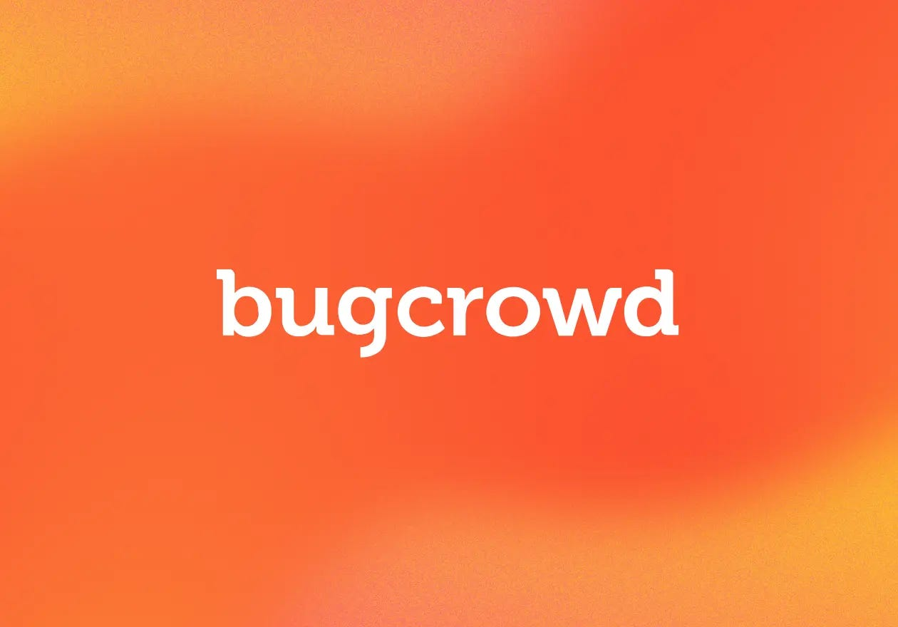

IMAGE: BUGCROWD LOGO

A privately owned company formed in 2012, Bugcrowd don’t post their financial information publicly, and any estimates for annual recurring revenue (ARR) are sitting between $200m-$328m. 

They carry an estimated $1bn in valuation, nine funding rounds deep. 

This is a review of Bugcrowds; 

* [Privacy policy](https://www.bugcrowd.com/privacy/)  
* [Website Terms & Conditions](https://www.bugcrowd.com/website-terms-and-conditions/)  
* [Standard Disclosure Terms](https://www.bugcrowd.com/resources/hacker-resources/standard-disclosure-terms/)  
* [Customer Terms & Conditions](https://www.bugcrowd.com/customer-terms-and-conditions/)  
* [Code of Conduct](https://www.bugcrowd.com/resources/hacker-resources/code-of-conduct/)  
* [Public Disclosure Policy](https://docs.bugcrowd.com/researchers/disclosure/disclosure/)  
* [Platform Behaviour Standards](https://www.bugcrowd.com/resources/hacker-resources/platform-behavior-standards/)  
* [Customer Terms and Conditions](https://www.bugcrowd.com/customer-terms-and-conditions/)

It is worth noting that individual programs through Bugcrowd are subject to their own additional terms and policies, this is just an overview of the services as a whole, not individual programs within the platform.

# WHAT INFORMATION IS COLLECTED BY BUGCROWD

Bugcrowd state that they my collect; 

* Name   
* Contact details  
* Photographs  
* Examples of your work  
* Information on work previously performed via the service and outside of the service  
* Skills and “other information”  
* Information the user discloses in any postings on the service *“You should be aware that when you disclose information about yourself on Bugcrowds pages, blogs, private messages and community forums, \[we\] will collect the information you provide in such submissions, including personal information”.*

Bugcrowd state that there may be some automatic data collection through use of their services or other methods of web analysis including; 

* IP address  
* Cookie identifiers  
* Mobile carrier  
* Mobile advertising identifiers  
* MAC address   
* IMEI  
* Advertising ID   
* *“Other device identifiers that are automatically assigned to your computer or device when you access the internet”*  
* Browser type   
* Language setting(s)  
* Geo location information  
* Hardware type  
* Operating system   
* Internet Service Provider   
* Pages the user visits before and after using the Services   
* Date and time of the users visit  
* The amount of time the user spends on each page   
* Information about the links clicked and pages viewed within the Service

If a user undertakes identity verification Bugcrowd may require; 

* Full name   
* Email address  
* Telephone number   
* Residential address  
* Identification documents (passport, drivers licence or other government issued documentation)  
* Government issued ID numbers   
* Age  
* Gender  
* Place of birth  
* Nationality  
* Place of residence   
* Selfie or image   
* Biometric information; including facial image extracted from photos within identification information and any selfies submitted  
* Identity verification outcome (and related profile which is generated) 

# DATA RETENTION 

Bugcrowd retain information pretty much indefinitely, *“for as long as you use our Services or as necessary to fulfil the purpose(s) for which it was collected, provide our Services, resolve disputes, establish legal defences, conduct audits, pursue legitimate business purposes, enforce our agreements, and comply with applicable laws”*

Where required by law, biometric information is stored for no more than one year. 

# WHAT IS DISCLOSED AND WITH WHO 

*“We may share any information we receive, including biometric information with vendors and service providers”.* 

This may include;

* Providers of IT and related services   
* Payment processors   
* Jumio (biometric verification partner)   
* Business partners   
* Advertising partners   
* Bugcrowd customers (when a user makes a submission some information is shared with the customer)  
* Legal and similar disclosures (e.g. to comply with law enforcement or national security requests and legal processes including court orders and subpoenas)

Data collected via or by Bugcrowd may be transferred, processed and stored anywhere in the world due to international reach and use of cloud servers globally. 

# TERMS OF SERVICE 

Researchers are independent contractors of Bugcrowd. 

Each submission is evaluated by the Program Owner on the basis of first-to-find. Bugcrowd may assist in the evaluation process. 

Bugcrowd are committed to protecting the interests of Security Researchers, *“the more closely your behaviour follows these rules the more we’ll be able to protect you if a difficult situation escalates”*

Valid submissions to Bugcrowd can count towards ISC2 Continuing Professional Experience (CPE) credits, where the user provides their ISC2 ID into the Bugcrowd Portal. 

Taxes to be paid on monetary rewards are the sole responsibility of the user. 

Any monetary rewards which remain unclaimed or undeliverable for a period of six (6) months will be forfeited. 

There are a number of common “non-qualifying” submission types, users are discouraged from reporting these issues unless they can demonstrate a chained attack with high impact; 

* Descriptive error messages (e.g. Stack Traces, application or server errors)  
* HTTP 404 codes/pages or other HTTP non-200 codes/pages  
* Banner disclosure on common/public services  
* Disclosure of known public files or directories, (e.g. robots.txt)  
* Clickjacking and issues only exploitable through clickjacking  
* CSRF on forms that are available to anonymous users (e.g. the contact form)  
* Logout Cross-Site Request Forgery (logout CSRF)  
* Presence of application or web browser ‘autocomplete’ or ‘save password’ functionality  
* Lack of Secure and HTTPOnly cookie flags  
* Lack of Security Speedbump when leaving the site  
* Weak Captcha / Captcha Bypass  
* Username enumeration via Login Page error message  
* Username enumeration via Forgot Password error message\#  
* Login or Forgot Password page brute force and account lockout not enforced  
* OPTIONS / TRACE HTTP method enabled  
* SSL Attacks such as BEAST, BREACH, Renegotiation attack  
* SSL Forward secrecy not enabled  
* SSL Insecure cipher suites  
* The Anti-MIME-Sniffing header X-Content-Type-Options  
* Missing HTTP security headers, specifically (https://blog.veracode.com/2014/03/guidelines-for-setting-security-headers/)

Users may qualify for a reward if they were the first eligible person to alert the Program Owner to a previously unknown issue AND the issue triggers a code or configuration change. Rewards can take the form of USD, Bugcrowd Points, CPE points, or Swag. 

The user agrees that they have obtained the necessary approvals and consents from all third parties including their employer for the purpose of participating as a Researcher. 

The user agrees to assign to Bugcrowd any and all of their Testing Results and rights thereto; to the extent any rights are not assignable, the user shall grant and agrees to grant to Bugcrowd *“an irrevocable, paid-up, royalty free, perpetual, exclusive, sub-licensable (directly or indirectly through multiple tiers), transferable, and worldwide license to use and permit others to use such Testing Results in any manner desired by us (and/or our customers and sponsors, without restriction or accounting to you”.*

The user agrees to waive in favour of Bugcrowd any moral right or other claim that is contrary to the intent of a complete transfer of rights to Bugcrowd in the users Testing Results. 

All submissions are confidential information of the Program Owner unless otherwise stated in the Bounty Brief, no submissions may be publicly disclosed at any time unless the Program Owner has consented to disclosure. 

All findings must be submitted with a full description, proof of concept and complete replication steps in the original report. Where the initial report lacks any of those reports will be automatically closed. 

# COOKIES 

Bugcrowd deploy cookies, pixel tags/web beacons and analytics trackers and partner with;

* Google Analytics  
* LinkedIn Analytics  
* Facebook Connect.

# OTHER CONSIDERATIONS 

Personal information may be de-identified and/or aggregated, in that instance it is no longer considered by Bugcrowd as Personal Information and may be shared within Bugcrowd and with third parties.

Bugcrowd do not respond to or honour Do Not Track (DNT) signals or mechanisms transmitted by web browsers. 

Researchers are required under the code of conduct to not use GenAI tools in a manner which discloses any confidential information. 

