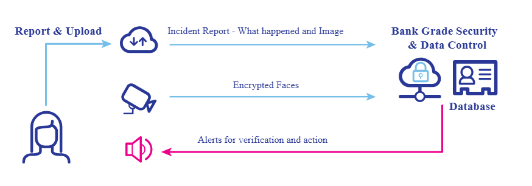
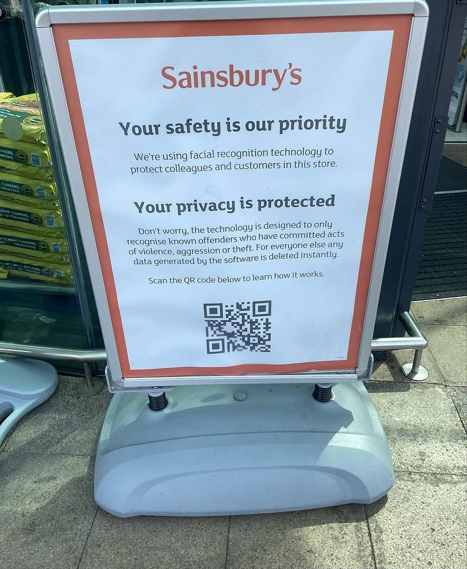
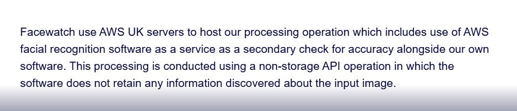

# I Read The Terms So You Don't Have To; Facewatch (UK Retail Facial Recognition)

Facewatch are a facial recognition crime prevention tool currently being rolled out to retailers across the UK, existing clients being the likes of; Sainsbury’s, Budgens, Spar, Home Bargains, Sports Direct, B\&M, Southern Co-Op, Farm Foods, Frasers, Flanners, River Island and many many more.

Their technology is scanning millions of faces each week, describing themselves as *“the only crime prevention tool that proactively identifies known criminals, allowing staff to act before a crime has been committed”.*

Facewatch cameras screen every person who walks into a store where they are deployed.

*“If your staff subsequently notice that someone who has entered your premises has committed a crime, they can log into the Facewatch system and add them to the database”.*

When a person is added to the Facewatch database they become a ‘Subject of Interest’.

When a Subject of Interest returns to that store, or goes to another store with the Facewatch system installed, an alert is issued.

Prior to an alert being issued a process happens.

Retailers deploying the Facewatch system are required to display signage outside of the property to inform customers of the technology.

This article consists of a review of Facewatch’s;

* [Privacy Notice](https://www.facewatch.co.uk/privacy/)  
* [DPA Notice](https://www.facewatch.co.uk/facewatch-and-dpa/)  
* [Privacy Notice for Facewatch Users](https://prod-portal.fwdvp.co.uk/privacy-policy/)  
* [Terms of Use of Facewatch Services](https://prod-portal.fwdvp.co.uk/terms/)

Facewatch works by converting the facial images captured by Facewatch cameras of persons entering a Subscriber premises using facial recognition algorithm templates which are then used to compare the facial recognition templates within their database of Subjects of Interest, creating alerts if there is a potential match.

# WHAT INFORMATION IS COLLECTED BY FACEWATCH

The information collected depends on whether you are a customer of Facewatch or a customer of a business which utilises the services of Facewatch.

If you are a customer of Facewatch (i.e. deploying their systems) they collect;

* Name  
* Email address  
* Contact details  
* User account activity  
* Audit logs  
* IP address  
* Approximate location

If you are a person walking into a retail store or business premises the following data is collected;

* Facial images  
* Subject of Interest information added by the Subscriber (Facewatch customer)

# DATA RETENTION

Personal data is only retained for so long as it is considered necessary and proportionate to do so for legal purposes.

Where a customer of Facewatch closes their account the personal data associated with that account is deleted from Facewatch systems within 30 days unless it is needed to be retained for audit purposes (e.g. they raised an incident report), in which instance that data is retained for a maximum of one year.

Recorded Incidents are retained for one year.

Alert data (excluding images and biometric data) is retained for 7 days.

Alert time and location data is retained for 48 hours.

Detected faces from the camera feed an alert are trained for 7 days

Biometric data is deleted at the point of being converted into facial biometric measurements.

Where a person under 18 is added to the Subject of Interest database data is retained for six months.

Other Subject of Interest data is retained for a period of up to 12 months from their last recorded incident, apart from where the incident involves a weapon or threat, in which case it is retained for two years.

Findings of no crime, not guilty or cessation of proceedings will lead to removal of that incident report against the Subject of Interest database.

# WHAT IS DISCLOSED AND WITH WHO

Facewatch use AWS UK servers, which includes use of AWS facial recognition software as a secondary check for accuracy of their own systems.

Data is shared with AWS, UK becomes subject to AWS privacy policies.

Facewatch state that data is not shared with third parties except;

* Where required by law, or  
* Where necessary to maintain the security and integrity of the system (e.g. incident investigation).

# TERMS OF SERVICE

There are no Terms of Service available for customers of businesses where Facewatch is deployed, the Terms of Service apply to customers of Facewatch.

Equipment (‘The Edge Equipment’) is supplied and owned by Facewatch and includes third-party facial recognition software.

Facewatch acts as data controller. Images of SOIs may be uploaded by the Subscribers, any information provided may be used to create alerts for the benefit of other subscribers where appropriate.

The services may only be used by persons over the age of 18 and must be an employee, director, partner or otherwise authorised to do so by a current subscriber (Facewatch customer).

All rights in Intellectual Property in the Services are owned by Facewatch.

All Subject of Interest information supplied must be true to the best of the knowledge of the retailer. Making a false or malicious report may itself be a crime.

Customers of Facewatch must only use the technology in any way that breaches any applicable local, national or international law or regulation (including the DPA) or is in any way unlawful or fraudulent or has any unlawful or fraudulent purpose or effect.

All customers of Facewatch must display appropriate signage as recommended by Facewatch at all times at Properties which use the Services.

Customers are not to upload to the Services any data that contains personal data of any individual under 18 years of age.

Facewatch must be used in a confidential manner. Customers will not disclose Facewatch Confidential Information during the term of the contract or at any time during the five year period following the end of Term.

# OTHER CONSIDERATIONS

Facewatch own the hardware installed into retail premises and provide access to the system and data which Facewatch are sole data controller of.

The customer (retailer) is data controller only of the Subject of Interest information they add to the database (name, reason flags, images of suspected crime or disorder and the statements and information supplied).

Anyone has the right of access to submit a Subject Access Request to Facewatch to obtain confirmation as to whether or not they are processing your personal data. To respond to a Subject Access Request, Facewatch will need to obtain proof of identity.

Facewatch do not record SOI's nor generate alerts for children under 18 or adults aged over 80 unless by their recorded actions they pose a threat to the safety or others or themselves.