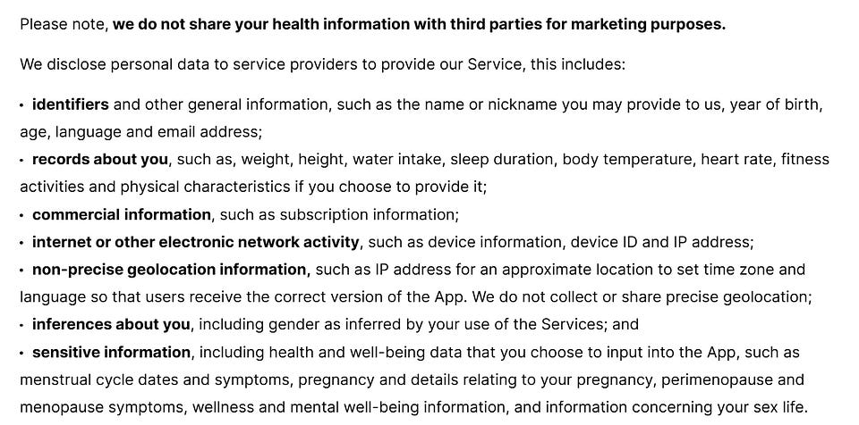

# I Read The Policies So You Don't Have To; Flo (Period, Ovulation & Pregnancy Tracking)

Flo is an app aimed at the female health market, it is used by women to track their period, menstrual cycle in general, ovulation, and/or pregnancy.

Whilst registered in the UK, Flo are a globally used app, the app is known by some other names depending on the country, Flo’s aka names can be [found here](https://flo.health/flo-application-names).

Flo claim more than 77 million monthly active users worldwide, earning them a revenue of around $275 million in 2025\.

This article consists of a review of Flo’s;

* [Privacy Policy](https://flo.health/privacy-policy)  
* [Cookie Policy](https://flo.health/cookie-policy)  
* [US State Privacy Notice](https://flo.health/supplemental-flo-us-state-privacy-notice)  
* [Consumer Health Data Privacy Notice](https://flo.health/consumer-health-data-privacy-notice)  
* [Your Body, Your Data](https://flo.health/privacy-portal)  
* [Flo Privacy FAQ](https://flo.health/flo-privacy-faqs)  
* [Terms of Use](https://flo.health/terms-of-service)  
* [Security at Flo](https://flo.health/security)

# WHAT INFORMATION IS COLLECTED BY FLO

Flo collect the following user data;

* Name  
* Email address  
* Device ID  
* Age (group)  
* Subscription status  
* Each time the app is launched  
* Birth month and year  
* Password  
* Location  
* Time zone  
* Language  
* Gender (inferred)  
* Weight  
* Height  
* BMI  
* Body temperature  
* Menstrual cycle details  
* Pregnancy related information  
* Menstrual cycle symptoms  
* General health and wellbeing  
* Details about sex life  
* Physical and mental health  
* Water intake  
* Sleep duration

The following data is collected automatically when a user engages with the Flo App;

* Device model  
* Operating system and version  
* Unique device identifier  
* Whether the device has any accessibility features applied  
* Mobile operator  
* Network information  
* Device storage information  
* *“version of device system”* (unusual wording choice)  
* IP address for an approximate location, country, time zone (they state they do not collect exact location of users)  
* Frequency of use of app  
* Areas and features of the services accessed or used  
* Payment transaction information (excluding full payment card details)

The above data is collected through either a person’s use of the app inputting the information themselves into the app, or inferred, or collected through third party services including wearables (i.e. fitness watch linked to smartphone, Apple Healthkit, Google Health Connect)

Connecting Flo App to a third party service such as Apple Healthkit or Google Health Connect enables Flo to automatically import the users health data to Flo, saving the user the trouble of having to log it themselves within the Flo App. The data Flo collects via Third Party Services (including wearables) includes;

* Fitness activities  
* Calories burned  
* Heart rate  
* Steps taken  
* Distance travelled  
* Body temperature  
* *“other activity details”*

Flo state they may receive personal data from third party external sources, but do not state who any of those third parties are.

# DATA RETENTION

Flo keep the personal data of users for *“as long as necessary to provide the Services or fulfill the purposes for which it was collected”.*

Users can deactivate their account at any time and request deletion of their data, which is completed within 90 days of the erasure request being submitted.

Where a user merely deletes the App from their device or their account becomes inactive, Flo will retain the personal data for 3 years, after 3 years the data is deleted.

Certain data (i.e. that relating to subscriptions) must be retained for longer to comply with regulations and legal obligations.

Data may be aggregated or anonymised, in which case retention periods may be longer.

# WHAT IS DISCLOSED AND WITH WHO

Flo only shares health data with third parties with the users consent. The user provides their consent by using the product, using the product is agreement of the terms of service, within which the user agrees to provide their consent for Flo to share their information.

Flo shares information with;

* AppsFlyer  
* Firebase  
* TikTok Ad Manager

They state that health data is not shared with the above, only personal data, for marketing and promotional purposes. They state the information they share as being;

* Technical identifiers: IP address, Android ID, Device ID, Google Advertising ID  
* Age group  
* Subscription status  
* That the app was launched  
* Advertising identifiers

In order to provide their services, or their services be provided on their behalf, sometimes personal data is shared with subprocessors.

Flo state their subprocesors as;

* Affiliates (Flo Health Cyprus, Flo Health LTU UAB, Flo Health NL. BV)  
* Amazon Web Services  
* Cloudflare  
* Auth0  
* Kibana (Elastic N. V.)  
* Vercel  
* SendGrid Inc (Twillio)  
* Trustpilot  
* SurkeyMonkey  
* Looker (Google Cloud EMEA)  
* Databricks  
* Google (Tag Manager and Analytics)  
* Zendesk  
* Customer Thermometer  
* Tecton (Machine Learning)  
* Apple  
* Stripe  
* PayPal  
* Chargeback Gurus  
* AppsFlyer UK  
* Firebase  
* Commercial Partners (Wellhub)  
* Telehealth partners  
* Research institutions

Tecton is the machine learning model behind menstrual cycle predictions for users within the app, amongst other features.

Flo have an option for users to share their data with their human partner. If a user chooses to share their Flo App information with a human partner, the human partner is provided with read-only access in a semi-restricted way (unable to see calendar information, personal notes, symptoms, secret chats). Partners will also receive notifications of key cycle points, educational insights, and if pregnancy tracking, notifications about changes to the users body.

Where data is shared with a subprocessor, the data becomes subject to the subprocessors privacy policy, and any/all of their subprocessors, etc etc.

Flo use an AI model to predict cycles, though they do not give much information about the model they use, what is known is *“The Flo Health app uses a hybrid artificial intelligence system Flo Health Accelerates AI Innovation. It relies on foundational machine learning neural networks for cycle and ovulation tracking Neural Network Implementation, and fine-tuned large language models (LLMs) via Databricks Mosaic AI to power its generative AI virtual assistant”.*

Vague.

# TERMS OF SERVICE

The app is not for persons under the age of 13\. People in the EEA, UK or Canada must be at least 16 years of age to use the app.

Flo only shares health data with third parties with the users consent. The user provides their consent by using the product, using the product is agreement of the terms of service, within which the user agrees to provide their consent for Flo to share their information.

If the user doesn’t agree with the terms, they may not access or use the app.

Clause 7.2.13, the user agrees not to use the predicted fertile window or ovulation estimates as a form of birth control or to facilitate conception (which is kind of funny given the whole purpose and marketing of the app).

In providing User Content (any information/details the user adds to the app i.e. period dates, symptoms etc) to the app, the user grants Flo a non-exclusive, transferable, sublicensable, worldwide, royalty-free licence to use, copy, exploit, modify, publicly display, publicly perform, create derivative works from, incorporate it into other works, change, reformat and distribute the User Content in any way Flo deemed appropriate.

Deleting the app does not stop any subscriptions, which must be cancelled separately if/where a user wishes to.

Any trial of the product automatically turns into a paid subscription at the end of the trial period, unless cancelled during the trial period by the user.

# COOKIES

The very long list of Cookies that Flo utilise [can be viewed here.](https://flo.health/cookie-policy)

# OTHER CONSIDERATIONS

In 2022, [Flo reached settlement with the FTC](https://flo.health/our-privacy-journey) regarding data sharing practices between 2016 and 2019, following a lawsuit which alleged Flo incorporated code from Flurry, Meta Platforms, Inc. and Google’s SDKs in the Flo App through which Flo allegedly shared information related to Flo App users.

A settlement agreement was reached, with no admission of wrongdoing, to the tune of $59.5 million. Following this, Flo voluntarily engaged Guidepost Solutions to undergo auditing of their practices, later achieving ISO 27001 and ISO 27701 certifications, with support from ZeroDayLab and Vanta.

If you are based in the US and were a user of Flo between the above dates, you can [make a claim for part of the settlement funds here.](https://periodtrackerdataprivacylitigation.com/)  

