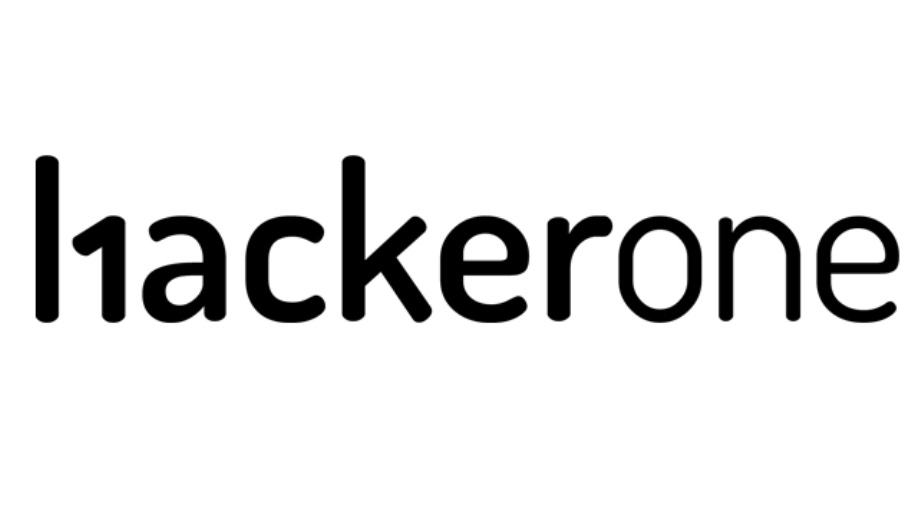

# I Read The Policies So You Don’t Have To: HackerOne (Vulnerability Reporting Platform)

HackerOne describe themselves as a global leader in Continuous Threat Exposure Management (CTEM), partnering with the global security researcher community to provide businesses with access to top talent Community Members who identify and surface relevant security issues in a business’s products and/or services.

A privately owned company typically not releasing any financial data publicly, though state they have paid over $81 million in bug bounties to Ethical hackers over a recent 12 months period.

This article consists of a review of Hackerone’s';

* [Privacy Policy](https://www.hackerone.com/policies/privacy)  
* [Customer Terms and Conditions](https://www.hackerone.com/terms)  
* [Customer Artificial Intelligence (AI) Terms and Conditions](https://www.hackerone.com/terms/AI)  
* [General Terms and Conditions](https://www.hackerone.com/terms/general)  
* [Community Member Terms and Conditions](https://www.hackerone.com/terms/community)  
* [Gold Standard Safe Harbour Statement](https://docs.hackerone.com/en/articles/8494525-gold-standard-safe-harbor-statement)  
* [Bug Bounty Maturity Framework](https://docs.hackerone.com/en/articles/14048481-bug-bounty-maturity-framework)  
* [Cookies Policy](https://www.hackerone.com/policies/cookies)  
* [Data & Information Security](https://www.hackerone.com/terms/security)  
* [Code of Conduct](https://www.hackerone.com/policies/code-of-conduct)  
* [Detailed Platform Standards](https://docs.hackerone.com/en/articles/8369826-detailed-platform-standards)  
* [Requesting Disclosure](https://docs.hackerone.com/en/articles/8475358-requesting-disclosure)  
* [Program Participation & Submission Process](https://www.hackerone.com/terms/disclosure-guidelines)  
* [Clear Rules of Engagement](https://www.hackerone.com/policies/clear-rules-of-engagement)  
* [Pentest Rules of Engagement](https://www.hackerone.com/policies/pentest-rules-of-engagement)  
* [Compliance and Trust](https://trust.hacker.one/)  
* [Employee Participation Policy](https://www.hackerone.com/policies/employee-participation)  
* [Business Code of Conduct](https://www.hackerone.com/sites/default/files/2025-02/HackerOne-Code-of-Conduct_1.pdf)

It is worth noting that individual programs through HackerOne are subject to their own additional terms and policies, this is just an overview of the services as a whole, not individual programs within the platform.

# WHAT INFORMATION IS COLLECTED BY HACKERONE

The type of data collected by HackerOne depends on whether you are a customer or a “community member”.

Customers are those who pay HackerOne for a service, everyone else is a community member.

HackerOne state they may collect the following information;

* Username  
* Password  
* Email address  
* Profile picture  
* Information in “about me” and/or “intro” fields  
* Telephone number  
* Language  
* Location (based on IP)  
* IP Address  
* Clothing size (where “swag” is claimed  
* *“the use you make of our Services and the content you provide while doing so”*

To enable pay outs for successful bounties, HackerOne require;

* Name (as per the account receiving funds)  
* Account or card information  
* Residential address  
* Nationality  
* Tax identification documentation  
* Transaction details (amount due or paid)  
* Date of birth  
* Social security / Tax ID  
* Identification documents (passport or driving licence)  
* Images and/or videos of the users face  
* Face scans and other measurements extracted from images/videos of users face

HackerOne state that they also collect personal data from devices and third parties when services are accessed, stating that data as;

* Browser type  
* Browser version  
* IP address  
* MAC address  
* Approximate location  
* Time zone  
* Access logs  
* Device type  
* Operating system  
* User ID  
* URLs and content visited  
* Language preferences  
* Clickstream  
* Date and time of visits to pages  
* Page response times  
* Length of visits to pages  
* Interactions (such as scrolling, clicks, anonymous click IDs and mouse-overs)  
* Methods used to leave their site

HackerOne state that they may collect Video and Audio recordings, which are converted to transcripts but does not state in what context.

They state third parties from whom they obtain data about users as being (though I suspect this is not an exhaustive list);

* Google  
* LinkedIn  
* Meta  
* Public court records checks  
* Government sanctions  
* Professional references checks

To qualify as a HackerOne Clear Finder, HackerOne may conduct background and ID verifications, necessary to participate in Clear Programs. HackerOne may request reports from third party agencies (on a recurring basis) that may contain information relating to, amongst other things;

* Criminal records check  
* Character  
* Identify Verification information  
* Reputation

# DATA RETENTION

Enquiry and business development data is retained for 7 years from when the relationship between the user and HackerOne ends.

Chatbot data (not HAI, this refers to the website chatbot,) data is retained for 12 months following the interaction, unless it comes part of the users Account Data, in which case it is retained for 7 years from when the relationship between the user and HackerOne ends.

Video and Audio recordings and transcripts are retained for up to 30 days after the data is no longer necessary to fulfil the original purpose.

Account data, payment data and vetting data is retained for 7 years from the relationship between parties ending, except where a different period is required by applicable law.

Data collected for or from any hosted events is retained for two years from its initial collection.

Analytics data is retained for 26 months, at which point “underlying data” is deleted.

They note they may keep anonymised data indefinitely.

# WHAT IS DISCLOSED AND WITH WHO

HackerOne state that personal data may be shared with the following, in order for them to be able to provide their services.

* Members of the HackerOne corporate group  
* Google Analytics  
* Hosting providers  
* Website analytics partners  
* Behavioural remarketing services  
* Marketing automation partners  
* Payment processing partners  
* Contract signing services  
* IT maintenance providers  
* Security providers  
* Customer services  
* Artificial Intelligence (AI) processors (note the chatbot on the website is provided by a third party, the HAI model embedded into the platform is HackerOne operated)  
* Identity verification and screening partners (Berbix and First Advantage)

HackerOne may also disclose personal data where;

* Required by law, government, competent authorities or the courts (including to meet national security or law enforcement requirements, or to establish, exercise or defend their legal rights  
* For the purposes of preventing crime and fraud  
* To take precautions against liability, protect rights, property or safety of HackerOne, their users, other individuals or the public

# TERMS OF SERVICE

There are general terms, terms for community members and terms for customers.

## General Terms

Each customer and community member waives any right to assert any class action claims.

## Community Member Terms

If a community member does not cooperate with process, any reward that would otherwise be paid may be paid to a charity of HackerOne’s choosing.

HackerOne are not liable for any unpaid rewards arising directly or indirectly as a consequence of a breach of Terms (and/or policies) by a community member.

By making any data available through the use of the Platform, the community member hereby grant to HackerOne a perpetual, irrevocable, non-exclusive, transferable, sublicensable, worldwide, royalty-free license to use, copy, reproduce, display, modify, adapt, transmit, and distribute copies of that Community Member Data for our business purposes, including to provide and develop our products or services.

By making any Community Member Submission available to a Customer through the Platform, the community member hereby grant to the Customer a perpetual, irrevocable, non-exclusive, transferable, sublicensable, worldwide, royalty-free license to use, copy, reproduce, display, modify, adapt, transmit, and distribute copies of that Community Member Submission in connection with the Customer's use and receipt of the Services.

HackerOne does not claim any ownership in any Community Member Data generated by platform tools.

## Paying Customer Terms

HackerOne does not endorse any community member.

Use or reliance of community member submissions are received at the customers own risk.

Community members are independent third parties, the Customer agrees that any legal remedy for actions or omissions of a community member are limited to a claim against the community member, not HackerOne.

Customers may choose to reward community members (this is not a given, rewards are voluntary not obligatory). Demanding a reward or threatening to disclose a vulnerability publicly if a reward is not granted is not compliant with policy and may result in account suspension or ban.

Customer agrees that payments must be provided in advance and full for any Reward funds prior to the transfer of funds to a community member by HackerOne.

To receive the reward, the community member must have;

* Completed applicable KYC/AML requirements  
* Provided tax documentation  
* Passed screening inc sanctions list checks  
* Complied with terms and policies at all times

Customers understand and agree that community members have appointed HackerOne as their agent to accept monetary rewards on their behalf.

HackerOne fees and reward payments are non-refundable.

Where a community member submission has not been validated by the Customer within thirty (30) days of a valid termination, HackerOne shall be authorised to transfer the Reward funds for the purposes of providing a reward, based on normal industry validation practices.

If an Order Form does not specifically identify HackerOne as being responsible for the management and administration of a Customer's Programs, then the Customer is solely responsible for the management and administration of their Programs through the Services where they will be subject to the Customers own Program policy, in the event of any conflict between a Customer's Program Policy and HackerOne's Vulnerability Disclosure Guidelines, the Customer's Program Policy shall prevail.

Customer accounts may be suspended if payments are more than sixty (60) days late.

# COOKIES

Cookie partners of HackerOne they name as;

* Google Analytics  
* Marketo (Munchkin)  
* TechTarget  
* Demandbase  
* 6Sense  
* Pathfactory  
* DoubleClick  
* LinkedIn

# OTHER CONSIDERATIONS

Data is encrypted at rest. Network communications encrypted with TLS, Perfect Forward Secrecy, HTTP Strict Transport Security (HSTS), additionally HackerOne do not store passwords, only hashes.

HackerOne consider Good Faith Security Research conducted with a good faith effort to comply with their programme, whilst that remains the case they;

* Will not bring legal action against you or report you (“you” being the community member), including for bypassing technological measures HackerOne use to protect the applications in scope; and,  
* Will take steps to make known that the community member conducted Good Faith Security Research if someone else brings legal action against the community member.

If a researcher thinks they might engage in conduct which may be inconsistent with the Good Faith Security Research principles the researcher should contact HackerOne for clarity **before** engaging with such conduct.

If a community member prefers to remain anonymous, HackerOne encourages that community member to submit vulnerabilities under a pseudonym.

HackerOne vendor for ID verification is Berbix.

HackerOne vendor for background checks is First Advantage.

# PUBLIC DISCLOSURE

Public disclosures may be made only with the customers agreement. If the customer rejects the disclosure request or does not respond the report may not be disclosed.

If a security team has not responded to a formal request for disclosure for 180 days despite reasonable follow ups from the community member, the contents of the Report may be publicly disclosed, unless prohibited by the program's policy.

Any public disclosure must adhere to the HackerOne Code of Conduct, and cannot include third-party confidential or personal information.  
