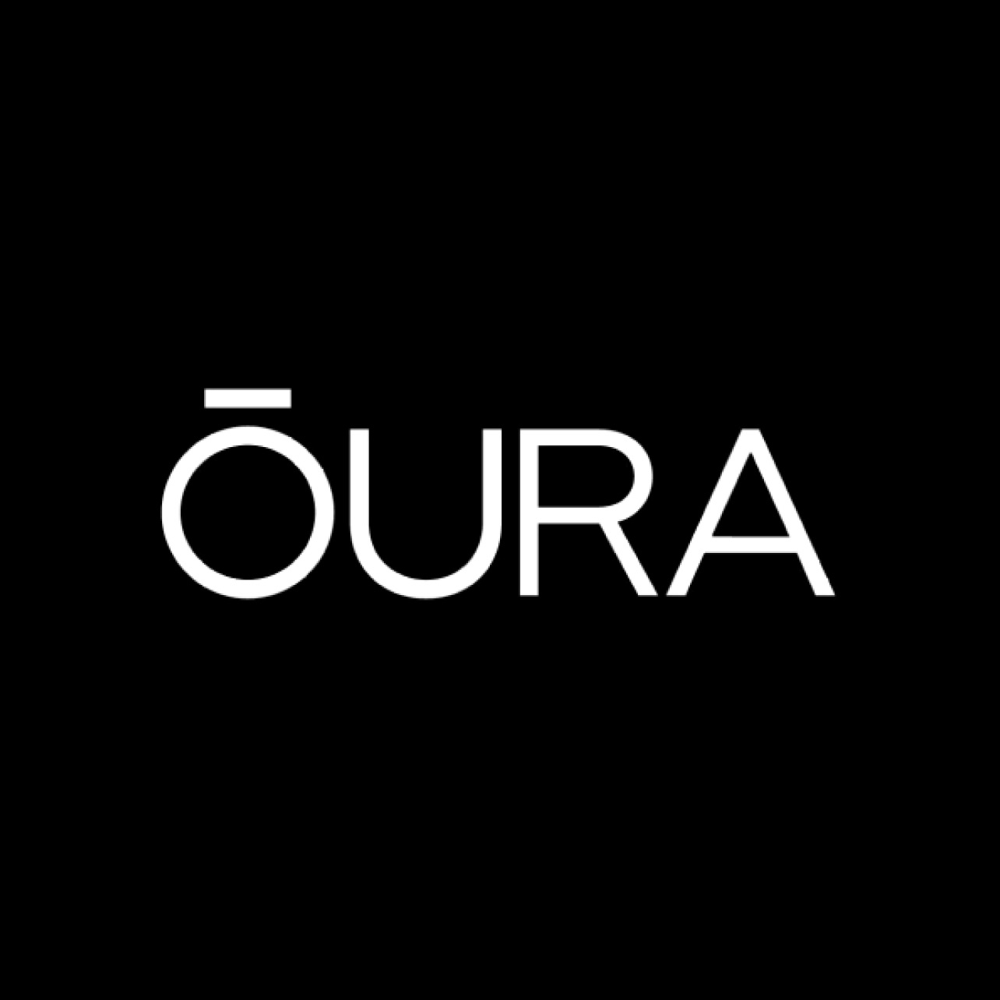

# I Read The Policies So You Don’t Have To: Oura Ring (Health Tracking Wearable Technology)

Oura rings are wearable tech designed *“to track important aspects of your health like your daily habits, reproductive health, and quality of your sleep”.*

For a company which generates a lot of revenue and collects the health data of millions of customers, they don’t have many policies or terms available for users to review.

The company claims revenues of $1 billion in 2025 having impressively increased revenue 100% year on year, Oura have sold 5.5 million rings since 2015\.

Oura are lining themselves up for IPO where they seeking to raise $3 billion through US markets taking the company valuation to circa $16 billion.

Most of the insights from the data collected through the ring are only available to paid members, with subscription prices starting at $5.99 per month. Oura *“anticipates having more than five million subscribers this quarter”.*

The policies written by Oura apply to the processing of personal data by Oura Inc, Oura Health Oy, Oura ring Inc, its subsidiaries, when a person visits their website, uses the Oura Ring within the Oura App, Membership Hub or uses other Oura services.

This article consists of a review of Oura’s;

* [Privacy Policy](https://ouraring.com/privacy-policy)  
* [Terms of Use](https://ouraring.com/terms-and-conditions)  
* [Your data is our priority \- security](https://ouraring.com/security)  
* [EU Declaration of Conformity (gen 3\)](https://ouraring.com/declarations-of-conformity/gen3)  
* [EU Declaration of Conformity (ring 4\)](https://ouraring.com/declarations-of-conformity/oura-ring-4)  
* [Cookies Policy](https://ouraring.com/cookie-policy)

# WHAT INFORMATION IS COLLECTED BY OURA

Oura collects the following personal data;

* Email address  
* Residential address address  
* Gender  
* Birth date and year  
* Height  
* Weight  
* User ID  
* Time of visit (to website or app)  
* Any information the user provides about themself or their account  
* IP address  
* Location data (estimated or accurate, settings dependent)  
* Heart rate  
* Movement data  
* Temperature data  
* Respiration data  
* Sleep phases (deep, light, REM, awake)  
* Height-level location  
* Activity levels  
* Readiness level  
* Body mass index  
* Card number, expiration date, security code  
* Card merchant  
* Billing address  
* Network ID  
* *“Wifi data”*  
* Automatically generated tags  
* Metadata regarding service use  
* Browsing patterns

As well as any user provided information such as;

* Activities  
* Notes  
* Photos  
* Comments  
* User feedback  
* Tags  
* Text submitted to the AI Assistant  
* Uploaded Electronic Health Records (which may include visit summaries, clinical notes, diagnoses, medications, allergies, immunisations, lab results, vital signs, care plans, etc).

Oura state they may also receive personal data about users from third parties and partners, but do not state what data that is or from whom.

# DATA RETENTION

*“The retention period for your personal data generally depends on the duration of your Oura account lifecycle”*

Personal data is deleted when it is no longer needed for the purpose for which it was originally collected, unless Oura have a legal obligation to retain data for a longer period of time.

# WHAT IS DISCLOSED AND WITH WHO

Data is shared with Oura’s AI assistant “Oura Advisor” to support development, testing and improvements to the large language model-powered features.

Where a user integrates Oura with a third party service, data is shared with that third party service.

The Oura Enterprise Platform enables users to share data with their doctor, coach, trainer, employer, researchers and/or any other person or entity after receiving an invitation to do so \- information is only shared with the users consent.

Where that consent is provided the recipient of the users health record becomes data controller of that personal data and the data is subject to their policies and terms. Consent to view further ongoing data can be revoked at any time by the user.

Removing consent does not affect the processing of data which has already been extracted, only ceases to share further data.

Oura is a global company with servers based around the world, they state that data may be across servers including at locations outside of the country the user resides.

Data is shared with subprocessors and partners where their service is required to deliver Oura services to the user.

Oura do not state who their subprocessors or partners are.

Where a user engages with the Oura Research App to participate in research studies conducted by or on behalf or Oura or an independent research sponsor, data is shared with the Research sponsor.

# TERMS OF SERVICE

Oura state that they are not responsible for the processing of a users personal data by any recipient through the Oura Enterprise Platform which enables data sharing with a users doctor, coach, trainer, employer, researcher or and/or any other person or entity the data is shared with by the user.

By accessing or using the services the user expressly agrees to be bound by all the terms and conditions and privacy policy.

Oura grants to the user a limited licence to access and use the services, subject to the users compliance with the terms.

Users of Oura must be at least 18 years of age.

Users are responsible for ensuring that Oura has accurate and current information within the account.

In the event that the user does not log in or use the services for six (6) months or longer following purchase or receipt of a product, Oura reserve the right to terminate the subscription.

Services are provided to users “as it with all faults” and “as available” without warranty of any kind, but to comply with local jurisdiction laws relating to consumer rights will consider replacement of defective products for between 90 days and 1 year from date of purchase.

Oura rings are not a medical device, users expressly agree that the services provided by Oura do not involve the provision of medical services or advice. The services are not intended to diagnose, treat, track, cure or prevent any disease or medical condition.

The services are for information purposes only.

Oura is not responsible for any health problems that may result from information the user learns through the Services.

# COOKIES

Oura do not disclose which cookies and pixels they deploy.

# OTHER CONSIDERATIONS

Oura is not a Covered Entity under HIPAA for direct-to-consumer services. When a user directs a HIPAA Covered Entity or Business Associate to share their health records with Oura through patient-directed disclosure or HIPAA Authorisation, the records received by Oura no longer fall under HIPAA whilst in Oura’s possession.

Oura offer special pricing and/or discounts to certain groups including; students, educators, first responders and healthcare professionals, to prove edibility for those discounts, the user is required to undergo ID verification through ID.me \- data provided to ID.me during the identity verification process is subject to ID.me’s policies and terms, some of which may be shared with Oura.  
