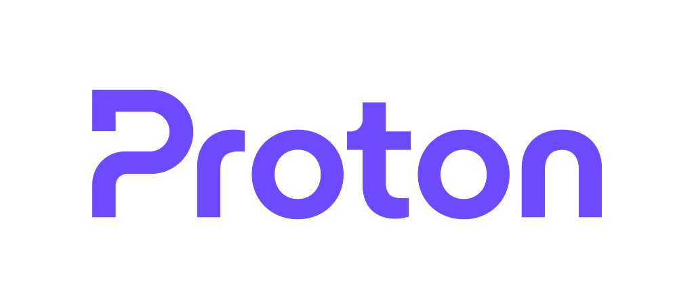
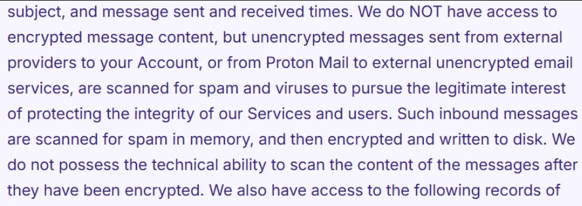
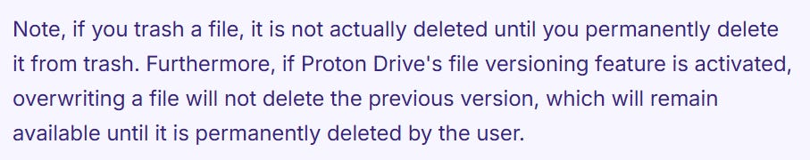
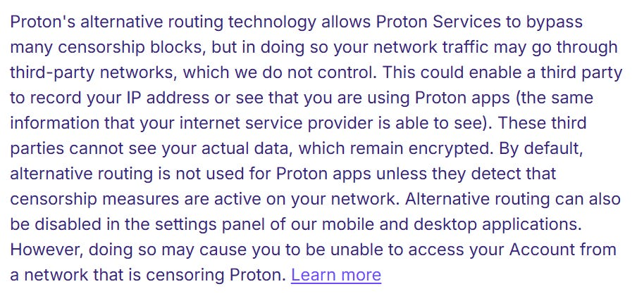
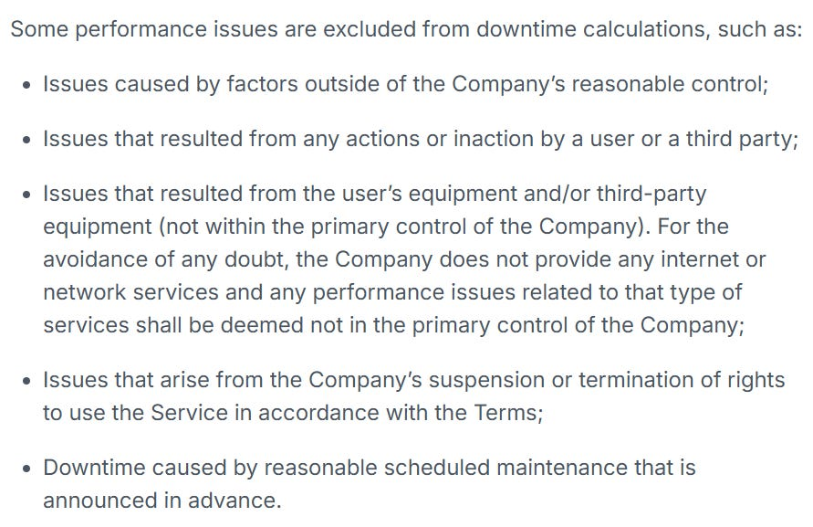

Proton have harnessed over 100 million active users. A private company (limiting the public financial information), with estimates as of September 2025 an ARR being around the $65m mark.

Unlike all of the products this series has considered so far, Proton made $0 in advertising revenue in 2025 and all years prior, instead relying on their privacy focussed subscription model to keep the coffers lined and the lights on.

This article summarises a review of Protons;

* [Privacy Policy](https://proton.me/legal/privacy)  
* [Proton Mail Privacy Policy](https://proton.me/mail/privacy-policy)  
* [Proton Drive Privacy Policy](https://proton.me/drive/privacy-policy)  
* [Proton Calendar Privacy Policy](https://proton.me/calendar/privacy-policy)  
* [Proton VPN Privacy Policy](https://protonvpn.com/privacy-policy)  
* [Proton Pass Privacy Policy](https://proton.me/pass/privacy-policy)  
* [Proton Wallet Privacy Policy](https://proton.me/wallet/privacy-policy)  
* [Proton Meet Privacy Policy](https://proton.me/meet/privacy-policy)  
* [Lumo Privacy Policy](https://proton.me/lumo/privacy-policy)  
* [Proton Business Privacy Policy](https://proton.me/business/privacy-policy)  
* [Terms of Service](https://proton.me/legal/terms)

# WHAT INFORMATION IS COLLECTED BY PROTON

Proton state that they *“do not have the technical means to access the content of your encrypted emails, files, calendar events, passwords or notes”*.

Their core privacy policy outlines the instances where data is collected with broad overview, whilst the individual product policies provide some further information on what is collected.

The core policy stipulates that Proton’s data collection is limited to;

* Anonymised analytics, stored locally. IP addresses are not retained and stored for analytics.  
* During account creation, the information a user provides to create the account i.e. alternative email address if provided.  
* Verification methods (where applicable), users may be asked to verify they are human using either email, SMS, (or Captcha).  
* Native applications, including mobile and desktop versions, which may collect certain technical information. They note app stores may collect (anonymised) data which is governed by the app store privacy policies.

They state that their applications do not access or track any location based information from user devices.

Proton Scribe operates locally on devices by default, users can choose to have it operate server side, in which case minimal data is shared to servers. No log, account data or content data is stored on Proton servers and Proton Scribe does not use content data to train models.

**Proton Mail** may collect the following data;

* Sender email address  
* Recipient email address  
* IP address of incoming messages  
* Attachment name(s)  
* Message subject  
* Message sent and received times  
* Number of messages sent  
* Amount of storage space used  
* Total number of messages  
* Last log in time

They also state the following in regard to emails to/from other third party unencrypted email service providers;

If a Proton user utilises the Easy Switch “Sign in With Google” feature to import data from Google or sign in with their Google account, information is received from Google’s APIs. (this applies to mail, calendar).

**Proton Drive** files are end to end encrypted and not shared with third parties. Proton Drive may collect;

* Size of encrypted files (not original unencrypted size)  
* File/folder creation and modification times  
* File permissions  
* Username that creates or uploads a particular file  
* Sharing URL creation date  
* Sharing URL last accessed  
* Sharing URL creator

**Proton Calendar** uses end-to-end encryption to protect event titles, summaries, descriptions, locations and attendees identifier(s) such as email address. They may collect (in order to provide notifications and alarms);

* Event start and end times  
* Time zone  
* Repetition rules  
* Event creation and update times  
* Event status

Proton Pass they state encrypts everything including metadata. They note that in order for the alias forwarding option to function under Proton Pass, alias addresses created in Proton Pass are not encrypted.

**Proton Meet** is end-to-end encrypted based on the Internet Engineering Task Force standard Messaging Layer Security (MLS). Proton do not have access to the content of meetings (including audio, video, screen sharing or chat messages), they do not store metadata after the meeting ends.

To provide the Proton Meet service they collect;

* *“Transient meeting identifiers”*  
* Real time data routing  
* Meeting creation and connection events

**Lumo**, AI assistant available through some Proton products, may send a simplified version of web searches to selected partner API’s for the purpose of retrieving relevant results, full content of the user’s query is not shared. This feature is optional and can be disabled at any time.

# DATA RETENTION

Where a user is required to undertake a form of human verification, the IP addresses, email addresses and phone numbers provided are saved temporarily, the period of retention is determined by their legitimate interests in protecting the service from spam. Where saved permanently it is saved in cryptographic hash format which cannot be deciphered by Proton.

With regard to IP logging, Proton state *“by default, we do not keep permanent IP logs in relation with your Account. However, IP logs may be kept temporarily to combat abuse and fraud, and your IP address may be retained permanently if you are engaged in activities that breach our Terms of Service”*.

Proton do not retain full credit card details if the user subscribes to services or uses Proton Wallet, they do retain the last four digits of the card number and name.

If a Proton Mail user imports emails from another provider (not Google) the credentials of the email account are stored for the purpose of the importation, once complete the credentials are deleted from Proton systems.

Proton offline backups (periodically stored, encrypted) are kept for up to thirty (30) days.

With regard to Proton Drive;

**Proton Pass** aliases are retained for as long as the user doesn’t delete them.

**Proton Meet** retains limited technical logs of past calls which are kept temporarily for debugging purposes. Any other data collected during the call is deleted after the meeting ends.

**Proton Business** users are subject to some additional data processing;

* Sign-in and sign-out events  
* Multi-factor authentication (2FA) events  
* SSO (Single Sign-On) authentication events  
* Account recovery operations  
* Device and IP metadata associated with account-related events  
* Connection and disconnection timestamps  
* Device metadata (such as device type and operating system)  
* IP address used to connect to the server

Gateway Monitoring is optional and can be disabled by the organisation at any time.

# WHAT IS DISCLOSED AND WITH WHO

If a user joins Proton through one of their referral programmes, the users subscription may be attributed to the referrer (some of which are third parties).

Zendesk provide Proton’s live chat support, interactions with live chat support are shared with Zendesk. Other communications with Proton (support requests, bug reports, feature requests) may be saved by staff.

Chargebee are Proton's payment processor, certain necessary information is shared with Chargebee for credit card, PayPal, Stripe and Bitcoin transactions in order for those payments to be successful and associated with a users account.

Certain Proton services may involve a users network traffic going through third-party networks which are not under Proton's control, they note third parties may record IP addresses or see that users are using Proton apps, more info in screenshot below.

Proton name subprocessors as;

* ProtonLabs DOOEL Skopje  
* ProtonLabs Taiwan Co., Ltd

Proton name Third-Party processors as;

* Zendesk  
* Stripe  
* PayPal  
* Chargebee  
* Atlassian Pty Ltd

If a user uses hide-my-email aliases provided by SimpleLogin or Proton Pass, some of that functionality is hosted on European cloud servers contracted through Proton subsidiary SimpleLogin SAS, and not on infrastructure that is wholly owned by Proton.

**Proton Drive** files are end-to-end encrypted and not shared with third parties, however where a user shares a URL the recipient will be able to view files accessible through the shared link.

**Proton Meet** relies on infrastructure provider LiveKit Cloud to deliver real-time video conferencing. LiveKit Cloud handles the transmission and routing of data, all data is end-to-end encrypted using MLS before it leaves the user’s device.

**Proton Business** data is never used for tracking or profiling and is only accessible to authorised administrators of the business account.

# TERMS OF SERVICE

Users of the service must be at least 13 years of age.

Accounts registered by “bots” or automated methods are not authorised and will be terminated.

Users are solely responsible for all actions performed through the services.

Long non-exhaustive list of illegal activities the user is not permitted to use the service for.

Accounts which have been inactive for a consecutive period of twelve (12) months may be suspended or deleted. Notices will be sent to the user (to their recovery email if listed) 30, 15, and 7 days in advance of any such action being taken.

Any accounts with an active subscription are always considered active.

The Company aims to provide Service availability of 99.95% or better. If downtime in any month exceeds 0.05% of that month, the Company will credit the users Account. Service credits are applied at the users request and will apply toward the balance due at the end of the next billing cycle (monthly or yearly). Does not apply to Dedicated IP feature of Proton VPN Business and Enterprise subscriptions.

* If the monthly uptime is less than 99.95% but equal to or greater than 99.0%, the service credit is equal to 10% of the Service’s monthly cost;

* If the monthly uptime is less than 99.0%, the service credit is equal to 30% of the Service’s cost.

If a users account exceeds the storage capacity limit, the account will be prevented from receiving email, sending emails with attachments, creating new calendar events or uploading files, until space is made through deleting files/emails.

Class action waiver.

# COOKIES

Proton does not have a Cookies Policy.

# OTHER CONSIDERATIONS

Proton state that IP addresses are not retained and stored for analytics.

Third-party services may process user data to deliver images displayed on their website(s).

Servers used in connection with Proton Mail services are wholly owned and operated by Proton or their subsidiaries.  
