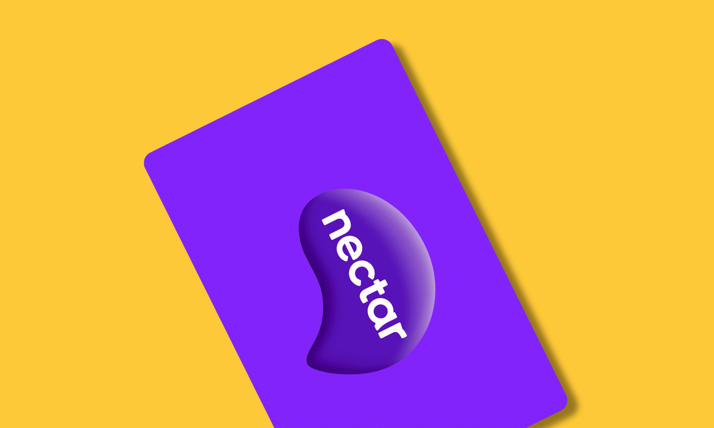
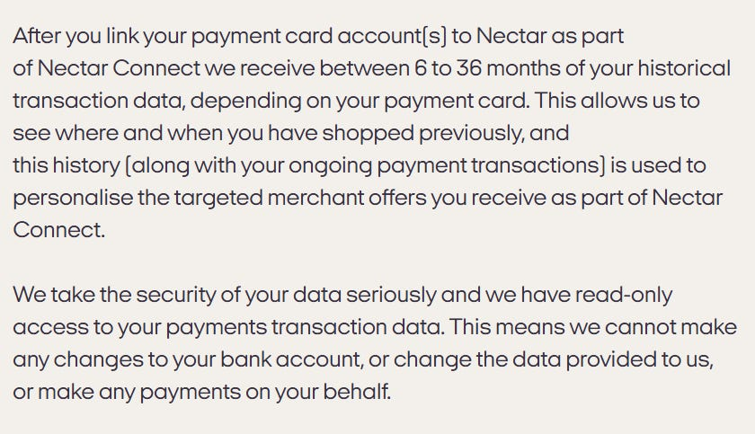
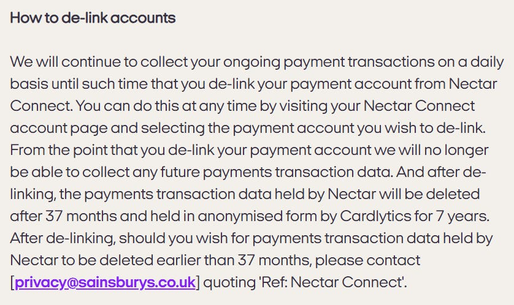

I had originally planned to bundle the supermarket loyalty cards into one article, covering the UK’s forerunners in one swoop, but I quickly realised that would be information overload, confusing to many, and just a bit silly.

So, in the traditional “keep it simple, stupid” mindset, we’ll proceed instead with looking at these one at a time, starting off with Nectar, the supermarket loyalty scheme operated by Sainsbury’s in the UK.

This article consists of a review of Nectar’s;

* [Privacy Policy](https://www.nectar.com/about/privacy-and-legal/privacy-policy)  
* [Nectar Connect Terms & Conditions](https://www.nectar.com/about/privacy-and-legal/nectar-connect)  
* [Cookie Policy](https://www.nectar.com/about/privacy-and-legal/cookie-policy)  
* [Sainsbury’s Group Privacy Policy](https://privacy-hub.sainsburys.co.uk/privacy-policy/)  
* [Participating Companies](https://www.nectar.com/about/privacy-and-legal/participating-companies)  
* [Nectar Terms of Use](https://www.nectar.com/about/privacy-and-legal/terms-of-use)  
* [Collector Rules](https://www.nectar.com/about/privacy-and-legal/collector-rules)  
* [eShop Terms & Conditions](https://www.nectar.com/about/privacy-and-legal/eshops-terms-and-conditions)  
* [Nectar Prices and Your Nectar Prices Terms & Conditions](https://www.nectar.com/about/privacy-and-legal/nectar-prices)

# WHAT INFORMATION IS COLLECTED BY NECTAR/SAINSBURYS

When a customer signs up for a Nectar account, Necar collects;

* Name  
* Home address  
* Email address  
* Telephone number

Each time a customer scans their Nectar card, Nectar collect;

* Purchases  
* Where purchased

They also collect other data relating to how customers interact with the programme including;

* What offers the customer engages with and use  
* The points redemptions the customer makes  
* How the customer interacts with websites and apps  
* Predictions about the customers’ interests, shopping habits and characteristics (*“profiled characteristics”*)  
* Chats, calls and correspondence with the customer centre or chatbot on Nectar website  
* When the customer enters competitions operated by Nectar and Nectar Partners. (If the customer enters any partner competitions, they may share personal data with Nectar, including entry information, contact and delivery details)

When engaging with the Nectar app or website, Nectar collect;

* IP address  
* MAC address  
* Unique ID  
* Advertising ID  
* Location data  
* Browser type

If a customer connects their payment card to their nectar account to collect points on other purchases made through Nectar partners (e.g. Argos, Ebay, etc), Nectar collect;

* What the customer purchased  
* Where the customer made the purchase  
* Date and time of transaction  
* Description of transaction (merchant & category)  
* Type of transaction (purchase, direct debit, cashback, refund, credit)  
* Transaction amount  
* Transactions and transaction history related to the payment card  
* Unique ID relating to the payment account linked to the Nectar account  
* Bank name of payment card used  
* Account type held with the bank (e.g. current account, savings account, credit card etc)

After a customer links a payment card to Nectar, as part of Nectar Connect, Nectar receive between 6 to 36 months of the customers' historical transaction data, depending on the type of payment card used, in addition to ongoing transactions until the payment card is de-linked from the Nectar account.

Transaction data collected through Nectar Connect (linking a payment card to your Nectar account) is added to the users Nectar profile for analysis by Nectar.

Joint bank accounts can be added through this feature, be sure to obtain your joint account holders permission before sharing your banking transactions with a nationally operating company with many business partners and brands.

If connecting a payment card thus bank account to a Nectar account, the user agrees to TrueLayer’s Terms of Service and Privacy Policies to enable the Open Banking.

Nectar also collect data about account holders from Nectar Partners and Brands which they have collected about that account holder during their relationship with them, including';

* How the user engages with the partner or brands website and apps  
* Transactions made with the Partner and/or Brand  
* Competitions entered  
* Surveys completed  
* Marketing responded to  
* Other loyalty schemes engaged with  
* Profiled characteristics attributed to the customer from their interactions with the Partner and/or Brand

Nectar also receive personal data from third party companies such as Experian, CACI, Royal Mail etc.

# DATA RETENTION

Nectar keep customer information *“for as long as necessary for us to fulfil the purposes that we describe”*. Though go on to state that as a general rule, they retain personal data for the duration of the customers membership with the programme.

If an account does not earn or redeem points for a period of 12 months they may deem the account to be inactive and suspend or close the account.

Personal data is kept for a further period of 12 months after an account is deemed inactive, following which personal data is no longer retained.

Where data has been anonymised or *“in most cases”*, the retention period comes to an end after 7 years.

# WHAT IS DISCLOSED AND WITH WHO

Nectar state that personal data they collect may be shared with;

* The Sainsbury’s Group (Sainsbury’s Supermarkets, Sainsbury’s Bank, Argos, Tu Clothing, Habitat, Nectar)  
* [Nectar Partners](https://www.nectar.com/about/privacy-and-legal/participating-companies) (1,067 companies, skim read this list\!)  
* Service Providers  
* Argos Financial Services  
* Affiliate Marketing Networks  
* Advertising and marketing agencies  
* Sky Adsmart  
* Google  
* Facebook  
* Cloud infrastructure services  
* Analytics providers  
* Data matching providers  
* Competition administrators  
* Market research companies  
* Mailing houses  
* Salesforce  
* Companies who run Nectar contact centres  
* Companies which offer anonymisation and data modelling services  
* Cardlytics  
* TrueLayer  
* Open Banking

# TERMS OF SERVICE

If users make online purchases with Sainsbury’s or one of its partners with view to accruing the Nectar points but block cookies, points may not be allocated.

# COOKIES

Nectar do not disclose in their policies specifically what Cookies they operate, mostly just that they use Cookies to track users across websites and usage of their product(s).

# OTHER CONSIDERATIONS

If a consumer has connected a payment card to their Nectar account, Nectar *“will continue to collect your ongoing payment transactions on a daily basis until such a time that you de-link your payment account from Nectar Connect”.*

Nectar state that personal data may be anonymised, where data is anonymised, it is not subject to the privacy policy.  
