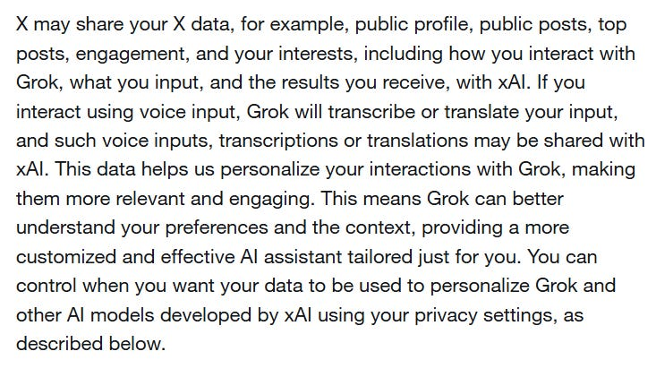
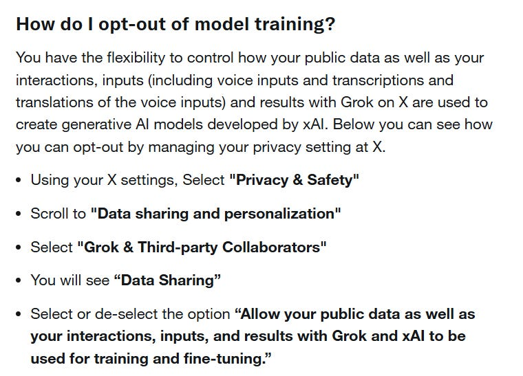

Twitter (now called X) claims over half a billion monthly active users, reportedly generating them a revenue of a swish $2.9 billion in 2025, of which apparently $1.8 billion was advertising revenue.

This article consists of a review of Twitters;

* [Terms of Service](https://x.com/en/tos)  
* [Privacy Policy](https://x.com/en/privacy)  
* [Sharing With Business Partners](https://help.x.com/en/safety-and-security/data-through-partnerships)  
* [Service Partners](https://privacy.x.com/en/subprocessors)  
* [Cookies on X](https://help.x.com/en/rules-and-policies/x-cookies)  
* [Corporate Affiliates](https://help.x.com/en/rules-and-policies/x-services-and-corporate-affiliates)  
* [Data Processing Addendum](https://privacy.x.com/en/for-our-partners/global-dpa)  
* [ID Verification Policy & Privacy](https://help.x.com/en/rules-and-policies/verification-policy)  
* [Consumer Health Data Privacy Policy](https://privacy.x.com/en/for-our-users/x-consumer-health-data-policy)  
* [About Grok](https://help.x.com/en/using-x/about-grok)

# WHAT INFORMATION IS COLLECTED BY TWITTER

To provide the account and services, Twitter/X may collect the following data;

* Display name  
* Username  
* Email address  
* Phone number  
* Date of birth  
* Display language  
* Third-party single sign-in information (if user chooses to utilise)  
* Location (approximate or GPS, user settings dependent)  
* Phone contacts (optional)  
* Payment information; billing address address, payment card details inc expiration date and CCV code (where user subscribes or purchases ads)  
* Biometric information  
* Job applications / recommendations (may include biographical information, employment history, educational history, employment preferences, skills, abilities, job search activity and engagement)  
* Content the user posts (inc the content, contents of, date, application and version posted from)  
* User’s lists  
* Users bookmarks  
* Users communities  
* Users interactions with user users content; reposts, likes, bookmarks, shares, downloads, replies.  
* Viewing history  
* Search history  
* Spaces and broadcast interactions  
* *“Metadata related to encrypted messages”*  
* For unencrypted messages; the contents of the messages, recipients, date and time of message(s).  
* Links the user interacts with  
* If sending or receiving funds through a Twitter/X feature or service; information about the transaction, when it was made, amounts paid/received.  
* IP address  
* Browser type  
* Device ID  
* Advertising ID  
* Cookie ID  
* Operating system  
* Carrier  
* Language  
* Device memory  
* Apps installed  
* Battery level  
* Inferred identity (subject to settings); may associate users account with browsers or devices other than those the user uses to sign into Twitter/X. If not signed in, they *“may infer your identity based on the information we collect”*  
* Referring webpage  
* Access times  
* Pages visited  
* *“Search terms and ID’s (including those not submitted as queries)”*  
* Ads shown to the user on Twitter/X and off platform, how the user interacts with those ads  
* When a user installs another application through Twitter/X  
* Interactions with Twitter/X content on third party sites (when viewing a web page with embedded timelines or post buttons, they may receive log information including the page visited)

Twitter/X state they may also receive information about users from;

* Other users (through their posts with tags of the user or other users uploading their contacts)  
* Ad partners  
* Developers  
* Publishers  
* Business partners  
* Service providers  
* Affiliates (Vine, Twitpic)  
* Third parties  
* Account connections and integrations

which may include the following;

* Demographic information  
* Interests  
* Content viewed by the user on the wider internet  
* Actions taken on a website or app

Under their [Health Data Privacy Policy](https://privacy.x.com/en/for-our-users/x-consumer-health-data-policy), Twitter/X state they may collect;

* Content that includes information about your past, present, or future physical or mental health status that you send to specific X users, such as through [Direct Messages](https://help.x.com/using-x/direct-messages) or [protected posts](https://help.x..com/safety-and-security/public-and-protected-posts).  
* Based on your consent, biometric information for safety, security, and identification purposes.  
* If you have enabled [precise location](https://help.x.com/safety-and-security/x-location-services-for-mobile) on the X mobile app or if you choose to [share your location](https://help.x.com/using-x/post-location) in your profile and posts that could potentially indicate your attempt to seek health-related services.  
* Other information that may be used to infer or derive consumer health data as defined under the MHMDA.

# DATA RETENTION

Different types of information are retained for different periods of time;

* Usage information, content posted, interactions with others are deleted on an account or the content being deleted  
* Payment information and records of transactions are retained in accordance with applicable local laws  
* Communications with Twitter/X (like direct with them as a company) are retained for up to 18 months  
* Data obtained through cookies is retained for up to 13 months  
* Information about a users views or interactions with ads on and off Twitter/X on third-party sites are retained for up to 12 months  
* Where a user violates Twitter/X’s rules and the account is suspended, account identifiers may be kept indefinitely

They state this as a guide, citing that information may need to be kept for longer to comply with any legal requirements or for safety and security reasons.

Deidentified or anonymised information may be retained for indefinite periods.

# WHAT IS DISCLOSED AND WITH WHO

Content in public profile posts including profile picture, display name and username are public and shared publicly. People do not need to be signed in to view some content on the Twitter/X platform, they may also find content through search engines or through other websites.

With a users consent, personal information is shared with third parties which have a partnership with Twitter/X, \- this can be restricted under “data sharing with business partners” within the users Privacy and Safety settings ([Note: this does not include restricting of the sharing of data with service providers or through certain partnerships](https://help.x.com/en/safety-and-security/data-through-partnerships)).

User data and information may be shared with;

* Advertisers  
* Third party integrations  
* Service providers (see below)  
* Through their API’s  
* Where required by law  
* With affiliates

Data is shared with xAI;

Twitter/X partners with a variety of service providers during which they share user information in order to provide Twitter/X to users, they name their main service providers as;

* Accenture  
* Acxiom  
* Adjust  
* Adyen  
* Akami Technologies  
* Amazon Web Services  
* Appsflyer  
* Arkose Labs  
* Atlassian  
* Branch Metrics  
* Cognizant  
* comScore  
* CyberAgent  
* DoubleVerify  
* dunnhumby Limited  
* Foursquare Labs  
* Free Stream Media Corporation  
* GitHub  
* Google  
* HackerOne  
* HubSpot  
* Intage  
* Integral Ad Science  
* Kochava  
* LiveRamp  
* Microsoft  
* NAVEX Global  
* NC Ventures  
* Nielsen  
* Neustar Information Services  
* Oracle America  
* Persona  
* PRO Unlimited  
* Recurly  
* Salesforce  
* Singular Labs  
* Slack Technologies  
* Stripe  
* Tipalti  
* Unit 21  
* xAI  
* Zendesk

Data shared with service providers becomes subject to the Privacy Policy of each service provider the data is shared with.

# TERMS OF SERVICE

Twitter/X’s services are not directed to children, persons under the age of 13 are not permitted to use the product.

The usual royalty free licence malarkey.

# COOKIES

When a user accesses Twitter/X, more than 100 cookies are used to track and monitor the user, all of which can be [viewed here](https://help.x.com/content/dam/help-twitter/rules-and-policies/cookie-description-lists/cookie-description-list-en.pdf).

Some additional information can be [found here](https://help.x.com/en/rules-and-policies/x-cookies).

# OTHER CONSIDERATIONS

Twitter/X use Persona and Stripe for ID verifications, any information provided by the user to Persona or Stripe during the process of verifying their identity is subject to the privacy policy of the identity verifying party.

If a user opts to verify their identity with Twitter/X through either of their verification partners, Twitter/X collect an image of the ID and selfie of the user, which includes face data and data extracted from the ID.

Persona deletes images of ID’s, selfies and data extracted from the ID after 30 days. Stripe will retain the data for as long as the data remains a creator.

Users can opt out of their Twitter/X account being used to train xAI models by following these instructions;

