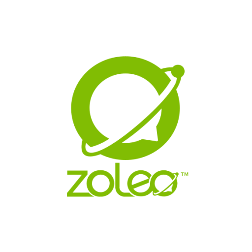

# I Read The Policies So You Don’t Have To: Zoleo (Satellite Comms Network)

Zoleo offer a form of satellite communications.

This article consists of a review of Zoleo’s;

* [Security and Privacy Policy](https://www.myzoleo.com/security-and-privacy-policy/)  
* [Service Terms](https://www.myzoleo.com/security-and-privacy-policy/)  
* [Privacy Policy](https://www.zoleo.com/en-gb/privacy-policy?_gl=1*1acr50t*_up*MQ..*_ga*MTY2NjI4MTM1MS4xNzc5MDQyODc4*_ga_0RW67BGLGE*czE3NzkwNDI4NzgkbzEkZzEkdDE3NzkwNDI4ODIkajYwJGwwJGgw*_ga_HV7ZEQKB9Z*czE3NzkwNDI4NzgkbzEkZzEkdDE3NzkwNDI4ODIkajYwJGwwJGgw)  
* [End User Licence Agreement](https://www.zoleo.com/en-gb/end-user-license-agreement?_gl=1*1acr50t*_up*MQ..*_ga*MTY2NjI4MTM1MS4xNzc5MDQyODc4*_ga_0RW67BGLGE*czE3NzkwNDI4NzgkbzEkZzEkdDE3NzkwNDI4ODIkajYwJGwwJGgw*_ga_HV7ZEQKB9Z*czE3NzkwNDI4NzgkbzEkZzEkdDE3NzkwNDI4ODIkajYwJGwwJGgw)  
* [Cookies List](https://www.zoleo.com/en-gb/privacy-policy-cookie-list?_gl=1*17k8zh0*_up*MQ..*_ga*MTY2NjI4MTM1MS4xNzc5MDQyODc4*_ga_HV7ZEQKB9Z*czE3NzkwNDI4NzgkbzEkZzEkdDE3NzkwNDI5MDMkajYwJGwwJGgw*_ga_0RW67BGLGE*czE3NzkwNDI4NzgkbzEkZzEkdDE3NzkwNDI5MDMkajYwJGwwJGgw)

Zoleo sends and receives messages via the [Iridium](https://www.iridium.com/) Global Satellite network, meaning any and all data collected by Zoleo is also subject to the policies and terms of [Iridium](https://www.iridium.com/).

You can read Iridium’s [Privacy Policy](https://www.iridium.com/privacy-policy) or [Terms and Conditions of Use](https://www.iridium.com/general-terms-and-conditions-use), if you like.

Zoleo presently only support messaging, not voice calls, to any cell/mobile number, email address or Zoleo app user.

# WHAT INFORMATION IS COLLECTED BY ZOLEO

Zoleo may collect the following information;

* Name  
* Mobile number  
* Payment card information  
* Billing address  
* Text messages sent and received (limited encryption, paid app subscriber to paid app subscriber only, other messages do not appear to be encrypted).  
* Location (GPS)  
* Contacts  
* Device battery level  
* Version of Zoleo app  
* Device operating system  
* Device ID  
* Device make and model  
* Connected mobile network  
* Session length  
* Language  
* *“any identifiable online activity”*  
* Credit report on user  
* Date and time of use  
* IP address  
* Unique Device Identifier  
* Browser type  
* Names of designated check-in  
* Emergency contacts  
* SOS emergency status

# DATA RETENTION

*“ZOLEO retains personal information for as long as necessary to fulfil legal or business purposes. Once your information is no longer required by ZOLEO to meet business, legal or regulatory requirements, it is securely destroyed, erased or made anonymous. Keep in mind however that information may be retained for a lengthier period of time due to an on-going investigation or legal proceeding, and that residual information may remain in back-ups for a period of time after its destruction date”.*

# WHAT IS DISCLOSED AND WITH WHO

Zoleo state that they may share information with;

* Iridium (Zoleo send and receive messages via the [Iridium](https://www.iridium.com/) Global Satellite network)  
* Business partners  
* Affiliates  
* Service providers  
* Credit reference agencies  
* IT service providers  
* Financial auditors  
* Marketing partners  
* Law enforcement or national security authorities, upon request.  
* API customers

# TERMS OF SERVICE

Users are solely responsible for any charges which may be assessed by Emergency Responders for false SOS Emergency Signals, including any negligent use, *“including but not limited to, pressing the SOS button to ‘see if it works’”*, which suggests many people have done that.

Should it be determined by Zoleo that the user has deliberately or negligently misuse the SOS emergency service, they agree that Zoleo may bill their credit card the appropriate fee, calculated at a rate of $400 per hour with a max charge of two (2) hours for each false SOS emergency signal event.

Late payment charge of 1.5%.

No refunds if data transmission does not work for any reason.

Needs a clear view of the night sky to work, is not reliable indoors, in caves or where the sky is not visible, keep other GPS products and other mobile phones at least 12 inches away.

Used at users' risk.

Zoleo are not liable for any failures of the product or ramifications from failures of the product.

# COOKIES

Zoleo state the cookies they use as being [these](https://www.zoleo.com/en-gb/privacy-policy-cookie-list?_gl=1*17k8zh0*_up*MQ..*_ga*MTY2NjI4MTM1MS4xNzc5MDQyODc4*_ga_HV7ZEQKB9Z*czE3NzkwNDI4NzgkbzEkZzEkdDE3NzkwNDI5MDMkajYwJGwwJGgw*_ga_0RW67BGLGE*czE3NzkwNDI4NzgkbzEkZzEkdDE3NzkwNDI5MDMkajYwJGwwJGgw).  
